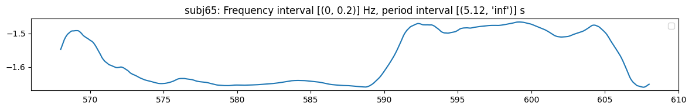

<!-- WARNING: THIS FILE WAS AUTOGENERATED! DO NOT EDIT! -->

``` python
dg0.face_t.project(features=['skew'], subjs=[65], fbands=[0,1,2], wdfactory=wfactory('db4',8)).plot_signal(subjs=[65])
```



    (<Figure size 1200x200 with 1 Axes>,
     [<Axes: title={'center': "subj65: Frequency interval [(0, 0.2)] Hz, period interval [(5.12, 'inf')] s"}>])

``` python
dg0.facebbox_t.plot_pdf(subj=65, secs=[568, 576], bw_method=0.1)
```

    Unable to display output for mime type(s): application/vnd.plotly.v1+json
