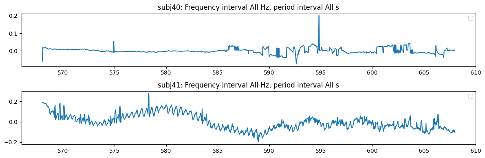
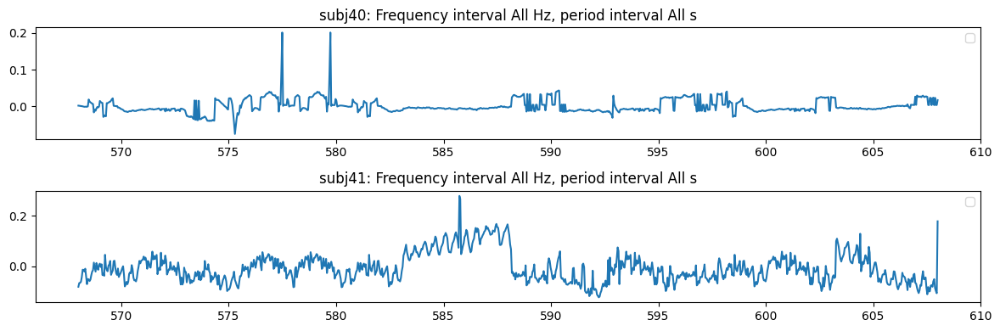
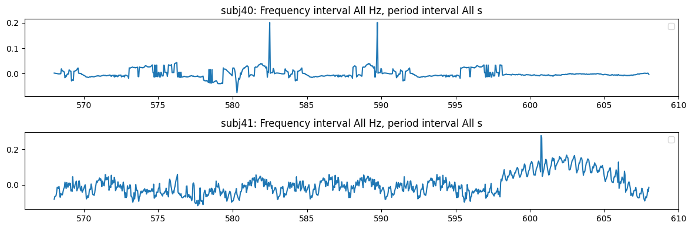

# Block Bootstrap Embeddings


<!-- WARNING: THIS FILE WAS AUTOGENERATED! DO NOT EDIT! -->

<div>

> **Note**
>
> Note that `EmbeddingCollection` invokes `.plot_signal` and
> `.bbootstrap` methods through its [Dynamic Attribute
> Forwarding](embeddingColl.ipynb#dynamic-attribute-access).

</div>

``` python
from nbdev_fhemb.embedding_ex import pca_emb, combined_emb0
```

## The Bootstrapped Signal

``` python
pca_emb.plot_signal(
    subjs=[40,41],  # specify subject(s) to plot: may be specified also as intervals, e.g., [(40, 45), 47]
    feature='pc2'   # specify feature to plot: principal components are prefixed by 'pc' 
)
```


    (<Figure size 1200x400 with 2 Axes>,
     [<Axes: title={'center': 'subj40: Frequency interval All Hz, period interval All s'}>,
      <Axes: title={'center': 'subj41: Frequency interval All Hz, period interval All s'}>])

``` python
combined_emb0.plot_signal(
    subjs=[40,41],  # specify subject(s) to plot: may be specified also as intervals, e.g., [(40, 45), 47]
    feature='pc2'   # specify feature to plot: principal components are prefixed by 'pc'
)
```



    {'pcomponents_ts': (<Figure size 1200x400 with 2 Axes>,
      [<Axes: title={'center': 'subj40: Frequency interval All Hz, period interval All s'}>,
       <Axes: title={'center': 'subj41: Frequency interval All Hz, period interval All s'}>])}

## Bootstrap with Different Block Lengths

> Here we demonstrate the bootstrap method, applied to an `Embedding`
> and to an `EmbeddingCollection` respectively.

``` python
pca_emb.bbootstrap(
    block_length=5, # specify the length of the block in the block bootstrap
    rseed=0,        # random seed for reproducibility
).plot_signal(
    subjs=[40,41],  # specify subject(s) to plot: may be specified also as intervals, e.g., [(40, 45), 47]
    feature='pc2'   # specify feature to plot: principal components are prefixed by 'pc' 
)
```


    (<Figure size 1200x400 with 2 Axes>,
     [<Axes: title={'center': 'subj40: Frequency interval All Hz, period interval All s'}>,
      <Axes: title={'center': 'subj41: Frequency interval All Hz, period interval All s'}>])

``` python
combined_emb0.bbootstrap(
    block_length=5, # specify the length of the block in the block bootstrap
    rseed=0,        # random seed for reproducibility
).plot_signal(
    subjs=[40,41],  # specify subject(s) to plot: may be specified also as intervals, e.g., [(40, 45), 47]
    feature='pc2'   # specify feature to plot: principal components are prefixed by 'pc'
)
```



    {'pcomponents_ts': (<Figure size 1200x400 with 2 Axes>,
      [<Axes: title={'center': 'subj40: Frequency interval All Hz, period interval All s'}>,
       <Axes: title={'center': 'subj41: Frequency interval All Hz, period interval All s'}>])}

``` python
pca_emb.bbootstrap(
    block_length=10, # specify the length of the block in the block bootstrap
    rseed=0,         # random seed for reproducibility
).plot_signal(
    subjs=[40,41],   # specify subject(s) to plot: may be specified also as intervals, e.g., [(40, 45), 47]
    feature='pc2'    # specify feature to plot: principal components are prefixed by 'pc' 
)
```



    (<Figure size 1200x400 with 2 Axes>,
     [<Axes: title={'center': 'subj40: Frequency interval All Hz, period interval All s'}>,
      <Axes: title={'center': 'subj41: Frequency interval All Hz, period interval All s'}>])

``` python
combined_emb0.bbootstrap(
    block_length=10, # specify the length of the block in the block bootstrap
    rseed=0,         # random seed for reproducibility
).plot_signal(
    subjs=[40,41],   # specify subject(s) to plot: may be specified also as intervals, e.g., [(40, 45), 47]
    feature='pc2'    # specify feature to plot: principal components are prefixed by 'pc'
)
```


    {'pcomponents_ts': (<Figure size 1200x400 with 2 Axes>,
      [<Axes: title={'center': 'subj40: Frequency interval All Hz, period interval All s'}>,
       <Axes: title={'center': 'subj41: Frequency interval All Hz, period interval All s'}>])}
