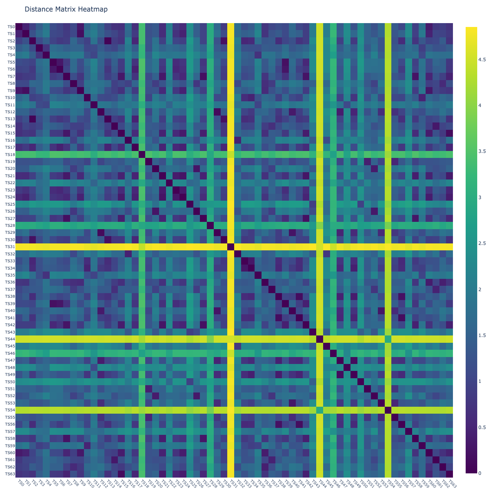
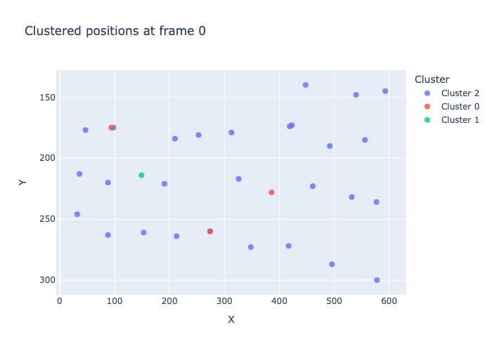
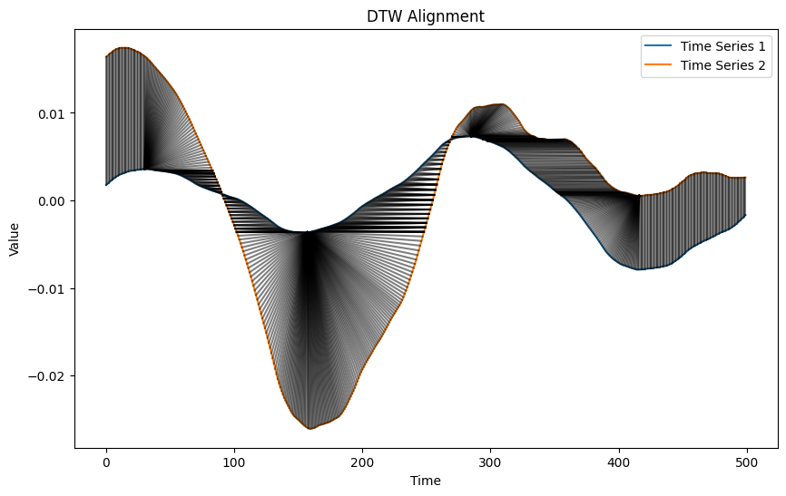

# Classify


<!-- WARNING: THIS FILE WAS AUTOGENERATED! DO NOT EDIT! -->

``` python
setup_logging(
    force=True,
    module_levels={
        "mixins": "WARNING",
        "piece": "INFO",
        "dbms": "INFO",
        "embedding": "INFO",
        "tutils": "INFO",
        "cutils": "INFO",
        "wdecomposition": "INFO",
        "wrepresentation": "INFO",
    },
)
```

``` python
fftrio_segment00 = (14200, 14700)
fftrio_segment11 = (14950, 15450)
```

``` python
fftrio00 = Piece(
    time_interval=fftrio_segment00, 
    title="Don Giovanni", subjs=(40,76))
```

``` python
fftrio11 = Piece(
    time_interval=fftrio_segment11,
    title="Don Giovanni", subjs=(40,76))
```

## Heatmap depicts DWT pairwise distances

``` python
Xopera0 = np.stack([
    fftrio00.percentiles_face(
        fbands=[1], 
        features=['p85'], 
        factory=wfactory('db4', level=8)
    ).features_tint[subj] for subj in fftrio00.percentiles_face(factory=wfactory('db4', level=8)).subjects
])

Xopera1 = np.stack([
    fftrio11.percentiles_face(
        fbands=[1], 
        features=['p85'], 
        factory=wfactory('db4', level=8)
    ).features_tint[subj] for subj in fftrio11.percentiles_face(factory=wfactory('db4', level=8)).subjects
])

Xopera = np.concatenate([Xopera0, Xopera1])
```

``` python
plot_dm_heatmap(Xopera, alignment_type='fastdtw', gamma=1, normalize='log', n_jobs=8)  # 'dcor', 'fastdtw'(euclidean), 'tslearn_dtw'(euclidean), 'soft_dtw'(sqeuclidean), 'soft_dtw_div'
```



``` python
features=['p90']

clusters_subj_fftrio00, subj_clusters_fftrio00, labels_fftrio00, silhouette_fftrio00, centroids_fftrio00 = dtw_clustering(
    fftrio00.percentiles_face(fbands=[1,2], features=features, factory=wfactory('db4', level=8)),
    normalize=False, #'minmax',
    metric = "dtw",
    n_clusters=3,
    max_iter=10,
    random_state=0
)
```

``` python
depict_clusters(clusters_subj_fftrio00, fftrio00.roi_t.position.features_tint)
```



``` python
depict_DTW(Xopera0[11].T, Xopera1[30].T, dist=euclidean, radius=10)
```


