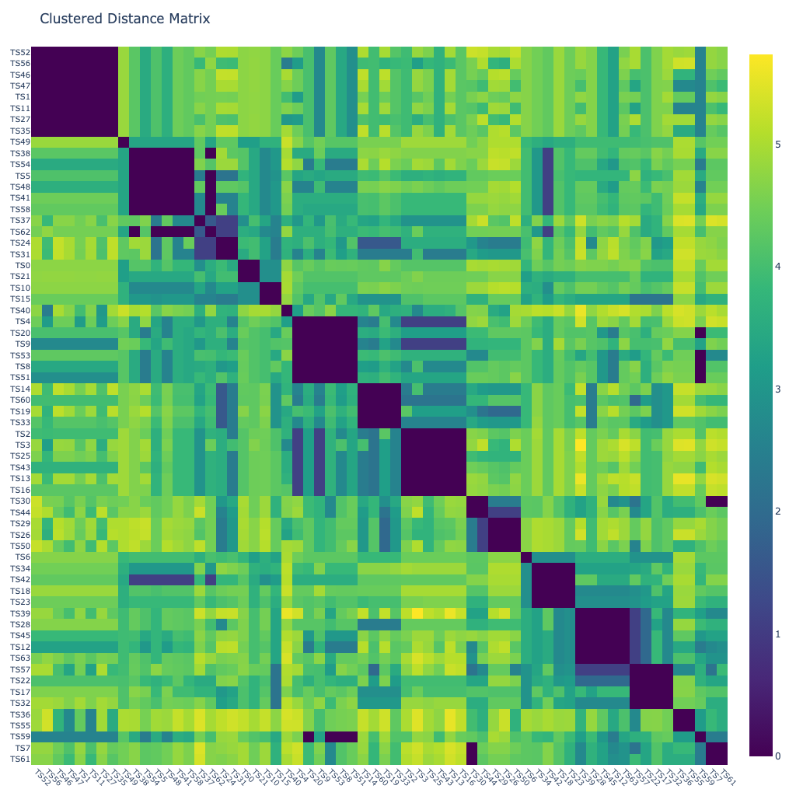
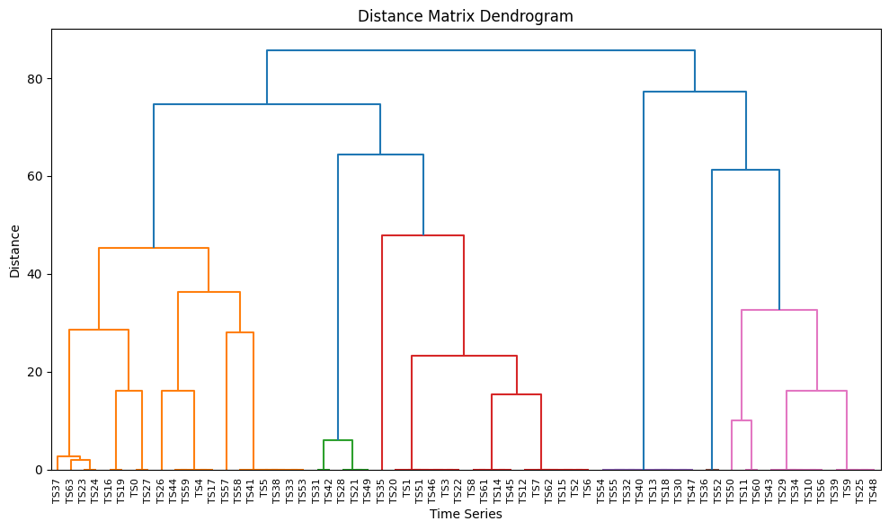
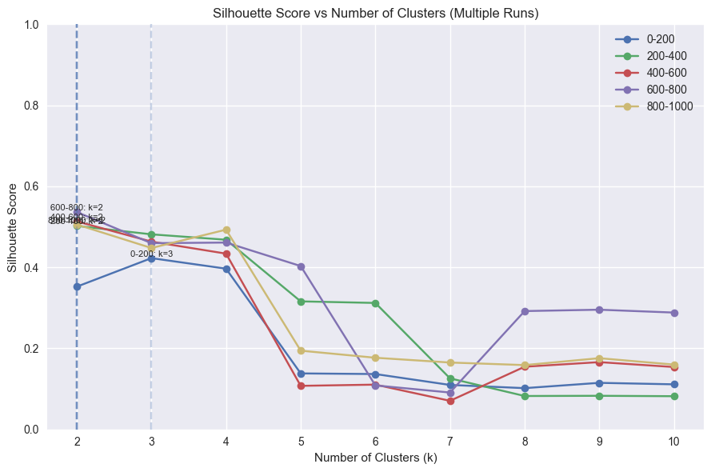
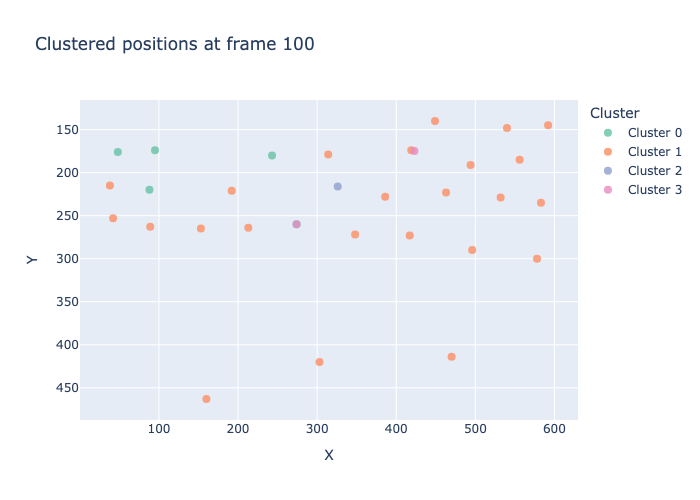
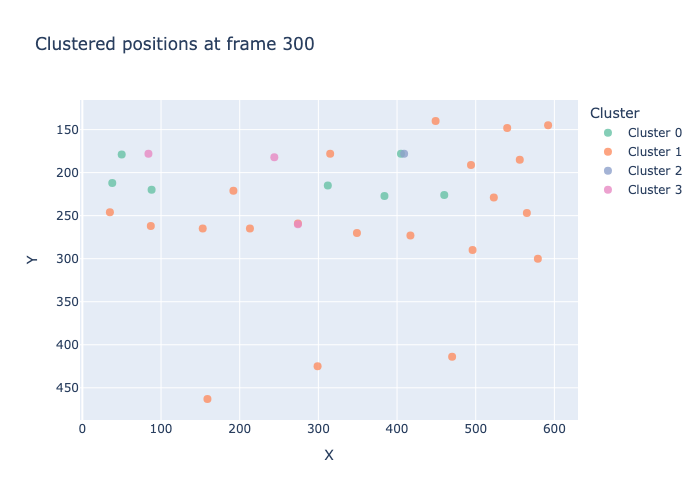
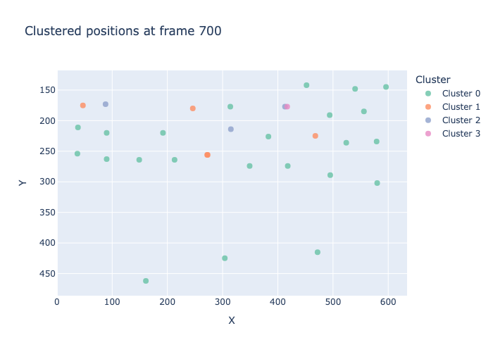
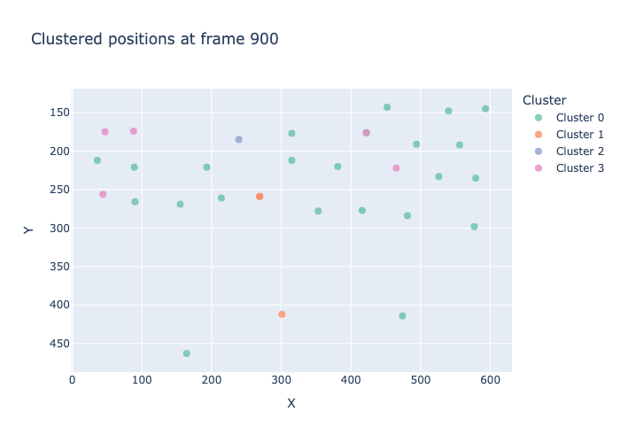

# Clustering of Embeddings


<!-- WARNING: THIS FILE WAS AUTOGENERATED! DO NOT EDIT! -->

> By integrating clustering with embeddings, users can observe how
> different representation choices influence the resulting cluster
> structure. This makes clustering a practical tool for diagnosing
> embedding quality, comparing feature‑extraction strategies, and
> gaining intuition about the underlying variability in a time‑series
> collection.

``` python
from fhemb.utils.cutils import plot_dm_dendrogram, plot_clustered_dm_heatmap, dtw_clustering, depict_clusters, compute_silhouette_vs_k, plot_silhouette_curves
```

``` python
from nbdev_fhemb.wreconstruction_ex import emb_prj_decomp_rec1
```

``` python
from nbdev_fhemb.module_functions_ex import Xdm
```

## Cluster DTW Alignments Between Pairs of Embeddings

``` python
from scipy.spatial.distance import (
    euclidean, 
    cityblock, 
    cosine, 
    mahalanobis, 
    sqeuclidean, 
    chebyshev, 
    minkowski, 
    braycurtis, 
    canberra, 
    correlation, 
    jaccard, 
    hamming
)
```

### Clustered heatmap

> pairwise distances whose rows and columns are reordered using
> hierarchical clustering, revealing similarity structure among the time
> series.

``` python
plot_clustered_dm_heatmap(
    Xdm,                       # data matrix (n_timeseries, n_dataframes) 
    alignment_type='fastdtw',  # 'dcor', 'fastdtw'(euclidean), 'tslearn_dtw'(euclidean), 'soft_dtw'(sqeuclidean), 'soft_dtw_div'
    dist=cosine,               # distance metric function used inside fastdtw
    radius=10,                 # refinement window size in fastdtw
    normalize='log',           # normalization method for distance matrix
    n_jobs=8,                  # number of jobs for parallelization
    base_size=16               # base pixel size
)
```



<div>

> **Clustered heatmap diagnostics**
>
> Often the first diagnostic before running *k‑means*, *hierarchical
> clustering*, or *spectral clustering*:
>
> - Large, clean diagonal blocks → strong cluster structure
> - Fuzzy or streaky blocks → weak or overlapping clusters
> - Off‑diagonal dark regions → cross‑cluster similarities
> - Asymmetry → distance metric issues or preprocessing inconsistencies

</div>

### Dendrogram

> a hierarchical tree showing how time series cluster together based on
> their DTW‑ or dcor‑derived distances, with merge heights reflecting
> the distances at which clusters join.

``` python
plot_dm_dendrogram(
    Xdm,                        # data matrix (n_timeseries, n_dataframes)
    alignment_type='fastdtw',   # Type of alignment method to use for distance computation. Options: 'dcor', 'fastdtw'(euclidean), 'tslearn_dtw'(euclidean), 'soft_dtw'(sqeuclidean), 'soft_dtw_div'
    dist=cosine,                # distance metric function to use for DTW alignment. Only applies when alignment_type='fastdtw'.
    radius=10,                  # refinement window size for FastDTW algorithm. Only applies when alignment_type='fastdtw'.
    n_jobs=8                    # number of parallel jobs to use for distance computation 
)
```



<div>

> **Dendrogram diagnostics**
>
> A dendrogram exposes the hierarchical structure of similarities among
> time series. It is especially useful for assessing:
>
> - whether clusters exist at multiple resolutions
> - how stable or fragile cluster boundaries are
> - whether the distance metric produces coherent merges
>
> Interpretation cues:
>
> - Long vertical branches before merging → well‑separated clusters with
>   strong internal cohesion
> - Short branches and early merges → weak structure; time series are
>   broadly similar or noise‑dominated
> - Large jumps in merge height → natural “cut points” suggesting
>   plausible cluster counts
> - Gradual, smooth merge heights → no clear cluster boundaries;
>   structure is diffuse
> - Single long chain (ladder shape) → chaining effect; distance metric
>   may be inappropriate or too sensitive to outliers
> - Asymmetric subtree sizes → heterogeneous cluster sizes or presence
>   of outliers
> - Repeated tiny merges near the bottom → many near‑duplicates or
>   redundant time series

</div>

## Cluster Dynamics

> clustering of time series based on their DTW alignment dynamics

### Silhouette score curve diagnostics

> A silhouette score curve plots the average silhouette coefficient as a
> function of the number of clusters. It is a global diagnostic for
> selecting a meaningful cluster count and assessing whether the data
> contain well‑separated groups.

``` python
from collections import defaultdict
```

``` python
results = defaultdict(dict)

for i in [0, 200, 400, 600, 800]:       
    result =compute_silhouette_vs_k(
        emb_prj_decomp_rec1,          # the embedding object (EmbeddingCollection) that contains the time series to cluster 
        interval=(i,i+200),           # the interval of frames to cluster
        normalize=False,              # to normalize the time series before clustering (`minmax` or `meanvar`)
        metric='dtw',                 # Distance metric for clustering in K-means algorithm.
        max_k=10,                     # maximum number of clusters to evaluate 
        max_iter=10,                  # maximum number of iterations for K-means algorithm
        random_state=0,               # random state for K-means algorithm
        n_jobs=8                      # number of parallel jobs
    )
    results[i]=result                 # store results in dictionary for later plotting
```

``` python
plot_silhouette_curves(
    results,                                                        # dictionary of silhouette results for different intervals
    labels=['0-200', '200-400', '400-600', '600-800', '800-1000'],  # labels for each interval
    show_best = True,                                               # whether to highlight the best silhouette score across intervals
    filepath='emb_prj_decomp_rec1'                                  # filepath for saving the plot  
)
```



<div>

> **Silhouette score curve diagnostics**
>
> Interpretation cues:
>
> - A clear, sharp peak at some *k* → strong evidence for a natural
>   number of clusters; structure is well separated at that resolution
> - A broad plateau across several *k* → multiple clusterings are
>   similarly valid; structure may be hierarchical or diffuse
> - Monotonically decreasing curve → data likely have no meaningful
>   cluster structure; increasing *k* only fragments noise
> - Multiple local maxima → possible multi‑scale structure; consider
>   hierarchical clustering or domain‑driven selection
> - Very low scores for all *k* → poor separation overall; distance
>   metric or preprocessing may be inappropriate
> - Sudden drop after the peak → over‑segmentation beyond that *k*;
>   clusters become unstable or too small

</div>

<div>

> **Silhouette score magnitude diagnostics**
>
> The magnitude of the silhouette score reflects the overall quality of
> cluster separation and cohesion. It provides a global assessment of
> how well the data naturally partition under the chosen distance metric
> and clustering method.
>
> Interpretation cues:
>
> - 0.75–1.0 (very high) → exceptionally strong structure; clusters are
>   compact and well separated
> - 0.50–0.75 (high) → meaningful, stable clusters; good separation with
>   minor overlap
> - 0.25–0.50 (moderate) → weak or fuzzy structure; clusters exist but
>   boundaries are not crisp
> - 0.00–0.25 (low) → poor separation; clusters overlap heavily or are
>   not meaningful
> - Negative values → systematic misclassification; points fit better in
>   neighboring clusters than their assigned one
> - High variance across runs → unstable clustering; sensitive to
>   initialization or noise

</div>

### DTW based clustering

> clustering of time series based on their DTW alignment, using a
> K-means algorithm

``` python
cluster_t = defaultdict(dict)

keys = [  
    "clusters_subj",
    "subj_clusters",
    "labels",
    "silhouette",
    "centroids",
]

for i in [0, 200, 400, 600, 800]:
    _values = dtw_clustering(
        emb_prj_decomp_rec1,         # the embedding object (EmbeddingCollection) that contains the time series to cluster
        interval=(i,i+200),          # the interval of frames to cluster
        normalize=False,             # whether to normalize the time series before clustering
        metric = "dtw",              # the distance metric for clustering
        n_clusters=4,                # the number of clusters to form
        max_iter=15,                 # the maximum number of iterations for the K-means algorithm
        random_state=0               # the random state for reproducibility
    )

    cluster_t[i] = dict(zip(keys, _values))  # store results in dictionary for later analysis and plotting
```

``` python
from nbdev_fhemb.piece_ex import dg0    # The `Piece` object that contains the original time series data and metadata for the first subject in the dataset. 
                                        # This is used for visualizing the clustered time series in the next step.
```

``` python
for frame, clusters in cluster_t.items():     # iterate over each interval and its corresponding clustering results
    depict_clusters(
        clusters['clusters_subj'],            # the cluster assignments for each time series in the interval
        dg0.face_t.position.features_tint,    # the coordinates of the subject positions corresponding to the time series
        frame=frame+100                       # the frame number to visualize (the interval center)
    )
```










<div>

> **DTW clustering of synchronized time series - What it shows**
>
> Clustering synchronized time series using DTW reveals which series
> share similar temporal patterns across the examined time window.
> Inspecting adjacent short intervals (8 sec each) helps interpret why
> certain series cluster together:
>
> - **Similar interval‑by‑interval evolution**: Time series in the same
>   cluster show comparable behavior across intervals.
> - **Shared temporal structure**: Clusters reflect series that rise,
>   fall, oscillate, or stabilize in similar ways.
> - **Differences concentrated in specific intervals**: If two series
>   diverge only in some intervals, this often explains why they fall
>   into different clusters.
> - **Distinct temporal signatures**: Outlier series show unique
>   patterns in one or more intervals, leading to isolated cluster
>   membership.
> - **Consistent behavior**: Series with stable patterns across all
>   intervals tend to cluster tightly.
> - **Abrupt changes**: Series with internal transitions (e.g., sudden
>   onset or decay) often cluster separately from smoother ones.

</div>
