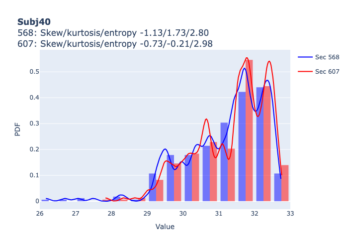

# Embed a Datasource


<!-- WARNING: THIS FILE WAS AUTOGENERATED! DO NOT EDIT! -->

## Inspect the Datasource

### Metadata of the underlying `Peace`

``` python
dg0.facebbox_t.piece_attributes
```

    {'piece': 'Don Giovanni',
     'temperature_threshold': 25,
     'percentile_interval': 5,
     'normalize_histogram': True,
     'norm_face_size': 1500,
     'sub_roi_width': 5,
     'resize': (40, 60),
     'db_schema': 'dg',
     'number_of_subjects': 77}

### Data of the `Datasource`

> which is a time series of 2d arrays the shape of which is not
> stationary, i.e., the grid of heatmaps is evolving.

``` python
dg0.facebbox_t.features_tint['subj40'][0].shape, dg0.facebbox_t.features_tint['subj40'][10].shape
```

    ((21, 16), (22, 16))

#### Depict the probability distribution

> for a specified subject and times

``` python
dg0.facebbox_t.plot_pdf(subj=40, secs=[568, 607], bw_method=0.1)
```



## Create Embeddings

### Simple embeddings

#### The positions of face is a trivial *vector* embedding - a series of (*x*, *y*) coordinates

``` python
dg0.facebbox_t.position.features_tint['subj40'].shape
```

    (2, 1000)

#### Percentiles are an example of a *vector* embedding - a series of (*p*0, …, *p*100) tuples

``` python
dg0.facebbox_t.percentiles_ts
```

    <fhemb.embedding.Embedding>

### PCA *eigenfaces* embedding

#### 1. Define PCA

<details open class="code-fold">
<summary>Exported source</summary>

``` python
from fhemb.utils.factories import pca_factory
```

</details>

<details open class="code-fold">
<summary>Exported source</summary>

``` python
pca = pca_factory(
    name='standard_kpca_5_sigmoid_0.1',
    # ---------------------------------------------------------------------
    # A human-readable identifier for this PCA configuration.
    # Use this to track experiments, cache results, or reference the model
    # in logs and reports. The name should encode the essential choices:
    # - preprocessing method
    # - PCA type
    # - kernel and key hyperparameters
    # ---------------------------------------------------------------------

    scaler='Standard',
    # ---------------------------------------------------------------------
    # Selects the preprocessing step applied before PCA.
    # 'Standard' corresponds to sklearn's StandardScaler.
    # Standardization is important for kernel methods because kernel values
    # depend on dot products; unscaled features can dominate the kernel.
    # ---------------------------------------------------------------------

    pca='Kernel',
    # ---------------------------------------------------------------------
    # Chooses the PCA implementation.
    # 'Kernel' selects KernelPCA, enabling nonlinear dimensionality reduction.
    # This is required when using kernels such as RBF, sigmoid, polynomial, etc.
    # ---------------------------------------------------------------------

    scaler_kwargs=dict(with_std=False),
    # ---------------------------------------------------------------------
    # Keyword arguments passed to the StandardScaler.
    # with_std=False → center features but do NOT scale to unit variance.
    # This preserves relative feature magnitudes, which may or may not be
    # desirable depending on the kernel. Sigmoid kernels are sensitive to
    # feature scale, so this choice should be deliberate.
    # ---------------------------------------------------------------------

    pca_kwargs=dict(
        n_components=5,
        # -------------------------------------------------------------
        # Number of principal components to extract.
        # For KernelPCA, this corresponds to the top eigenvectors of
        # the kernel (Gram) matrix. Choose based on downstream model
        # capacity or explained-variance needs.
        # -------------------------------------------------------------

        kernel='sigmoid',
        # -------------------------------------------------------------
        # Kernel function used to compute similarity between samples.
        # The sigmoid kernel has the form:
        #     K(x, y) = tanh(gamma * <x, y> + coef0)
        # It can model certain nonlinear structures but is not always
        # positive semi-definite, so stability depends on hyperparameters.
        # -------------------------------------------------------------

        gamma=0.07,
        # -------------------------------------------------------------
        # Scaling factor applied to the dot product inside the sigmoid.
        # Larger gamma increases sensitivity to small feature differences.
        # For sigmoid kernels, gamma strongly affects matrix conditioning.
        # -------------------------------------------------------------

        fit_inverse_transform=True,
        # -------------------------------------------------------------
        # Enables approximate reconstruction of original features from
        # the kernel PCA embedding. Useful for interpretability or
        # visualization, but increases computational cost.
        # -------------------------------------------------------------
    )
)
```

</details>

#### 2. Create the embedding of a datasource that has

##### a) *stationary* array-shape

> For example the array-shape in *face_t* is fixed over time

``` python
dg0.face_t.create_pca_embedding(factory=pca)
```

    (<fhemb.embedding.Embedding>,
     "StandardScaler(copy=True,with_mean=True,with_std=False) | KernelPCA(alpha=1.0,coef0=1,copy_X=True,degree=3,eigen_solver='auto',fit_inverse_transform=True,gamma=0.07,iterated_power='auto',kernel='sigmoid',kernel_params=None,max_iter=None,n_components=5,n_jobs=None,random_state=None,remove_zero_eig=False,tol=0)")

##### b) *non-stationary* array-shape

> The array shapes need to be normalized (made stationary) by calling
> `.rsfacebbox`,
> Datasource → Datasource ,
> which resizes `facebbox_t`

``` python
dg0.facebbox_t.rsfacebbox_t.create_pca_embedding(factory=pca)
```

    (<fhemb.embedding.Embedding>,
     "StandardScaler(copy=True,with_mean=True,with_std=False) | KernelPCA(alpha=1.0,coef0=1,copy_X=True,degree=3,eigen_solver='auto',fit_inverse_transform=True,gamma=0.07,iterated_power='auto',kernel='sigmoid',kernel_params=None,max_iter=None,n_components=5,n_jobs=None,random_state=None,remove_zero_eig=False,tol=0)")
