# Clustering of Signals of Individual Faces


<!-- WARNING: THIS FILE WAS AUTOGENERATED! DO NOT EDIT! -->

## Define Segments of the Opera

``` python
fftrio_segment00 = (14200, 14700)
fftrio_segment11 = (14950, 15450)
```

``` python
fftrio0 = Piece(
    time_interval=fftrio_segment0,
    title="Don Giovanni", 
    subjs=(40,76)
)
```

``` python
fftrio1 = Piece(
    time_interval=fftrio_segment1,
    title="Don Giovanni", 
    subjs=(40,76)
)
```

## Define Embeddings

> 85th percentile in the frequency band 0.05 - 0.1 Hz of the
> *Daubechies* wavelet `db4`

### Embed opera segments into a 1D feature space and concatenate the embeddings

1.  Specify the embedding

``` python
fbands= [1]                      # frequency bands of interest       
features=['p85']                 # 1d-feature space - 85-percentile 
factory=wfactory('db4', level=8) # Wavelet transform: daubechies 4, level 8
```

2.  Retrieve data from the Database and calculate the specified
    embedding

``` python
emb0 = fftrio0.face_t.project(  
    fbands=fbands,
    features=features,
    wdfactory=factory
)

emb1 = fftrio1.face_t.project(  
    fbands=fbands,
    features=features,
    wdfactory=factory
)
```

``` python
emb0.frequencies
```

    [(0.05, 0.1)]

3.  Organize the embeddings into a single matrix (subjects x time steps)

``` python
Xopera0 = np.stack([
    emb0.features_tint[subj] for subj in emb00.subjects
])

Xopera1 = np.stack([
    emb1.features_tint[subj] for subj in emb11.subjects
])

Xopera = np.concatenate([Xopera0, Xopera1])
```

## Heatmap Depicts DWT Pairwise Distances

### Non-clustered

``` python
plot_pr_heatmap(
    Xopera,                    # embedded opera segments 
    alignment_type='fastdtw',  # alignment type for distance matrix computation
    gamma=1,                   # soft-DTW gamma parameter (if applicable)
    dist=euclidean,            # distance metric for distance matrix computation (if applicable)
    normalize='log',           # normalization method for distance matrix ('log', 'zscore', or None)
    n_jobs=8                   # number of parallel jobs for accelerating the distance matrix computation
)
```

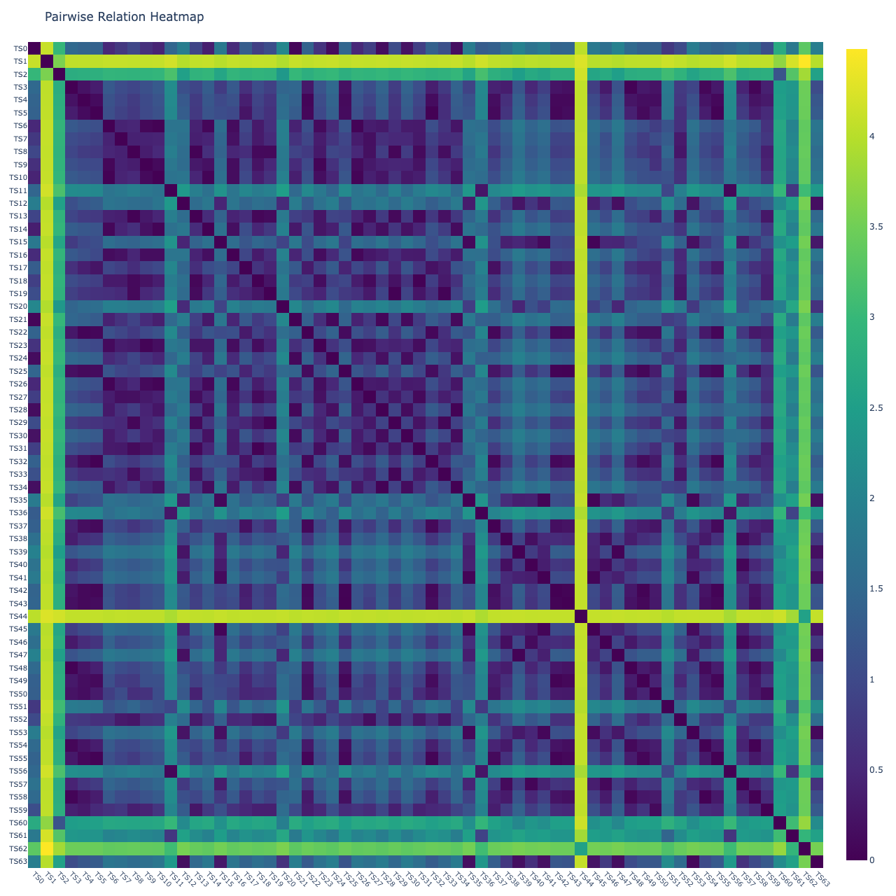

### Clustered

``` python
plot_clustered_pr_heatmap(
    Xopera, 
    alignment_type='fastdtw', 
    gamma=1, 
    normalize='log', 
    n_jobs=8
)
```

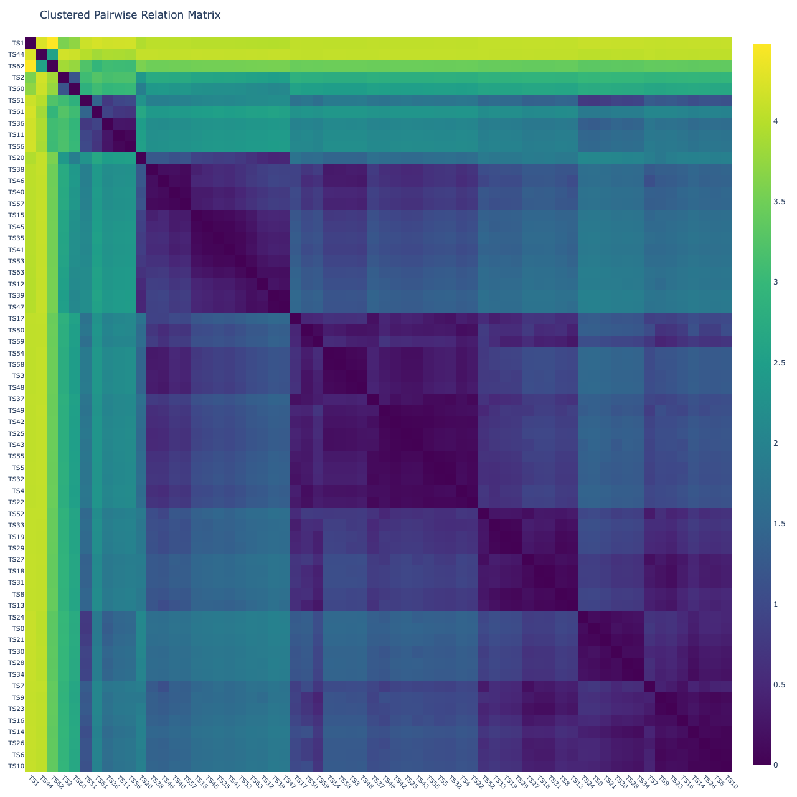

## Geometry ot the Pairwise Embedding

### Projection of the pairwise embedding into a low-dimensional space

``` python
plot_pr_projection(
    Xopera0, 
    Xopera1, 
    alignment_type='fastdtw', 
    gamma=1, 
    projection='pca', 
    transformation='minmax', 
    normalize='z-score', 
    n_jobs=8, 
    dimensions=3
)
```

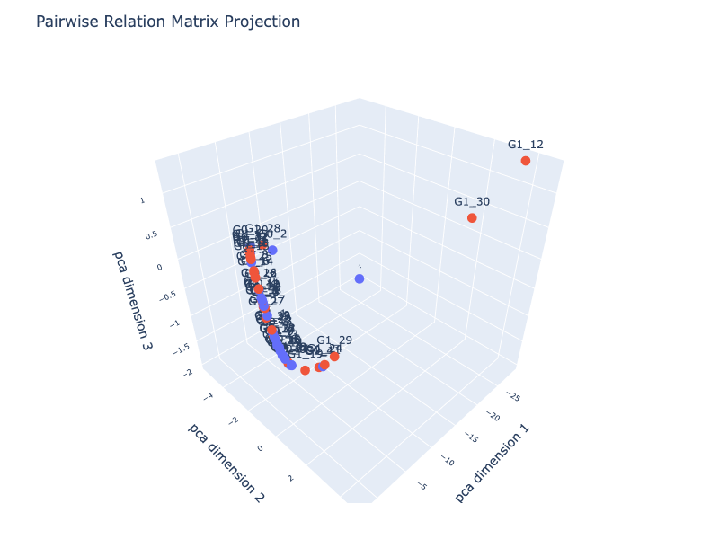

### Singular value decomposition of the pairwise embedding

``` python
U, S, Vt = svd_pr(
    Xopera, 
    alignment_type='fastdtw', 
    gamma=1, 
    transformation='minmax', 
    normalize='z-score', 
    n_jobs=8
)
```

``` python
import matplotlib.pyplot as plt
```

``` python
plt.figure(figsize=(6, 4))
plt.semilogy(S, marker='o', linewidth=1.5)
plt.xlabel("Index")
plt.ylabel("Singular value (log scale)")
plt.title("Singular-value spectrum (log scale)")
plt.grid(True, alpha=0.3)
plt.tight_layout()
plt.show()
```

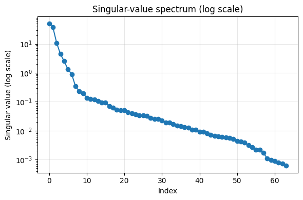

## Clusters of Embeddings

``` python
from fhemb.utils.cutils import compute_silhouette_vs_k, plot_silhouette_curves
```

### Number of clusters in the first segment

``` python
results0 = defaultdict(dict)

for i in [0, 50, 100, 150]:       
    result =compute_silhouette_vs_k(
        emb0,                         # the embedding object (EmbeddingCollection) that contains the time series to cluster 
        interval=(i,i+100),           # the interval of frames to cluster
        normalize=False,              # to normalize the time series before clustering (`minmax` or `meanvar`)
        metric='dtw',                 # Distance metric for clustering in K-means algorithm.
        max_k=10,                     # maximum number of clusters to evaluate 
        max_iter=10,                  # maximum number of iterations for K-means algorithm
        random_state=0,               # random state for K-means algorithm
        n_jobs=8                      # number of parallel jobs
    )
    results0[i]=result                 # store results in dictionary for later plotting
```

``` python
plot_silhouette_curves(
    results0,                                            # dictionary of silhouette results for different intervals
    labels=['0-100', '50-150', '100-200', '150-250'],    # labels for each interval
    show_best = True,                                    # whether to highlight the best silhouette score across intervals
    filepath='emb0'                                      # filepath for saving the plot  
)
```

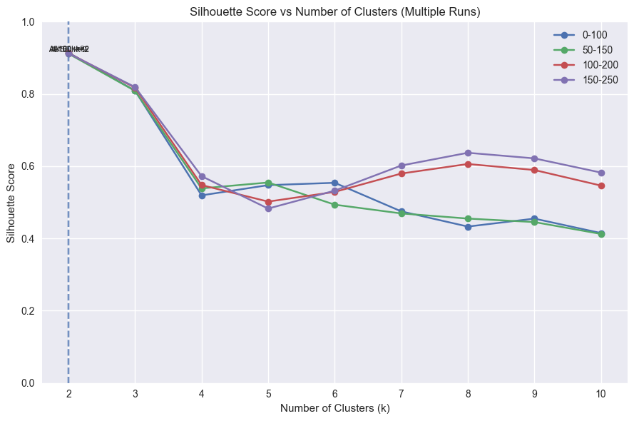

### Number of clusters in the second segment

``` python
cluster0_t = defaultdict(dict)

keys = [  
    "clusters_subj",
    "subj_clusters",
    "labels",
    "silhouette",
    "centroids",
]

for i in [0, 50, 100, 150]:
    _values = dtw_clustering(
        emb0,                        # the embedding object (EmbeddingCollection) that contains the time series to cluster
        interval=(i,i+100),          # the interval of frames to cluster
        normalize=False,             # whether to normalize the time series before clustering
        metric = "dtw",              # the distance metric for clustering
        n_clusters=4,                # the number of clusters to form
        max_iter=15,                 # the maximum number of iterations for the K-means algorithm
        random_state=0               # the random state for reproducibility
    )

    cluster0_t[i] = dict(zip(keys, _values))  # store results in dictionary for later analysis and plotting
```

``` python
results1 = defaultdict(dict)

for i in [0, 50, 100, 150]:       
    result =compute_silhouette_vs_k(
        emb1,                         # the embedding object (EmbeddingCollection) that contains the time series to cluster 
        interval=(i,i+100),           # the interval of frames to cluster
        normalize=False,              # to normalize the time series before clustering (`minmax` or `meanvar`)
        metric='dtw',                 # Distance metric for clustering in K-means algorithm.
        max_k=10,                     # maximum number of clusters to evaluate 
        max_iter=10,                  # maximum number of iterations for K-means algorithm
        random_state=0,               # random state for K-means algorithm
        n_jobs=8                      # number of parallel jobs
    )
    results1[i]=result                 # store results in dictionary for later plotting
```

``` python
plot_silhouette_curves(
    results1,                                             # dictionary of silhouette results for different intervals
    labels=['0-100', '50-150', '100-200', '150-250'],    # labels for each interval
    show_best = True,                                    # whether to highlight the best silhouette score across intervals
    filepath='emb1'                       # filepath for saving the plot  
)
```

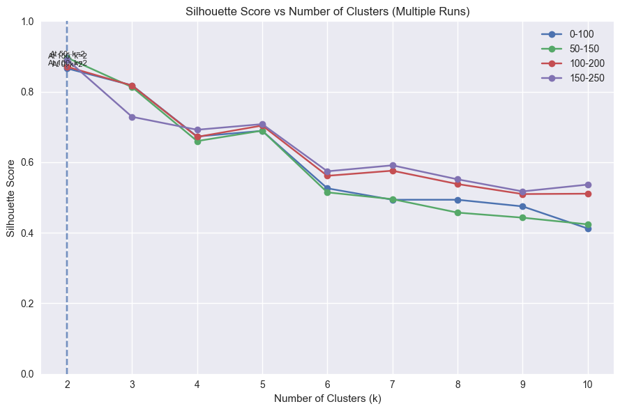

``` python
cluster1_t = defaultdict(dict)

keys = [  
    "clusters_subj",
    "subj_clusters",
    "labels",
    "silhouette",
    "centroids",
]

for i in [0, 50, 100, 150]:
    _values = dtw_clustering(
        emb1,                        # the embedding object (EmbeddingCollection) that contains the time series to cluster
        interval=(i,i+100),          # the interval of frames to cluster
        normalize=False,             # whether to normalize the time series before clustering
        metric = "dtw",              # the distance metric for clustering
        n_clusters=4,                # the number of clusters to form
        max_iter=15,                 # the maximum number of iterations for the K-means algorithm
        random_state=0               # the random state for reproducibility
    )

    cluster1_t[i] = dict(zip(keys, _values))  # store results in dictionary for later analysis and plotting
```

### Cluster visualization

``` python
from nbdev_fhemb.piece_ex import dg0    # The `Piece` object that contains the original time series data and metadata for the first subject in the dataset. 
                                        # This is used for visualizing the clustered time series in the next step.
```

``` python
for frame, clusters in cluster0_t.items():     # iterate over each interval and its corresponding clustering results
    depict_clusters(
        clusters['clusters_subj'],             # the cluster assignments for each time series in the interval
        dg0.face_t.position.features_tint,     # the coordinates of the subject positions corresponding to the time series
        frame=frame+50                         # the frame number to visualize (the interval center)
    )
```

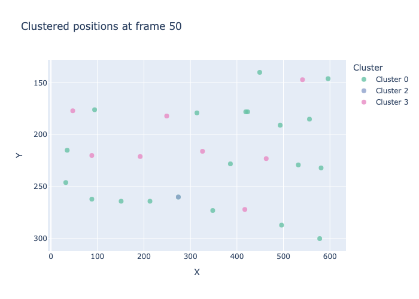

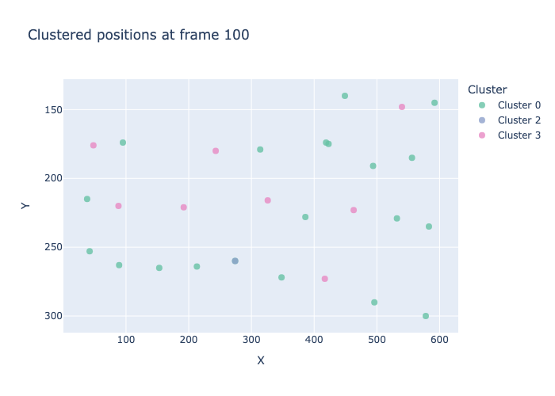

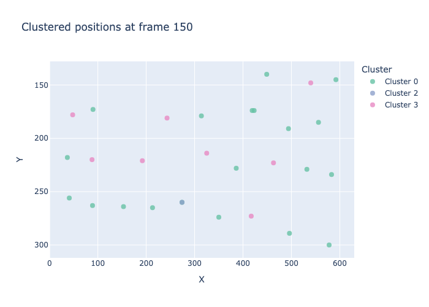

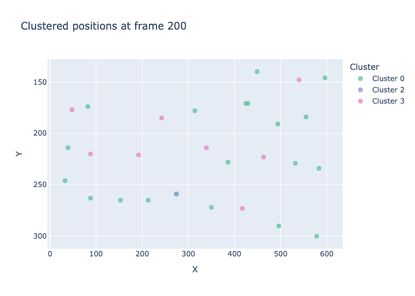

``` python
for frame, clusters in cluster1_t.items():     # iterate over each interval and its corresponding clustering results
    depict_clusters(
        clusters['clusters_subj'],             # the cluster assignments for each time series in the interval
        dg0.face_t.position.features_tint,     # the coordinates of the subject positions corresponding to the time series
        frame=frame+50                        # the frame number to visualize (the interval center)
    )
```

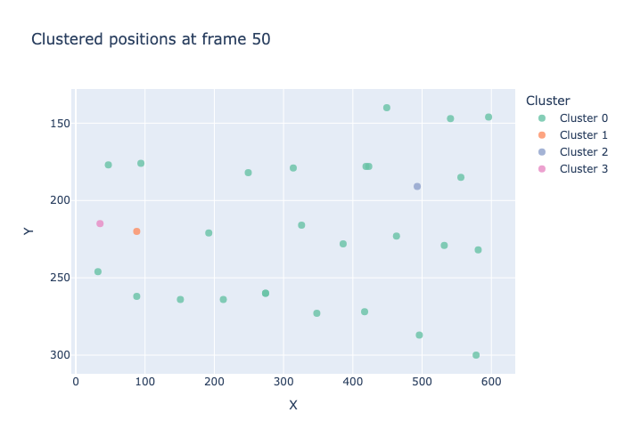


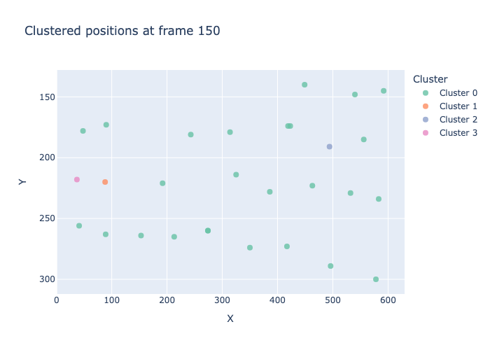


