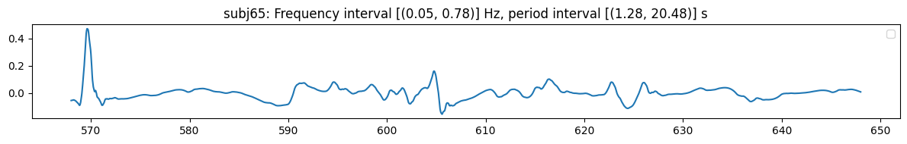
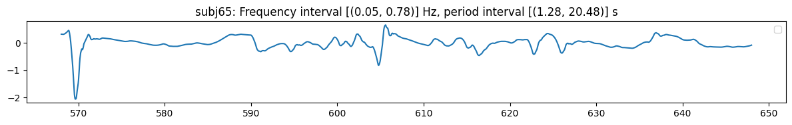
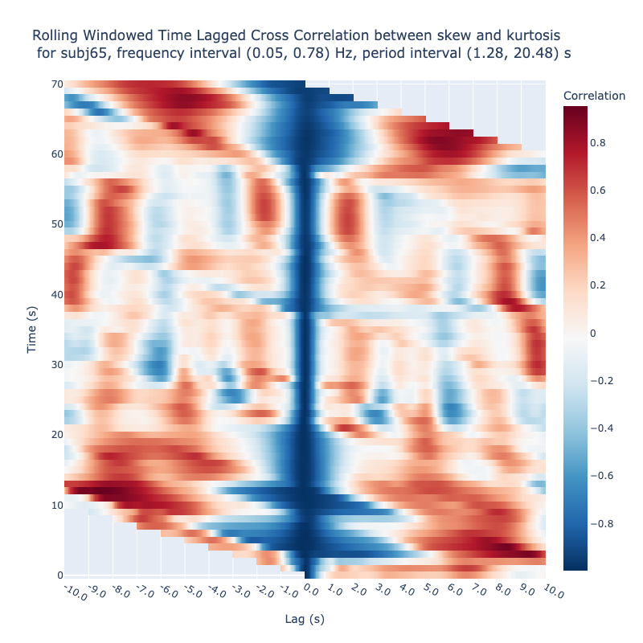
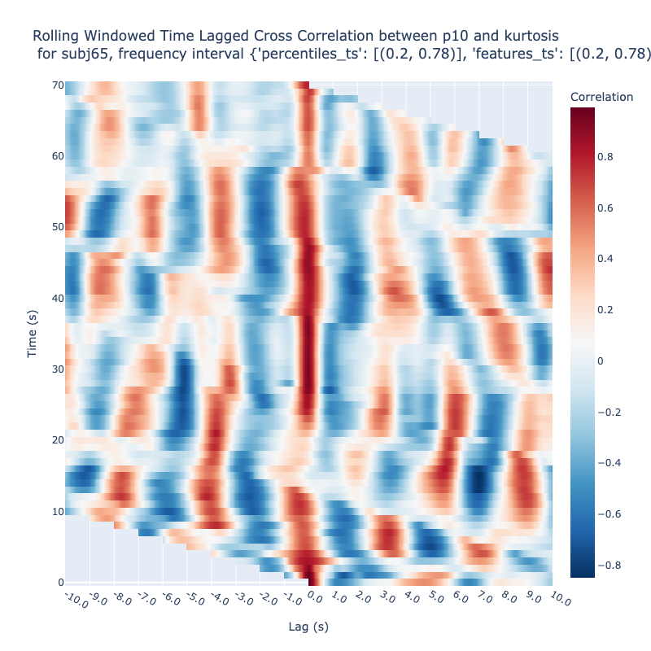
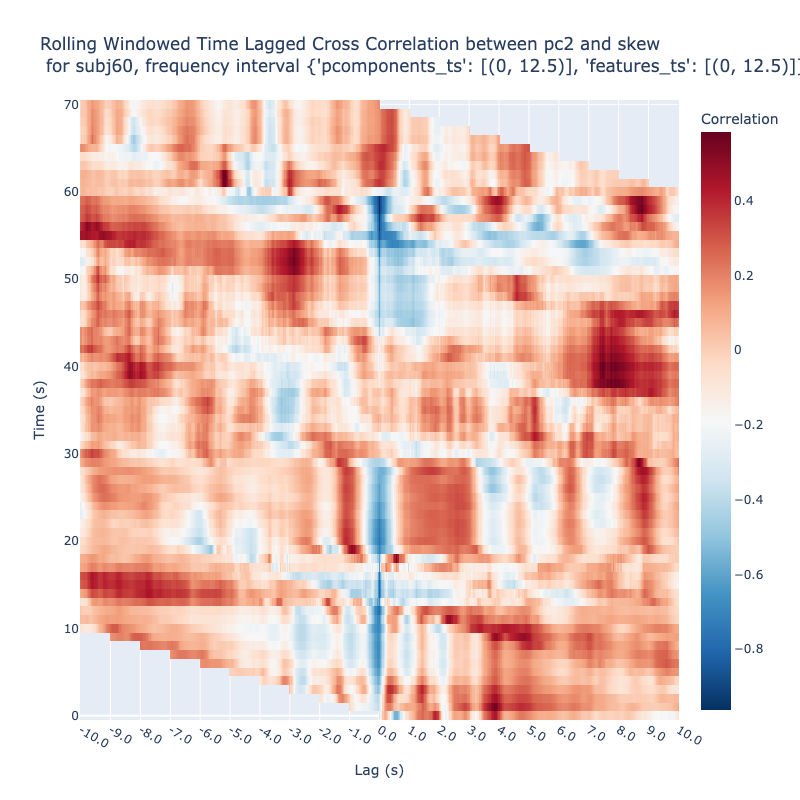
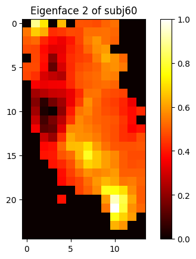

# Facial Heatmap Time Series Appear to be Constrained in a Highly
Specific Way


<!-- WARNING: THIS FILE WAS AUTOGENERATED! DO NOT EDIT! -->

## Define the Opera Segment

### Define the PCA to use for embedding

``` python
pca2 = pca_factory(
    name='standard_kpca_5_sigmoid_0.07', 
    scaler='Standard', 
    pca='Kernel',
    scaler_kwargs=dict(with_std=True), 
    pca_kwargs=dict(n_components=5, kernel='sigmoid', gamma=0.07, fit_inverse_transform=True)
)
```

``` python
pca8 = pca_factory(
    name='robust_kpca_5_linear_1', 
    scaler='Robust', 
    pca='Kernel',
    scaler_kwargs=dict(), 
    pca_kwargs=dict(n_components=5, kernel= 'linear', gamma=1, fit_inverse_transform=True) # gamma=0.008
)
```

## Define the 1D Embeddings

> skew and kurtosis in the frequency band 0.05 - 0.78 Hz of the
> daubechies wavelet `db4`

``` python
dg0 = Piece(title='Don Giovanni', time_interval=(14200,16200), subjs=[(60,70)])
```

``` python
dg0.face_t.project(features=['skew'], subjs=[65], fbands=[1,2,3,4], wdfactory=wfactory('db4',8)).frequencies
```

    [(0.05, 0.78)]

``` python
dg0.face_t.project(features=['skew'], subjs=[65], fbands=[1,2,3,4], wdfactory=wfactory('db4',8)).plot_signal(subjs=[65])
```



    (<Figure size 1200x200 with 1 Axes>,
     [<Axes: title={'center': 'subj65: Frequency interval [(0.05, 0.78)] Hz, period interval [(1.28, 20.48)] s'}>])

``` python
dg0.face_t.project(features=['kurtosis'], subjs=[65], fbands=[1,2,3,4], wdfactory=wfactory('db4',8)).plot_signal(subjs=[65])
```



    (<Figure size 1200x200 with 1 Axes>,
     [<Axes: title={'center': 'subj65: Frequency interval [(0.05, 0.78)] Hz, period interval [(1.28, 20.48)] s'}>])

## Visualize the Lagged Cross-Correlations in Various Frequency Bands

### Kurtosis vs Skew

``` python
dg0.face_t.project(
    subjs=[65],
    features=['kurtosis', 'skew'],
    fbands=[1,2,3,4],
    wdfactory=wfactory('db4',8),
    pcfactory=pca2,
).plot_lagged_correlations(
    twin=250,
    step=25,
    max_lag=250,
    n_jobs=8
)
```



### 10th Percentile vs Kurtosis

``` python
dg0.face_t.project(
    subjs=[65],
    features=['p10', 'kurtosis'],
    fbands=[3,4],
    wdfactory=wfactory('db4',8),
    pcfactory=pca2,
).plot_lagged_correlations(
    twin=250,
    step=25,
    max_lag=250,
    n_jobs=8
)
```



### Skew vs 2nd Eigenface

``` python
dg0.face_t.project(
    subjs=[60],
    features=['skew', 'pc2'],
    fbands=[0,1,2,3,4,5,6,7,8], 
    wdfactory=wfactory('db4',8),
    pcfactory=pca8 # robust_kpca_5_linear_1
).plot_lagged_correlations(
    twin=250,
    step=25,
    max_lag=250, 
    n_jobs=8    
)
```



### Visualize the 2nd Eigenface

``` python
dg0.face_t.create_pca_embedding(factory=pca8)[0].visualize_eigenfaces(subjs=[60], components=[2])
```



    {'subj60': [<Figure size 640x480 with 2 Axes>]}
