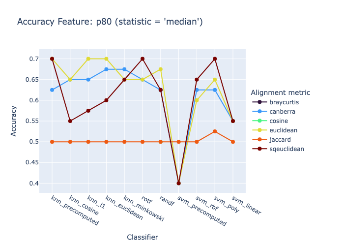

# Synchronization Classification of Signals of Individual Faces


<!-- WARNING: THIS FILE WAS AUTOGENERATED! DO NOT EDIT! -->

## Define Segments of the Opera

``` python
fftrio_segment0 = (14200, 14450)
fftrio_segment1 = (14950, 15200)
```

``` python
fftrio0 = Piece(
    time_interval=fftrio_segment0,
    title="Don Giovanni", 
    subjs=(40,76)
)
```

``` python
fftrio1 = Piece(
    time_interval=fftrio_segment1,
    title="Don Giovanni", 
    subjs=(40,76)
)
```

``` python
FFTRIO01_DIRNAME = 'fftrio0_fftrio1/'
```

``` python
dirname = FFTRIO01_DIRNAME + 'face_db4_fast_minmax(2,3)'
```

## Define Embeddings

> 80th percentile in the frequency band 0.1 - 0.39 Hz of the Daubechies
> wavelet `db4`

``` python
emb0 = fftrio0.face_t.project(  
    fbands=[2,3],
    features=['p80'],
    wdfactory=wfactory('db4',8)
)

emb1 = fftrio1.face_t.project(  
    fbands=[2,3],
    features=['p80'],
    wdfactory=wfactory('db4',8)
)
```

``` python
emb0.frequencies
```

    [(0.1, 0.39)]

``` python
from fhemb.utils.cutils import prepare_data, calc_and_save_pr_accuracy, plot_accuracy_summary
```

## Synchronization Classification of Pairwise Relation (Secondary) Embeddings

``` python
for feature in emb0.features:                                        #
                                          # iterate over this list of features of the Embedding object 
    print(f"Feature: {feature}")
    X, y = prepare_data(                  # prepare the matrix X and label vector y for the two groups
        emb0.get_df_ts_subjs(feature).T,  # samples for group 0
        emb1.get_df_ts_subjs(feature).T   # samples for group 1
    )
    print(f"Shape: {X.shape}")            # matrix (n_samples x n_dataframes)
    filename=calc_and_save_pr_accuracy(   # compute the classification accuracy across multiple classifiers and primary embeddings, save results to Excel file and return the filename  
        X[y==0],                          # group 0
        X[y==1],                          # group 1
        dirname=dirname,                  # directory in which the results Excel file will be stored
        alignment_type='fastdtw',         # alignment method for distance matrix computation
        normalize='minmax',               # normalize after splitting the data into train and test sets
        radius=1,                         # refinement window size in fastdtw (only used for fastdtw)
        feature=feature,                  # feature name for labeling the results
        random_states=10,                 # number of random states for train/test splits in classification
        njobs=8                           # number of jobs for parallelization
    )
    print(f"Saved results to: {filename}")
```

    Feature: p80
    Shape: (64, 250)

    Saved results to: /Users/radned/Projects/ttsembedding/fftrio0_fftrio1/face_db4_fast_minmax(2,3)/acc_summ_p80.xlsx

``` python
COLUMNS_FILTER=[                     # list of classifier columns to include in the visualization
        'knn_precomputed', 
        'knn_cosine', 
        'knn_l1', 
        'knn_euclidean', 
        'knn_minkowski', 
        'rotf', 
        'randf', 
        'svm_precomputed', 
        'svm_rbf', 
        'svm_poly', 
        'svm_linear'
    ]
```

``` python
plot_accuracy_summary(                  # visualize the `statistics` of the classification accuracy of multiple classifiers (`column_filter`) across `features` 
    dirname,                            # directory from which the results are loaded
    features=['p80'],                   # the features of the primary embeddings for which the accuracy will be visualized      
    statistics='median',                # statistic to aggregate accuracy across multiple random states ('median', 'mean', 'std', 'iqr')
    columns_filter=COLUMNS_FILTER,      # list of classifier columns to include in the visualization (e.g., ['knn_precomputed', 'svm_rbf'])
);
```



## Synchronization Classification of Primary Embeddings

``` python
from dvae.classifier import VAEClassifier
```

    Is cuda available? False
    Cuda device count: 0
    Using device: cpu
    Pyro version: 1.9.1

``` python
clf = VAEClassifier(
    feature_dim=250,
    z_dim=80,
    hidden_dim=80,
    alpha1=1e-5,
    alpha2=1,
    beta=1e-2,
    corruption=0.0,
    seed=42,
)
```

``` python
X_all, y_all = prepare_data(                  # prepare the matrix X and label vector y for the two groups
        emb0.get_df_ts_subjs(feature).T,  # samples for group 0
        emb1.get_df_ts_subjs(feature).T   # samples for group 1
    )
```

``` python
from fhemb.utils.cutils import split_scale_data
```

``` python
X_train, X_test, y_train, y_test, _ = split_scale_data(
    X_all, 
    y_all,
    test_size=0.3, 
    random_state=0, 
    normalize='meanvar'
)
```

``` python
y_pred = clf.fit_predict_on(X_train.squeeze(), y_train.squeeze(), X_test.squeeze(), num_epochs=2000)
```

``` python
from fhemb.utils.cutils import calc_similarity
```

``` python
calc_similarity(y_test, y_pred, sim_metric='f1')
```

    0.7493734335839599

``` python
calc_similarity(y_test, y_pred, sim_metric='accuracy')
```

    0.75

<div>

> **Classification Accuracy**
>
> DVAE embeddings remain more linearly and locally separable than
> secondary (pairwise‑relation) embeddings across both KNN and SVM
> families. This means the identity manifold is stronger and more
> coherent than the relation manifold. In both cases, accuracy is far
> above the 50 % chance level!

</div>
