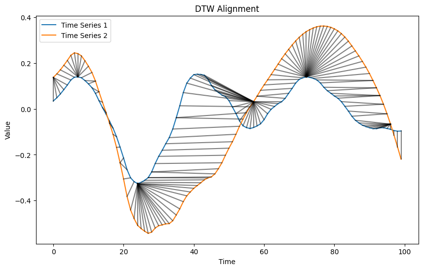
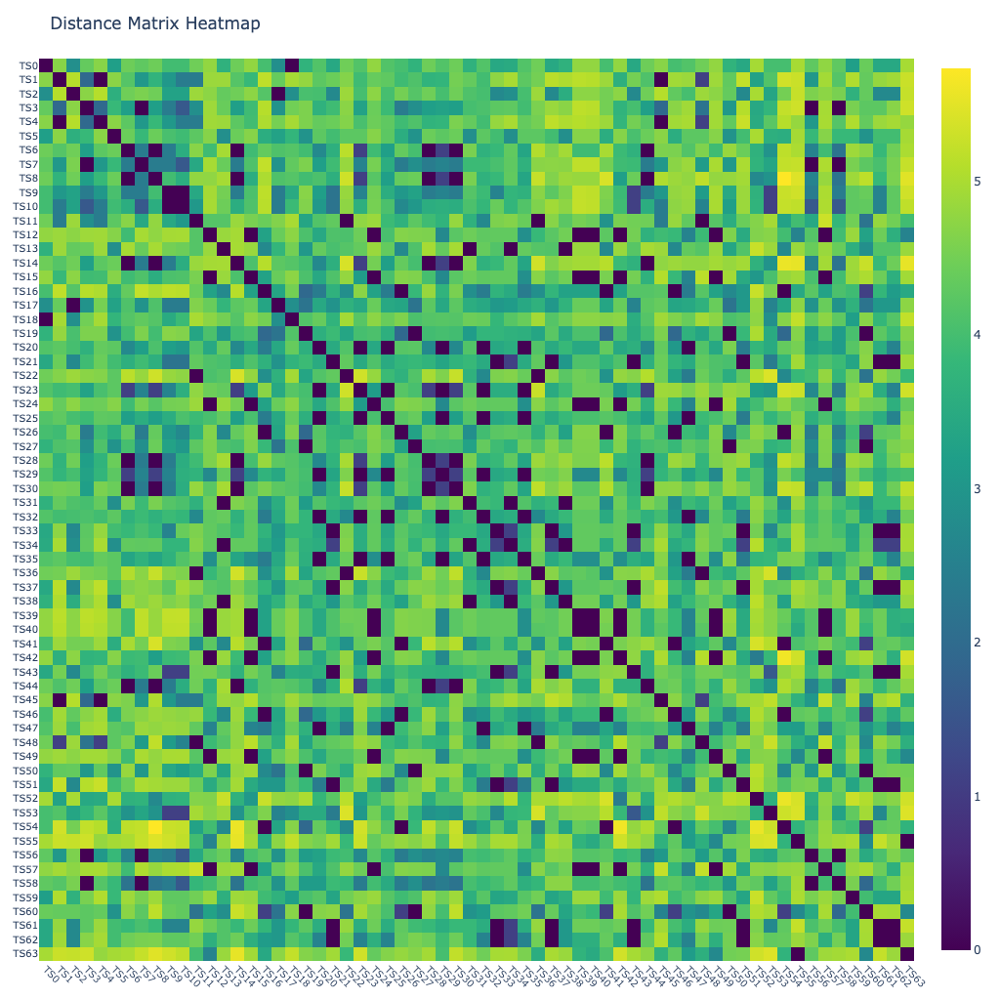
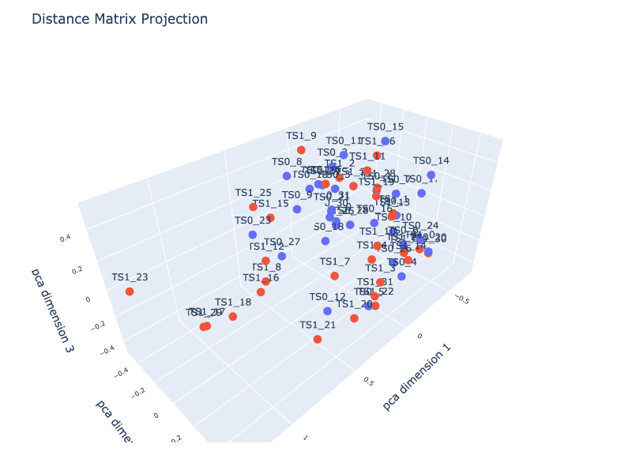
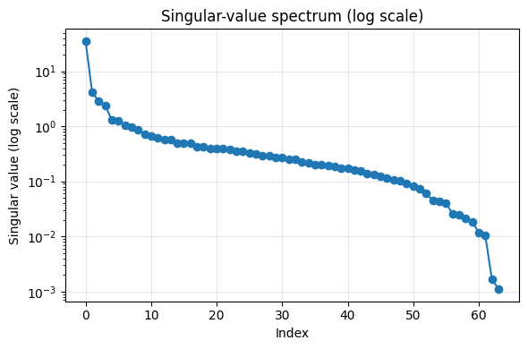
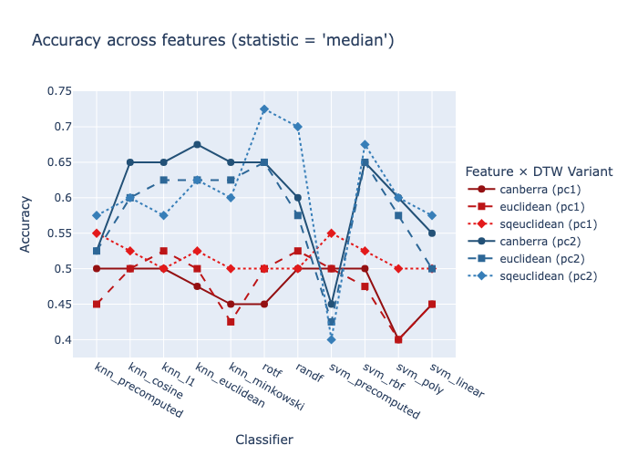
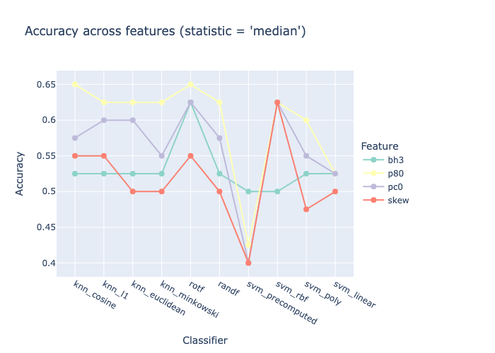

# Dynamic Time Warping


<!-- WARNING: THIS FILE WAS AUTOGENERATED! DO NOT EDIT! -->

``` python
from fhemb.utils.cutils import depict_DTW, calc_dtw_accuracy, prepare_data, plot_dm_heatmap, plot_dm_projection, svd_dmatrix, depict_accuracy
```

``` python
from nbdev_fhemb.wreconstruction_ex import emb_prj_decomp_rec1
```

## DTW Alignment

> is based on distance metrics

``` python
from scipy.spatial.distance import (
    euclidean, 
    cityblock, 
    cosine, 
    mahalanobis, 
    sqeuclidean, 
    chebyshev, 
    minkowski, 
    braycurtis, 
    canberra, 
    correlation, 
    jaccard, 
    hamming
)
```

<div>

> **Distance metrics for DTW — What they measure**
>
> DTW can operate with different point‑wise distance metrics, each
> defining how local differences between two time‑series samples are
> evaluated. Choosing a metric determines what “local similarity” means
> inside DTW, allowing the clustering to emphasize amplitude, shape,
> correlation, or categorical differences depending on the application.

</div>

<div>

> **Choosing a Distance Metric for DTW**
>
> Different metrics emphasize different aspects of local similarity
> inside DTW:
>
> - **euclidean** / **sqeuclidean** - best when absolute amplitude
>   differences matter
> - **cityblock** / **minkowski** - robust to outliers; good for
>   piecewise‑linear or sparse changes
> - **cosine** / **correlation** - focus on shape rather than magnitude;
>   useful when scaling varies
> - **chebyshev** - highlights the single largest deviation; good for
>   threshold‑type signals
> - **braycurtis** / **canberra** - emphasize relative changes; useful
>   when values vary across orders of magnitude
> - **hamming** / **jaccard** - for categorical or binary time series
> - **mahalanobis** - accounts for covariance structure when dimensions
>   are correlated
>
> Selecting a metric determines whether DTW prioritizes amplitude,
> shape, relative variation, or categorical differences, allowing the
> clustering to match the structure of your data.

</div>

### DTW alignment between two time series

``` python
depict_DTW(
    emb_prj_decomp_rec1.get_df_ts_subjs('pc0')['pcomponents_ts']['subj50'][:100], 
    emb_prj_decomp_rec1.get_df_ts_subjs('pc0')['pcomponents_ts']['subj51'][:100],
    dist=euclidean
)
```



<div>

> **DTW alignment of embeddings - What it shows**
>
> DTW alignment reveals similarity even if events occur a bit earlier or
> later across synchronized time series.

</div>

### DTW alignment between multiple time series

> A non‑clustered distance‑matrix heatmap shows the raw pairwise DTW
> distances between synchronized time series, in their original
> ordering.

``` python
from nbdev_fhemb.module_functions_ex import Xdm
```

``` python
plot_dm_heatmap(
    Xdm,                       # data matrix (64 x timesteps) 
    alignment_type='fastdtw',  # 'dcor', 'fastdtw'(euclidean), 'tslearn_dtw'(euclidean), 'soft_dtw'(sqeuclidean), 'soft_dtw_div'
    dist=cosine,               # distance metric function used inside fastdtw
    radius=10,                 # refinement window size in fastdtw
    normalize='log',           # normalization method for distance matrix
    n_jobs=8,                  # number of jobs for parallelization
    base_size=16               # base pixel size
)
```



<div>

> **Non‑clustered heatmap diagnostics (Synchronized time series)**
>
> It helps assess whether the dataset contains meaningful similarity
> structure before clustering:
>
> - **Uniform appearance** (no visible structure): All time series
>   behave similarly or differences are weak; clustering may not reveal
>   strong groups.
> - **Clear stripes** (horizontal or vertical): A specific time series
>   is consistently different from all others — an outlier or atypical
>   subject/channel.
> - **Gradients or smooth transitions along the diagonal**: The ordering
>   of the time series reflects a systematic progression (e.g., subjects
>   sorted by condition, intensity).
> - **Patchy or noisy texture**: Indicates heterogeneous data quality or
>   inconsistent preprocessing across time series.
> - **Large global brightness**: Distances are high overall — time
>   series differ strongly; normalization or scaling may need
>   adjustment.
> - **Symmetry check**: The matrix must be symmetric; deviations
>   indicate metric or implementation issues.
>
> This view reveals whether synchronized time series naturally separate
> into similarity groups, contain outliers, or require preprocessing
> adjustments before clustering.

</div>

<div>

> **Diagonal values**
>
> When the radius is very small (e.g.,  ≪ 10), FastDTW restricts the
> warping window too aggressively. This can force suboptimal alignments,
> causing unusually large diagonal values in the local cost matrix.
> These spikes are an artefact of the FastDTW approximation rather than
> properties of the underlying data.

</div>

<div>

> **Landmark embedding**
>
> The DTW distance matrix is computed over embedded time series
> (*primary embedding*). A row of this matrix defines a *landmark
> embedding*: the vector of DTW dissimilarities from a given embedded
> time series to all other embedded time series. Thus, the landmark
> embedding is a second‑order embedding determined jointly by the
> primary embedding and by the DTW configuration (`alignment_type`,
> `dist`, `radius`, `normalize`).

</div>

### DTW alignment geometry

#### Distance matrix projection using a dimensionality reduction method

> provides a geometric view of how the synchronized time series relate
> to each other

``` python
plot_dm_projection(
    Xdm[:32], Xdm[32:],         # data matrices for two groups (32 x 64)
    alignment_type='fastdtw',   # alignment method for distance matrix computation           
    dist=cosine,                # distance metric function used inside fastdtw     
    projection='pca',           # projection method for dimensionality reduction ('pca', 'tsne', 'mds') 
    transformation='minmax',    # to transform distances into similarities for PCA
    normalize='log',            # normalization method for distance matrix
    n_jobs=8,                   # number of jobs for parallelization
    dimensions=3,               # number of dimensions of the projection
)
```



<div>

> **Distance-matrix projection diagnostics**
>
> Look for:
>
> - **Compact groups** → evidence of cluster structure in the underlying
>   time series
> - **Overlapping or diffuse clouds** → weak or ambiguous cluster
>   boundaries
> - **Isolated points** → outlier time series with atypical temporal
>   behavior
> - **Arcs, curves, or gradients** → continuous progression rather than
>   discrete clusters
> - **Changes across preprocessing steps** → reveals whether
>   normalization or filtering improves separability
> - **Metric comparison** → different distance metrics produce different
>   geometries; projection shows how strongly
> - **A sanity check**: it shows whether the DTW geometry contains
>   meaningful structure before applying any clustering algorithm.

</div>

#### Intrinsic dimensionality of a distance matrix via singular value decomposition (SVD)

##### Calculate singular-value spectrum

``` python
U, S, Vt = svd_dmatrix(       # returns U, S, Vt matrices from SVD of the distance matrix
    Xdm,                      # data matrix (64 x 64)
    alignment_type='fastdtw', # alignment method for distance matrix computation
    dist=cosine,              # distance metric function used inside fastdtw
    radius=2,                 # refinement window size in fastdtw
    transformation='minmax',  # to transform distances into similarities for SVD
    normalize='log',          # normalization method for distance matrix
    n_jobs=8                  # number of jobs for parallelization
)
```

<div>

> **svd_matrix**
>
> `svd_matrix(X, alignment_type, gamma, transformation, normalize, n_jobs)`  
> Computes a **low‑rank decomposition** of a distance‑based similarity
> matrix using **Singular Value Decomposition (SVD)**.  
> This function helps analyze the structure of the similarity geometry
> and estimate the **intrinsic dimensionality** of the dataset.
>
> **Pipeline** 1. Compute pairwise distances using `alignment_type`
> (e.g., `fastdtw`).  
> 2. Convert distances into similarities using `transformation` (e.g.,
> `gauss`, `invert`, `minmax`).  
> 3. Optionally normalize time series using `normalize`.  
> 4. Apply SVD to the resulting similarity matrix
>    *K* = *U**Σ**V*<sup>⊤</sup>
>
> **Returns** - `U` — left singular vectors  
> - `S` — singular values  
> - `Vt` — right singular vectors
>
> **Interpretation** - Singular values `S` quantify how much structure
> each latent dimension explains.  
> - Their decay provides a practical estimate of the **intrinsic
> dimension** of the similarity space:  
> - sharp drop → low intrinsic dimension  
> - gradual decay → diffuse or noisy structure  
> - Conceptually similar to PCA, but applied directly to the
> **similarity matrix** rather than centered feature data.
>
> **Use cases** - Inspecting geometric structure before embedding  
> - Choosing the number of PCA/MDS components  
> - Detecting noise vs. signal in distance‑based representations  
> - Low‑rank smoothing or compression of similarity matrices

</div>

##### Visualize the singular-value spectrum

> The vector S contains the singular values returned by the SVD. By
> convention, these values are sorted in descending order, so the first
> one corresponds to the dominant singular value and subsequent entries
> decrease monotonically.

``` python
import matplotlib.pyplot as plt
```

``` python
plt.figure(figsize=(6, 4))
plt.semilogy(S, marker='o', linewidth=1.5)
plt.xlabel("Index")
plt.ylabel("Singular value (log scale)")
plt.title("Singular-value spectrum (log scale)")
plt.grid(True, alpha=0.3)
plt.tight_layout()
plt.show()
```



<div>

> **Intrinsic Dimensionality**
>
> The singular-value spectrum exhibits a sharp decay after the first
> four components. This indicates that the matrix is well-approximated
> by a rank‑4 model, and that the intrinsic dimensionality of the
> similarity structure is approximately four. Components beyond the
> fourth lie near the noise floor and contribute minimally to the
> geometry of the space.

</div>

## Classification Accuracy

> of a binary classification problem. A class contains landmark
> embeddings (rows in a DTW distance matrix) of time series that are
> synchronized, i.e., belong to the same segment the underlying
> `Datasource` object.

<div>

> **Classification accuracy**
>
> Accuracy quantifies how well a binary classifier distinguishes between
> two classes of synchronized time‑series embeddings. Each class
> contains *landmark embeddings* of time series that originate from the
> same segment of the underlying `Datasource` object. High accuracy
> indicates that the embeddings preserve class‑specific temporal
> structure strongly enough for a simple classifier to separate the two
> groups.

</div>

<div>

> **Landmark embeddings**
>
> Landmark embeddings arise from a two‑stage process:
>
> 1.  Primary embeddings (`features`) are aligned by
>     `alignment_type`/`dtw_type` DTW wrt. a distance metrics
>     `dist`/`dtw_filters`.
> 2.  The resulting alignment defines the geometric mapping used to
>     construct the landmark embeddings.

</div>

#### The primary embedding `features`

``` python
emb_prj_decomp_rec1.features
```

    {'percentiles_ts': ('p20', 'p80'),
     'binheights_ts': ('bh1', 'bh2', 'bh3'),
     'pcomponents_ts': ('pc0', 'pc1', 'pc2'),
     'features_ts': ('skew', 'kurtosis')}

### Calculate and store

#### Soft DTW

> uses the squared Euclidean distance as a similarity metric when
> computing the distance matrix

``` python
dirname_soft = 'dtw_accuracy' + '_emb_prj_decomp_rec1' + '_soft_minmax'
```

``` python
for embedding, features in emb_prj_decomp_rec1.features.items():   # iterate over all features of the EmbeddingCollection object 
    for feature in features:                                       # 
        print(f"Embedding: {embedding}, Feature: {feature}")
        X, y = prepare_data(                                                        # prepare the matrix X and label vector y for the two groups
            emb_prj_decomp_rec1.get_df_ts_subjs(feature)[embedding].iloc[:500].T,   # first 500 samples for group 0
            emb_prj_decomp_rec1.get_df_ts_subjs(feature)[embedding].iloc[500:].T    # last 500 samples for group 1
        )
        print(f"Shape: {X.shape}")    # matrix (n_samples x n_dataframes)
        filename=calc_dtw_accuracy(   # compute the classification accuracy across multiple classifiers and primary embeddings, save results to Excel file and return the filename 
            X[y==0],                  # group 0
            X[y==1],                  # group 1
            dirname=dirname_soft,     # directory in which the results Excel file will be stored
            dtw_type='soft_dtw',      # alignment method for distance matrix computation
            normalize='minmax',       # normalization method for distance matrix
            feature=feature,          # feature name for labeling the results
            random_states=10          # number of random states for train/test splits in classification    
        )
        print(f"Saved results to: {filename}")
```

    Embedding: percentiles_ts, Feature: p20
    Shape: (64, 500)

    Saved results to: /Users/radned/Projects/ttsembedding/dtw_accuracy_emb_prj_decomp_rec1_soft_minmax/acc_summ_p20.xlsx
    Embedding: percentiles_ts, Feature: p80
    Shape: (64, 500)

    Saved results to: /Users/radned/Projects/ttsembedding/dtw_accuracy_emb_prj_decomp_rec1_soft_minmax/acc_summ_p80.xlsx
    Embedding: binheights_ts, Feature: bh1
    Shape: (62, 500)

    Saved results to: /Users/radned/Projects/ttsembedding/dtw_accuracy_emb_prj_decomp_rec1_soft_minmax/acc_summ_bh1.xlsx
    Embedding: binheights_ts, Feature: bh2
    Shape: (62, 500)

    Saved results to: /Users/radned/Projects/ttsembedding/dtw_accuracy_emb_prj_decomp_rec1_soft_minmax/acc_summ_bh2.xlsx
    Embedding: binheights_ts, Feature: bh3
    Shape: (64, 500)

    Saved results to: /Users/radned/Projects/ttsembedding/dtw_accuracy_emb_prj_decomp_rec1_soft_minmax/acc_summ_bh3.xlsx
    Embedding: pcomponents_ts, Feature: pc0
    Shape: (64, 500)

    Saved results to: /Users/radned/Projects/ttsembedding/dtw_accuracy_emb_prj_decomp_rec1_soft_minmax/acc_summ_pc0.xlsx
    Embedding: pcomponents_ts, Feature: pc1
    Shape: (64, 500)

    Saved results to: /Users/radned/Projects/ttsembedding/dtw_accuracy_emb_prj_decomp_rec1_soft_minmax/acc_summ_pc1.xlsx
    Embedding: pcomponents_ts, Feature: pc2
    Shape: (64, 500)

    Saved results to: /Users/radned/Projects/ttsembedding/dtw_accuracy_emb_prj_decomp_rec1_soft_minmax/acc_summ_pc2.xlsx
    Embedding: features_ts, Feature: skew
    Shape: (64, 500)

    Saved results to: /Users/radned/Projects/ttsembedding/dtw_accuracy_emb_prj_decomp_rec1_soft_minmax/acc_summ_skew.xlsx
    Embedding: features_ts, Feature: kurtosis
    Shape: (64, 500)

    Saved results to: /Users/radned/Projects/ttsembedding/dtw_accuracy_emb_prj_decomp_rec1_soft_minmax/acc_summ_kurtosis.xlsx

#### FastDTW

> uses various distance metrics as a similarity metric when computing
> the distance matrix

``` python
dirname_fast = 'dtw_accuracy' + '_emb_prj_decomp_rec1' + '_fast_minmax'
```

``` python
for embedding, features in emb_prj_decomp_rec1.features.items():    #                 
    for feature in features:                                        #
        if feature in ['pc1', 'pc2']:                               # iterate over this list of features of the EmbeddingCollection object 
            print(f"Embedding: {embedding}, Feature: {feature}")
            X, y = prepare_data(                                                      # prepare the matrix X and label vector y for the two groups
                emb_prj_decomp_rec1.get_df_ts_subjs(feature)[embedding].iloc[:500].T, # first 500 samples for group 0
                emb_prj_decomp_rec1.get_df_ts_subjs(feature)[embedding].iloc[500:].T  # last 500 samples for group 1
            )
            print(f"Shape: {X.shape}")         # matrix (n_samples x n_dataframes)
            filename=calc_dtw_accuracy(        # compute the classification accuracy across multiple classifiers and primary embeddings, save results to Excel file and return the filename  
                X[y==0],                       # group 0
                X[y==1],                       # group 1
                dirname=dirname_fast,          # directory in which the results Excel file will be stored
                dtw_type='fastdtw',            # alignment method for distance matrix computation
                normalize='minmax',            # normalization method for distance matrix
                radius=1,                      # refinement window size in fastdtw (only used for fastdtw)
                feature=feature,               # feature name for labeling the results
                random_states=10               # number of random states for train/test splits in classification
            )
            print(f"Saved results to: {filename}")
        else:
            print(f"Skipping Embedding: {embedding}, Feature: {feature} for fastdtw")
```

    Skipping Embedding: percentiles_ts, Feature: p20 for fastdtw
    Skipping Embedding: percentiles_ts, Feature: p80 for fastdtw
    Skipping Embedding: binheights_ts, Feature: bh1 for fastdtw
    Skipping Embedding: binheights_ts, Feature: bh2 for fastdtw
    Skipping Embedding: binheights_ts, Feature: bh3 for fastdtw
    Skipping Embedding: pcomponents_ts, Feature: pc0 for fastdtw
    Embedding: pcomponents_ts, Feature: pc1
    Shape: (64, 500)

    Saved results to: /Users/radned/Projects/ttsembedding/dtw_accuracy_emb_prj_decomp_rec1_fast_minmax/acc_summ_pc1.xlsx
    Embedding: pcomponents_ts, Feature: pc2
    Shape: (64, 500)

    Saved results to: /Users/radned/Projects/ttsembedding/dtw_accuracy_emb_prj_decomp_rec1_fast_minmax/acc_summ_pc2.xlsx
    Skipping Embedding: features_ts, Feature: skew for fastdtw
    Skipping Embedding: features_ts, Feature: kurtosis for fastdtw

### Retrieve and visualize

> Accuracy of multiple classifiers on various landmark embeddings

``` python
COLUMNS_FILTER=[
        'knn_precomputed', 
        'knn_cosine', 
        'knn_l1', 
        'knn_euclidean', 
        'knn_minkowski', 
        'rotf', 
        'randf', 
        'svm_precomputed', 
        'svm_rbf', 
        'svm_poly', 
        'svm_linear'
    ]
```

``` python
depict_accuracy(                         # visualize the `statistics` of the classification accuracy of multiple classifiers (`column_filter`) across `features` and  `dtw_filter` 
    dirname_fast,                        # directory from which the results are loaded
    features=['pc2', 'pc1'],             # the features of the primary embeddings for which the accuracy will be visualized
    statistics='median',                 # statistic to aggregate accuracy across multiple random states ('median', 'mean', 'std', 'iqr')
    dtw_filter=[                         # list of DTW alignment distance metrics to include in the visualization
        'euclidean', 
        'sqeuclidean', 
        'canberra'
    ],          
    columns_filter=COLUMNS_FILTER,       # list of classifier columns to include in the visualization (e.g., ['knn_precomputed', 'svm_rbf'])
    verbose=True                         # for debugging
);
```



``` python
depict_accuracy(                             # visualize the `statistics` of the classification accuracy of multiple classifiers (`column_filter`) across `features` 
    dirname_soft,                            # directory from which the results are loaded
    features=['p80', 'bh3', 'pc0', 'skew'],  # the features of the primary embeddings for which the accuracy will be visualized      
    statistics='median',                     # statistic to aggregate accuracy across multiple random states ('median', 'mean', 'std', 'iqr')
    columns_filter=COLUMNS_FILTER,           # list of classifier columns to include in the visualization (e.g., ['knn_precomputed', 'svm_rbf'])
    verbose=True                             # for debugging
);
```


