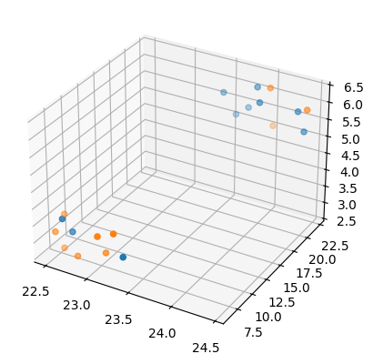
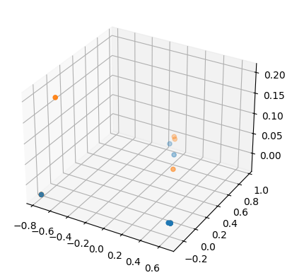
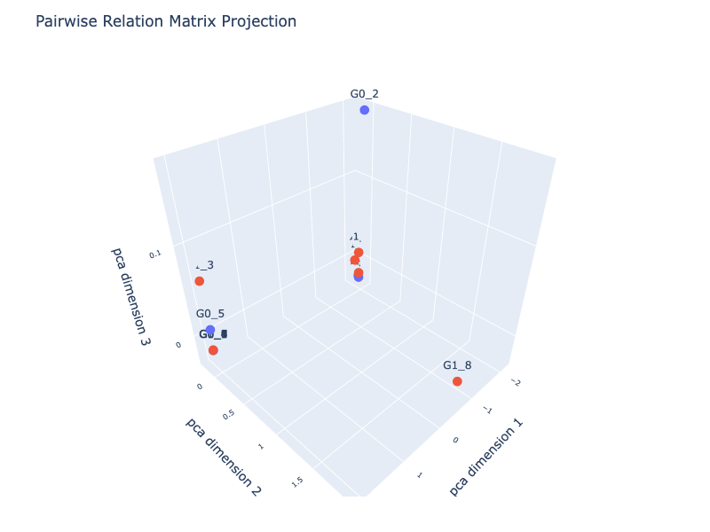

# Denoising Variational Auto-Encoder


<!-- WARNING: THIS FILE WAS AUTOGENERATED! DO NOT EDIT! -->

## Install the External Package

``` python
!pip install dvae;
```

    Requirement already satisfied: dvae in /Users/radned/.pyenv/versions/3.11.3/envs/p311.fhemb/lib/python3.11/site-packages (0.1.3)
    Requirement already satisfied: numpy<2 in /Users/radned/.pyenv/versions/3.11.3/envs/p311.fhemb/lib/python3.11/site-packages (from dvae) (1.26.4)
    Requirement already satisfied: torch==2.2.2 in /Users/radned/.pyenv/versions/3.11.3/envs/p311.fhemb/lib/python3.11/site-packages (from dvae) (2.2.2)
    Requirement already satisfied: pyro-ppl==1.9.1 in /Users/radned/.pyenv/versions/3.11.3/envs/p311.fhemb/lib/python3.11/site-packages (from dvae) (1.9.1)
    Requirement already satisfied: scikit-learn==1.7.2 in /Users/radned/.pyenv/versions/3.11.3/envs/p311.fhemb/lib/python3.11/site-packages (from dvae) (1.7.2)
    Requirement already satisfied: opt-einsum>=2.3.2 in /Users/radned/.pyenv/versions/3.11.3/envs/p311.fhemb/lib/python3.11/site-packages (from pyro-ppl==1.9.1->dvae) (3.4.0)
    Requirement already satisfied: pyro-api>=0.1.1 in /Users/radned/.pyenv/versions/3.11.3/envs/p311.fhemb/lib/python3.11/site-packages (from pyro-ppl==1.9.1->dvae) (0.1.2)
    Requirement already satisfied: tqdm>=4.36 in /Users/radned/.pyenv/versions/3.11.3/envs/p311.fhemb/lib/python3.11/site-packages (from pyro-ppl==1.9.1->dvae) (4.67.3)
    Requirement already satisfied: scipy>=1.8.0 in /Users/radned/.pyenv/versions/3.11.3/envs/p311.fhemb/lib/python3.11/site-packages (from scikit-learn==1.7.2->dvae) (1.17.1)
    Requirement already satisfied: joblib>=1.2.0 in /Users/radned/.pyenv/versions/3.11.3/envs/p311.fhemb/lib/python3.11/site-packages (from scikit-learn==1.7.2->dvae) (1.5.3)
    Requirement already satisfied: threadpoolctl>=3.1.0 in /Users/radned/.pyenv/versions/3.11.3/envs/p311.fhemb/lib/python3.11/site-packages (from scikit-learn==1.7.2->dvae) (3.6.0)
    Requirement already satisfied: filelock in /Users/radned/.pyenv/versions/3.11.3/envs/p311.fhemb/lib/python3.11/site-packages (from torch==2.2.2->dvae) (3.25.2)
    Requirement already satisfied: typing-extensions>=4.8.0 in /Users/radned/.pyenv/versions/3.11.3/envs/p311.fhemb/lib/python3.11/site-packages (from torch==2.2.2->dvae) (4.15.0)
    Requirement already satisfied: sympy in /Users/radned/.pyenv/versions/3.11.3/envs/p311.fhemb/lib/python3.11/site-packages (from torch==2.2.2->dvae) (1.14.0)
    Requirement already satisfied: networkx in /Users/radned/.pyenv/versions/3.11.3/envs/p311.fhemb/lib/python3.11/site-packages (from torch==2.2.2->dvae) (3.6.1)
    Requirement already satisfied: jinja2 in /Users/radned/.pyenv/versions/3.11.3/envs/p311.fhemb/lib/python3.11/site-packages (from torch==2.2.2->dvae) (3.1.6)
    Requirement already satisfied: fsspec in /Users/radned/.pyenv/versions/3.11.3/envs/p311.fhemb/lib/python3.11/site-packages (from torch==2.2.2->dvae) (2026.2.0)
    Requirement already satisfied: MarkupSafe>=2.0 in /Users/radned/.pyenv/versions/3.11.3/envs/p311.fhemb/lib/python3.11/site-packages (from jinja2->torch==2.2.2->dvae) (3.0.3)
    Requirement already satisfied: mpmath<1.4,>=1.1.0 in /Users/radned/.pyenv/versions/3.11.3/envs/p311.fhemb/lib/python3.11/site-packages (from sympy->torch==2.2.2->dvae) (1.3.0)

    [notice] A new release of pip is available: 26.0.1 -> 26.1
    [notice] To update, run: pip install --upgrade pip

## Import Data

> to skip the first three steps of the [basic
> workflow](./module_functions_ex.ipynb#obtain_input_data): Obtain,
> Prepare, Split and Scale

``` python
from nbdev_fhemb.module_functions_ex import X_train, X_test, y_train, y_test
```

## Train and Test

### Train and test in two steps

> using `fit` and `predict` separately

#### Define the classifier

``` python
from dvae.classifier import VAEClassifier
```

``` python
clf1 = VAEClassifier(
    feature_dim=250,
    z_dim=80,
    hidden_dim=80,
    alpha1=1e-5,
    alpha2=1,
    beta=1e-2,
    corruption=0.0,
    seed=42,
)
```

#### 1. Fit the classifier to the training data

``` python
clf1.fit(X_train.squeeze(), y_train.squeeze(), num_epochs=1000)
```

<style>#sk-container-id-1 {
  /* Definition of color scheme common for light and dark mode */
  --sklearn-color-text: #000;
  --sklearn-color-text-muted: #666;
  --sklearn-color-line: gray;
  /* Definition of color scheme for unfitted estimators */
  --sklearn-color-unfitted-level-0: #fff5e6;
  --sklearn-color-unfitted-level-1: #f6e4d2;
  --sklearn-color-unfitted-level-2: #ffe0b3;
  --sklearn-color-unfitted-level-3: chocolate;
  /* Definition of color scheme for fitted estimators */
  --sklearn-color-fitted-level-0: #f0f8ff;
  --sklearn-color-fitted-level-1: #d4ebff;
  --sklearn-color-fitted-level-2: #b3dbfd;
  --sklearn-color-fitted-level-3: cornflowerblue;
&#10;  /* Specific color for light theme */
  --sklearn-color-text-on-default-background: var(--sg-text-color, var(--theme-code-foreground, var(--jp-content-font-color1, black)));
  --sklearn-color-background: var(--sg-background-color, var(--theme-background, var(--jp-layout-color0, white)));
  --sklearn-color-border-box: var(--sg-text-color, var(--theme-code-foreground, var(--jp-content-font-color1, black)));
  --sklearn-color-icon: #696969;
&#10;  @media (prefers-color-scheme: dark) {
    /* Redefinition of color scheme for dark theme */
    --sklearn-color-text-on-default-background: var(--sg-text-color, var(--theme-code-foreground, var(--jp-content-font-color1, white)));
    --sklearn-color-background: var(--sg-background-color, var(--theme-background, var(--jp-layout-color0, #111)));
    --sklearn-color-border-box: var(--sg-text-color, var(--theme-code-foreground, var(--jp-content-font-color1, white)));
    --sklearn-color-icon: #878787;
  }
}
&#10;#sk-container-id-1 {
  color: var(--sklearn-color-text);
}
&#10;#sk-container-id-1 pre {
  padding: 0;
}
&#10;#sk-container-id-1 input.sk-hidden--visually {
  border: 0;
  clip: rect(1px 1px 1px 1px);
  clip: rect(1px, 1px, 1px, 1px);
  height: 1px;
  margin: -1px;
  overflow: hidden;
  padding: 0;
  position: absolute;
  width: 1px;
}
&#10;#sk-container-id-1 div.sk-dashed-wrapped {
  border: 1px dashed var(--sklearn-color-line);
  margin: 0 0.4em 0.5em 0.4em;
  box-sizing: border-box;
  padding-bottom: 0.4em;
  background-color: var(--sklearn-color-background);
}
&#10;#sk-container-id-1 div.sk-container {
  /* jupyter's `normalize.less` sets `[hidden] { display: none; }`
     but bootstrap.min.css set `[hidden] { display: none !important; }`
     so we also need the `!important` here to be able to override the
     default hidden behavior on the sphinx rendered scikit-learn.org.
     See: https://github.com/scikit-learn/scikit-learn/issues/21755 */
  display: inline-block !important;
  position: relative;
}
&#10;#sk-container-id-1 div.sk-text-repr-fallback {
  display: none;
}
&#10;div.sk-parallel-item,
div.sk-serial,
div.sk-item {
  /* draw centered vertical line to link estimators */
  background-image: linear-gradient(var(--sklearn-color-text-on-default-background), var(--sklearn-color-text-on-default-background));
  background-size: 2px 100%;
  background-repeat: no-repeat;
  background-position: center center;
}
&#10;/* Parallel-specific style estimator block */
&#10;#sk-container-id-1 div.sk-parallel-item::after {
  content: "";
  width: 100%;
  border-bottom: 2px solid var(--sklearn-color-text-on-default-background);
  flex-grow: 1;
}
&#10;#sk-container-id-1 div.sk-parallel {
  display: flex;
  align-items: stretch;
  justify-content: center;
  background-color: var(--sklearn-color-background);
  position: relative;
}
&#10;#sk-container-id-1 div.sk-parallel-item {
  display: flex;
  flex-direction: column;
}
&#10;#sk-container-id-1 div.sk-parallel-item:first-child::after {
  align-self: flex-end;
  width: 50%;
}
&#10;#sk-container-id-1 div.sk-parallel-item:last-child::after {
  align-self: flex-start;
  width: 50%;
}
&#10;#sk-container-id-1 div.sk-parallel-item:only-child::after {
  width: 0;
}
&#10;/* Serial-specific style estimator block */
&#10;#sk-container-id-1 div.sk-serial {
  display: flex;
  flex-direction: column;
  align-items: center;
  background-color: var(--sklearn-color-background);
  padding-right: 1em;
  padding-left: 1em;
}
&#10;
/* Toggleable style: style used for estimator/Pipeline/ColumnTransformer box that is
clickable and can be expanded/collapsed.
- Pipeline and ColumnTransformer use this feature and define the default style
- Estimators will overwrite some part of the style using the `sk-estimator` class
*/
&#10;/* Pipeline and ColumnTransformer style (default) */
&#10;#sk-container-id-1 div.sk-toggleable {
  /* Default theme specific background. It is overwritten whether we have a
  specific estimator or a Pipeline/ColumnTransformer */
  background-color: var(--sklearn-color-background);
}
&#10;/* Toggleable label */
#sk-container-id-1 label.sk-toggleable__label {
  cursor: pointer;
  display: flex;
  width: 100%;
  margin-bottom: 0;
  padding: 0.5em;
  box-sizing: border-box;
  text-align: center;
  align-items: start;
  justify-content: space-between;
  gap: 0.5em;
}
&#10;#sk-container-id-1 label.sk-toggleable__label .caption {
  font-size: 0.6rem;
  font-weight: lighter;
  color: var(--sklearn-color-text-muted);
}
&#10;#sk-container-id-1 label.sk-toggleable__label-arrow:before {
  /* Arrow on the left of the label */
  content: "▸";
  float: left;
  margin-right: 0.25em;
  color: var(--sklearn-color-icon);
}
&#10;#sk-container-id-1 label.sk-toggleable__label-arrow:hover:before {
  color: var(--sklearn-color-text);
}
&#10;/* Toggleable content - dropdown */
&#10;#sk-container-id-1 div.sk-toggleable__content {
  display: none;
  text-align: left;
  /* unfitted */
  background-color: var(--sklearn-color-unfitted-level-0);
}
&#10;#sk-container-id-1 div.sk-toggleable__content.fitted {
  /* fitted */
  background-color: var(--sklearn-color-fitted-level-0);
}
&#10;#sk-container-id-1 div.sk-toggleable__content pre {
  margin: 0.2em;
  border-radius: 0.25em;
  color: var(--sklearn-color-text);
  /* unfitted */
  background-color: var(--sklearn-color-unfitted-level-0);
}
&#10;#sk-container-id-1 div.sk-toggleable__content.fitted pre {
  /* unfitted */
  background-color: var(--sklearn-color-fitted-level-0);
}
&#10;#sk-container-id-1 input.sk-toggleable__control:checked~div.sk-toggleable__content {
  /* Expand drop-down */
  display: block;
  width: 100%;
  overflow: visible;
}
&#10;#sk-container-id-1 input.sk-toggleable__control:checked~label.sk-toggleable__label-arrow:before {
  content: "▾";
}
&#10;/* Pipeline/ColumnTransformer-specific style */
&#10;#sk-container-id-1 div.sk-label input.sk-toggleable__control:checked~label.sk-toggleable__label {
  color: var(--sklearn-color-text);
  background-color: var(--sklearn-color-unfitted-level-2);
}
&#10;#sk-container-id-1 div.sk-label.fitted input.sk-toggleable__control:checked~label.sk-toggleable__label {
  background-color: var(--sklearn-color-fitted-level-2);
}
&#10;/* Estimator-specific style */
&#10;/* Colorize estimator box */
#sk-container-id-1 div.sk-estimator input.sk-toggleable__control:checked~label.sk-toggleable__label {
  /* unfitted */
  background-color: var(--sklearn-color-unfitted-level-2);
}
&#10;#sk-container-id-1 div.sk-estimator.fitted input.sk-toggleable__control:checked~label.sk-toggleable__label {
  /* fitted */
  background-color: var(--sklearn-color-fitted-level-2);
}
&#10;#sk-container-id-1 div.sk-label label.sk-toggleable__label,
#sk-container-id-1 div.sk-label label {
  /* The background is the default theme color */
  color: var(--sklearn-color-text-on-default-background);
}
&#10;/* On hover, darken the color of the background */
#sk-container-id-1 div.sk-label:hover label.sk-toggleable__label {
  color: var(--sklearn-color-text);
  background-color: var(--sklearn-color-unfitted-level-2);
}
&#10;/* Label box, darken color on hover, fitted */
#sk-container-id-1 div.sk-label.fitted:hover label.sk-toggleable__label.fitted {
  color: var(--sklearn-color-text);
  background-color: var(--sklearn-color-fitted-level-2);
}
&#10;/* Estimator label */
&#10;#sk-container-id-1 div.sk-label label {
  font-family: monospace;
  font-weight: bold;
  display: inline-block;
  line-height: 1.2em;
}
&#10;#sk-container-id-1 div.sk-label-container {
  text-align: center;
}
&#10;/* Estimator-specific */
#sk-container-id-1 div.sk-estimator {
  font-family: monospace;
  border: 1px dotted var(--sklearn-color-border-box);
  border-radius: 0.25em;
  box-sizing: border-box;
  margin-bottom: 0.5em;
  /* unfitted */
  background-color: var(--sklearn-color-unfitted-level-0);
}
&#10;#sk-container-id-1 div.sk-estimator.fitted {
  /* fitted */
  background-color: var(--sklearn-color-fitted-level-0);
}
&#10;/* on hover */
#sk-container-id-1 div.sk-estimator:hover {
  /* unfitted */
  background-color: var(--sklearn-color-unfitted-level-2);
}
&#10;#sk-container-id-1 div.sk-estimator.fitted:hover {
  /* fitted */
  background-color: var(--sklearn-color-fitted-level-2);
}
&#10;/* Specification for estimator info (e.g. "i" and "?") */
&#10;/* Common style for "i" and "?" */
&#10;.sk-estimator-doc-link,
a:link.sk-estimator-doc-link,
a:visited.sk-estimator-doc-link {
  float: right;
  font-size: smaller;
  line-height: 1em;
  font-family: monospace;
  background-color: var(--sklearn-color-background);
  border-radius: 1em;
  height: 1em;
  width: 1em;
  text-decoration: none !important;
  margin-left: 0.5em;
  text-align: center;
  /* unfitted */
  border: var(--sklearn-color-unfitted-level-1) 1pt solid;
  color: var(--sklearn-color-unfitted-level-1);
}
&#10;.sk-estimator-doc-link.fitted,
a:link.sk-estimator-doc-link.fitted,
a:visited.sk-estimator-doc-link.fitted {
  /* fitted */
  border: var(--sklearn-color-fitted-level-1) 1pt solid;
  color: var(--sklearn-color-fitted-level-1);
}
&#10;/* On hover */
div.sk-estimator:hover .sk-estimator-doc-link:hover,
.sk-estimator-doc-link:hover,
div.sk-label-container:hover .sk-estimator-doc-link:hover,
.sk-estimator-doc-link:hover {
  /* unfitted */
  background-color: var(--sklearn-color-unfitted-level-3);
  color: var(--sklearn-color-background);
  text-decoration: none;
}
&#10;div.sk-estimator.fitted:hover .sk-estimator-doc-link.fitted:hover,
.sk-estimator-doc-link.fitted:hover,
div.sk-label-container:hover .sk-estimator-doc-link.fitted:hover,
.sk-estimator-doc-link.fitted:hover {
  /* fitted */
  background-color: var(--sklearn-color-fitted-level-3);
  color: var(--sklearn-color-background);
  text-decoration: none;
}
&#10;/* Span, style for the box shown on hovering the info icon */
.sk-estimator-doc-link span {
  display: none;
  z-index: 9999;
  position: relative;
  font-weight: normal;
  right: .2ex;
  padding: .5ex;
  margin: .5ex;
  width: min-content;
  min-width: 20ex;
  max-width: 50ex;
  color: var(--sklearn-color-text);
  box-shadow: 2pt 2pt 4pt #999;
  /* unfitted */
  background: var(--sklearn-color-unfitted-level-0);
  border: .5pt solid var(--sklearn-color-unfitted-level-3);
}
&#10;.sk-estimator-doc-link.fitted span {
  /* fitted */
  background: var(--sklearn-color-fitted-level-0);
  border: var(--sklearn-color-fitted-level-3);
}
&#10;.sk-estimator-doc-link:hover span {
  display: block;
}
&#10;/* "?"-specific style due to the `<a>` HTML tag */
&#10;#sk-container-id-1 a.estimator_doc_link {
  float: right;
  font-size: 1rem;
  line-height: 1em;
  font-family: monospace;
  background-color: var(--sklearn-color-background);
  border-radius: 1rem;
  height: 1rem;
  width: 1rem;
  text-decoration: none;
  /* unfitted */
  color: var(--sklearn-color-unfitted-level-1);
  border: var(--sklearn-color-unfitted-level-1) 1pt solid;
}
&#10;#sk-container-id-1 a.estimator_doc_link.fitted {
  /* fitted */
  border: var(--sklearn-color-fitted-level-1) 1pt solid;
  color: var(--sklearn-color-fitted-level-1);
}
&#10;/* On hover */
#sk-container-id-1 a.estimator_doc_link:hover {
  /* unfitted */
  background-color: var(--sklearn-color-unfitted-level-3);
  color: var(--sklearn-color-background);
  text-decoration: none;
}
&#10;#sk-container-id-1 a.estimator_doc_link.fitted:hover {
  /* fitted */
  background-color: var(--sklearn-color-fitted-level-3);
}
&#10;.estimator-table summary {
    padding: .5rem;
    font-family: monospace;
    cursor: pointer;
}
&#10;.estimator-table details[open] {
    padding-left: 0.1rem;
    padding-right: 0.1rem;
    padding-bottom: 0.3rem;
}
&#10;.estimator-table .parameters-table {
    margin-left: auto !important;
    margin-right: auto !important;
}
&#10;.estimator-table .parameters-table tr:nth-child(odd) {
    background-color: #fff;
}
&#10;.estimator-table .parameters-table tr:nth-child(even) {
    background-color: #f6f6f6;
}
&#10;.estimator-table .parameters-table tr:hover {
    background-color: #e0e0e0;
}
&#10;.estimator-table table td {
    border: 1px solid rgba(106, 105, 104, 0.232);
}
&#10;.user-set td {
    color:rgb(255, 94, 0);
    text-align: left;
}
&#10;.user-set td.value pre {
    color:rgb(255, 94, 0) !important;
    background-color: transparent !important;
}
&#10;.default td {
    color: black;
    text-align: left;
}
&#10;.user-set td i,
.default td i {
    color: black;
}
&#10;.copy-paste-icon {
    background-image: url(data:image/svg+xml;base64,PHN2ZyB4bWxucz0iaHR0cDovL3d3dy53My5vcmcvMjAwMC9zdmciIHZpZXdCb3g9IjAgMCA0NDggNTEyIj48IS0tIUZvbnQgQXdlc29tZSBGcmVlIDYuNy4yIGJ5IEBmb250YXdlc29tZSAtIGh0dHBzOi8vZm9udGF3ZXNvbWUuY29tIExpY2Vuc2UgLSBodHRwczovL2ZvbnRhd2Vzb21lLmNvbS9saWNlbnNlL2ZyZWUgQ29weXJpZ2h0IDIwMjUgRm9udGljb25zLCBJbmMuLS0+PHBhdGggZD0iTTIwOCAwTDMzMi4xIDBjMTIuNyAwIDI0LjkgNS4xIDMzLjkgMTQuMWw2Ny45IDY3LjljOSA5IDE0LjEgMjEuMiAxNC4xIDMzLjlMNDQ4IDMzNmMwIDI2LjUtMjEuNSA0OC00OCA0OGwtMTkyIDBjLTI2LjUgMC00OC0yMS41LTQ4LTQ4bDAtMjg4YzAtMjYuNSAyMS41LTQ4IDQ4LTQ4ek00OCAxMjhsODAgMCAwIDY0LTY0IDAgMCAyNTYgMTkyIDAgMC0zMiA2NCAwIDAgNDhjMCAyNi41LTIxLjUgNDgtNDggNDhMNDggNTEyYy0yNi41IDAtNDgtMjEuNS00OC00OEwwIDE3NmMwLTI2LjUgMjEuNS00OCA0OC00OHoiLz48L3N2Zz4=);
    background-repeat: no-repeat;
    background-size: 14px 14px;
    background-position: 0;
    display: inline-block;
    width: 14px;
    height: 14px;
    cursor: pointer;
}
</style><body><div id="sk-container-id-1" class="sk-top-container"><div class="sk-text-repr-fallback"><pre>VAEClassifier(feature_dim=250)</pre><b>In a Jupyter environment, please rerun this cell to show the HTML representation or trust the notebook. <br />On GitHub, the HTML representation is unable to render, please try loading this page with nbviewer.org.</b></div><div class="sk-container" hidden><div class="sk-item"><div class="sk-estimator fitted sk-toggleable"><input class="sk-toggleable__control sk-hidden--visually" id="sk-estimator-id-1" type="checkbox" checked><label for="sk-estimator-id-1" class="sk-toggleable__label fitted sk-toggleable__label-arrow"><div><div>VAEClassifier</div></div><div><span class="sk-estimator-doc-link fitted">i<span>Fitted</span></span></div></label><div class="sk-toggleable__content fitted" data-param-prefix="">
        <div class="estimator-table">
            <details>
                <summary>Parameters</summary>
                &#10;

<table class="parameters-table" data-quarto-postprocess="true">
<tbody>
<tr class="user-set">
<td><em></em></td>
<td class="param">feature_dim </td>
<td class="value">250</td>
</tr>
</tbody>
</table>

            </details>
        </div>
    </div></div></div></div></div><script>function copyToClipboard(text, element) {
    // Get the parameter prefix from the closest toggleable content
    const toggleableContent = element.closest('.sk-toggleable__content');
    const paramPrefix = toggleableContent ? toggleableContent.dataset.paramPrefix : '';
    const fullParamName = paramPrefix ? `${paramPrefix}${text}` : text;
&#10;    const originalStyle = element.style;
    const computedStyle = window.getComputedStyle(element);
    const originalWidth = computedStyle.width;
    const originalHTML = element.innerHTML.replace('Copied!', '');
&#10;    navigator.clipboard.writeText(fullParamName)
        .then(() => {
            element.style.width = originalWidth;
            element.style.color = 'green';
            element.innerHTML = "Copied!";
&#10;            setTimeout(() => {
                element.innerHTML = originalHTML;
                element.style = originalStyle;
            }, 2000);
        })
        .catch(err => {
            console.error('Failed to copy:', err);
            element.style.color = 'red';
            element.innerHTML = "Failed!";
            setTimeout(() => {
                element.innerHTML = originalHTML;
                element.style = originalStyle;
            }, 2000);
        });
    return false;
}
&#10;document.querySelectorAll('.fa-regular.fa-copy').forEach(function(element) {
    const toggleableContent = element.closest('.sk-toggleable__content');
    const paramPrefix = toggleableContent ? toggleableContent.dataset.paramPrefix : '';
    const paramName = element.parentElement.nextElementSibling.textContent.trim();
    const fullParamName = paramPrefix ? `${paramPrefix}${paramName}` : paramName;
&#10;    element.setAttribute('title', fullParamName);
});
</script></body>

#### 2. Use the trained classifier to predict the labels of the test data

``` python
y_pred1 = clf1.predict(X_test.squeeze())
```

#### Evaluate the performance of the classifier

``` python
from fhemb.utils.cutils import calc_similarity
```

``` python
calc_similarity(y_test, y_pred1, sim_metric='f1')
```

    0.6491228070175439

``` python
calc_similarity(y_test, y_pred1, sim_metric='accuracy')
```

    0.65

### Train and test in one step

> using `fit` and `predict` in one step as `fit_predict_on`

#### Define the classifier

``` python
clf2 = VAEClassifier(
    feature_dim=250,
    z_dim=80,
    hidden_dim=80,
    alpha1=1e-5,
    alpha2=1,
    beta=1e-2,
    corruption=0.0,
    seed=42,
)
```

#### Fit and predict

> in one step

``` python
y2_pred = clf2.fit_predict_on(X_train.squeeze(), y_train.squeeze(), X_test.squeeze(), num_epochs=1000)
```

#### Evaluate the performance of the classifier

``` python
calc_similarity(y_test, y2_pred, sim_metric='f1')
```

    0.6

``` python
calc_similarity(y_test, y2_pred, sim_metric='accuracy')
```

    0.6

## Diagnostics via Pairwise Relation and Dimensionality Reduction

### Get the latent space of the trained classifier

``` python
z_all1 = clf1.vae.z_loc_embedding
```

### Projection of the latent space into a 3D space

#### UMAP projection

``` python
!pip install umap-learn;
```

    Requirement already satisfied: umap-learn in /Users/radned/.pyenv/versions/3.11.3/envs/p311.fhemb/lib/python3.11/site-packages (0.5.12)
    Requirement already satisfied: numpy>=1.23 in /Users/radned/.pyenv/versions/3.11.3/envs/p311.fhemb/lib/python3.11/site-packages (from umap-learn) (1.26.4)
    Requirement already satisfied: scipy>=1.3.1 in /Users/radned/.pyenv/versions/3.11.3/envs/p311.fhemb/lib/python3.11/site-packages (from umap-learn) (1.17.1)
    Requirement already satisfied: scikit-learn>=1.6 in /Users/radned/.pyenv/versions/3.11.3/envs/p311.fhemb/lib/python3.11/site-packages (from umap-learn) (1.7.2)
    Requirement already satisfied: numba>=0.51.2 in /Users/radned/.pyenv/versions/3.11.3/envs/p311.fhemb/lib/python3.11/site-packages (from umap-learn) (0.58.1)
    Requirement already satisfied: pynndescent>=0.5 in /Users/radned/.pyenv/versions/3.11.3/envs/p311.fhemb/lib/python3.11/site-packages (from umap-learn) (0.6.0)
    Requirement already satisfied: tqdm in /Users/radned/.pyenv/versions/3.11.3/envs/p311.fhemb/lib/python3.11/site-packages (from umap-learn) (4.67.3)
    Requirement already satisfied: llvmlite<0.42,>=0.41.0dev0 in /Users/radned/.pyenv/versions/3.11.3/envs/p311.fhemb/lib/python3.11/site-packages (from numba>=0.51.2->umap-learn) (0.41.1)
    Requirement already satisfied: joblib>=0.11 in /Users/radned/.pyenv/versions/3.11.3/envs/p311.fhemb/lib/python3.11/site-packages (from pynndescent>=0.5->umap-learn) (1.5.3)
    Requirement already satisfied: threadpoolctl>=3.1.0 in /Users/radned/.pyenv/versions/3.11.3/envs/p311.fhemb/lib/python3.11/site-packages (from scikit-learn>=1.6->umap-learn) (3.6.0)

    [notice] A new release of pip is available: 26.0.1 -> 26.1
    [notice] To update, run: pip install --upgrade pip

``` python
from sklearn.manifold import TSNE
from umap import UMAP
from sklearn.decomposition import PCA
```

``` python
umap1=UMAP(n_components=3, random_state=0)
reduced_umap1=umap1.fit_transform(z_all1)
```

``` python
import matplotlib.pyplot as plt
```

``` python
fig = plt.figure()
ax = fig.add_subplot(111, projection='3d')

ax.scatter(reduced_umap1[y_test==0, 0], reduced_umap1[y_test==0, 1], reduced_umap1[y_test==0, 2])
ax.scatter(reduced_umap1[y_test==1, 0], reduced_umap1[y_test==1, 1], reduced_umap1[y_test==1, 2])
plt.show()
```



#### PCA projection

``` python
pca1=PCA(n_components=3, random_state=0)
reduced_pca1=pca1.fit_transform(z_all1)
```

``` python
fig = plt.figure()
ax = fig.add_subplot(111, projection='3d')

ax.scatter(reduced_pca1[y_test==0, 0], reduced_pca1[y_test==0, 1], reduced_pca1[y_test==0, 2])
ax.scatter(reduced_pca1[y_test==1, 0], reduced_pca1[y_test==1, 1], reduced_pca1[y_test==1, 2])
plt.show()
```



### Projection of a pairwise relation embedding of the latent space into a 3D space

``` python
from fhemb.utils.cutils import plot_pr_projection
```

``` python
plot_pr_projection(
    z_all1[y_test==0],
    z_all1[y_test==1],           # data matrices for two groups 
    alignment_type='dcor',       # distance correlation by Székely, Rizzo, and Bakirov (2007)            
    projection='pca',            # projection method for dimensionality reduction ('pca', 'tsne', 'mds', 'umap') 
    transformation='minmax',     # to transform distances into similarities for PCA
    normalize='l1',              # normalization method for distance matrix
    n_jobs=8,                    # number of jobs for parallelization
    dimensions=3,                # number of dimensions of the projection
)
```


