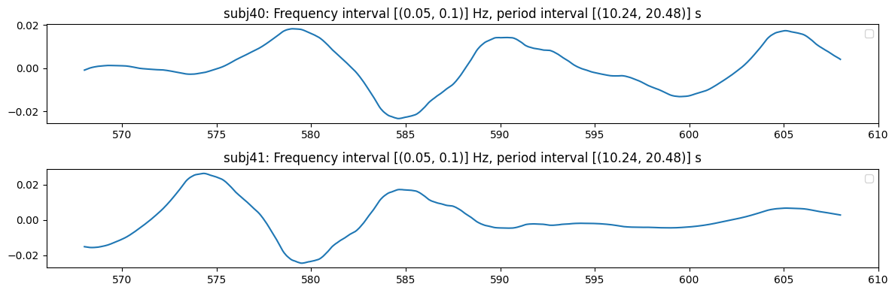
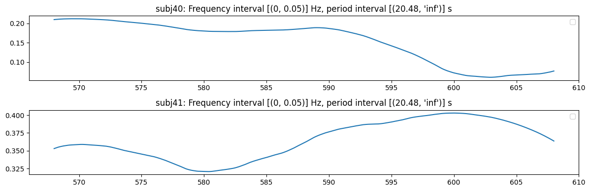
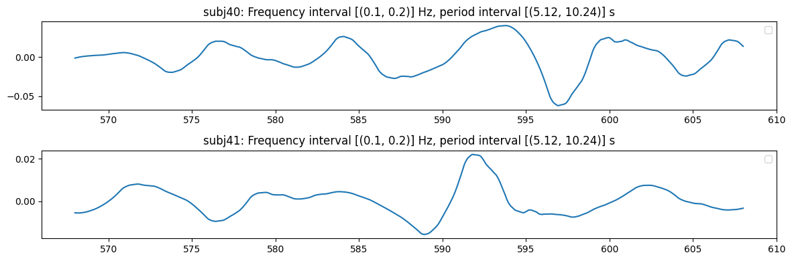
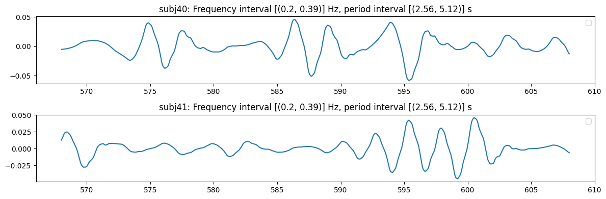
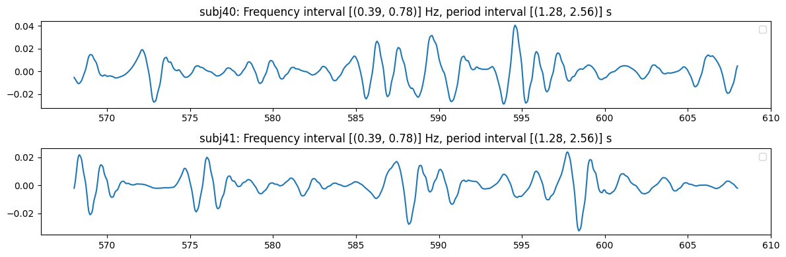
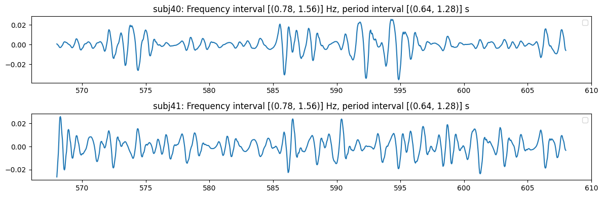
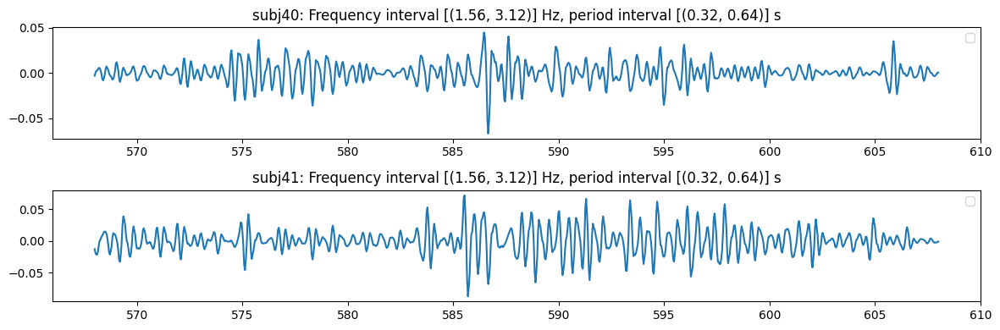
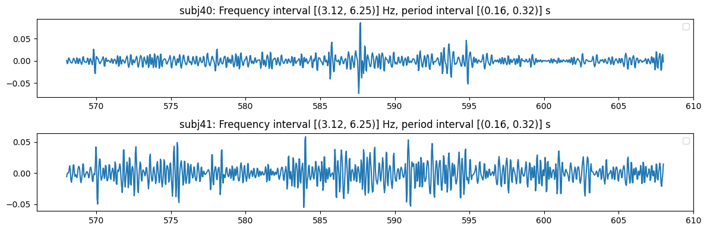
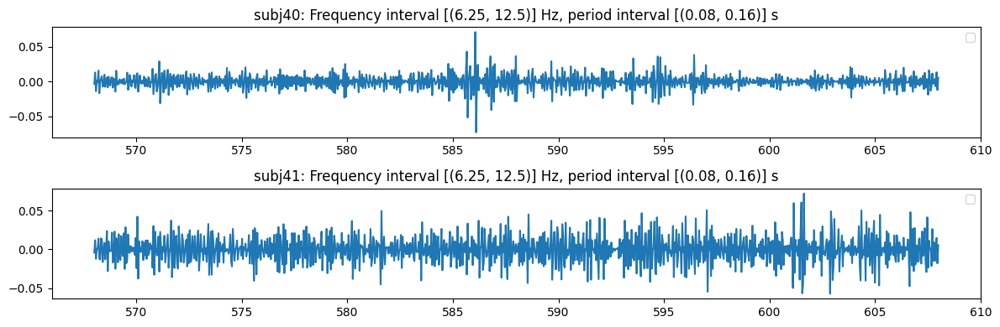

<!-- WARNING: THIS FILE WAS AUTOGENERATED! DO NOT EDIT! -->

## Inspect the `Wdecomposition` object

``` python
from nbdev_fhemb.decomposeEmb_ex import percentile_emb_decomp
from nbdev_fhemb.wdecomposition_ex import bin_emb_decomp_coll, bin_emb_decomp
```

## Metadata

### Features

#### The `Wdecomposition.features`

``` python
percentile_emb_decomp.features
```

    ('p0', 'p50', 'p90')

``` python
bin_emb_decomp.features
```

    ('bh0', 'bh1', 'bh2', 'bh3', 'bh4', 'bh5', 'bh6', 'bh7', 'bh8', 'bh9', 'bh10')

#### The `EmbeddingCollection.features`

``` python
bin_emb_decomp_coll.features
```

    {0: ('bh0',
      'bh1',
      'bh2',
      'bh3',
      'bh4',
      'bh5',
      'bh6',
      'bh7',
      'bh8',
      'bh9',
      'bh10'),
     1: ('bh0',
      'bh1',
      'bh2',
      'bh3',
      'bh4',
      'bh5',
      'bh6',
      'bh7',
      'bh8',
      'bh9',
      'bh10'),
     2: ('bh0',
      'bh1',
      'bh2',
      'bh3',
      'bh4',
      'bh5',
      'bh6',
      'bh7',
      'bh8',
      'bh9',
      'bh10'),
     3: ('bh0',
      'bh1',
      'bh2',
      'bh3',
      'bh4',
      'bh5',
      'bh6',
      'bh7',
      'bh8',
      'bh9',
      'bh10'),
     4: ('bh0',
      'bh1',
      'bh2',
      'bh3',
      'bh4',
      'bh5',
      'bh6',
      'bh7',
      'bh8',
      'bh9',
      'bh10'),
     5: ('bh0',
      'bh1',
      'bh2',
      'bh3',
      'bh4',
      'bh5',
      'bh6',
      'bh7',
      'bh8',
      'bh9',
      'bh10'),
     6: ('bh0',
      'bh1',
      'bh2',
      'bh3',
      'bh4',
      'bh5',
      'bh6',
      'bh7',
      'bh8',
      'bh9',
      'bh10'),
     7: ('bh0',
      'bh1',
      'bh2',
      'bh3',
      'bh4',
      'bh5',
      'bh6',
      'bh7',
      'bh8',
      'bh9',
      'bh10'),
     8: ('bh0',
      'bh1',
      'bh2',
      'bh3',
      'bh4',
      'bh5',
      'bh6',
      'bh7',
      'bh8',
      'bh9',
      'bh10')}

### Frequency and period intervals

#### Period in seconds

``` python
frequency_band = 1   # specify a frequency band of the transform
```

``` python
percentile_emb_decomp.periods[frequency_band]   # show the period interval of the frequency band
```

    (10.24, 20.48)

``` python
bin_emb_decomp.periods[frequency_band]   # show the period interval of the frequency band
```

    (10.24, 20.48)

``` python
bin_emb_decomp_coll.periods[frequency_band]  # show the frequency interval of the frequency band
```

    [(10.24, 20.48)]

#### Fequency in Hz

``` python
percentile_emb_decomp.frequencies[frequency_band]  # show the frequency interval of the frequency band
```

    (0.05, 0.1)

``` python
bin_emb_decomp.frequencies[frequency_band]  # show the frequency interval of the frequency band
```

    (0.05, 0.1)

``` python
bin_emb_decomp_coll.frequencies[frequency_band]  # show the frequency interval of the frequency band
```

    [(0.05, 0.1)]

## Data

#### The `Wdecomposition.subsignals`

> returns a mapping directly into the data:
> subjects × fbands → decomposed signals(features × timeframes)

``` python
percentile_emb_decomp.subsignals['subj40'][frequency_band].shape  # show the signal shape of the specified subject and frequency band
```

    (3, 1000)

``` python
bin_emb_decomp.subsignals['subj40'][frequency_band].shape
```

    (11, 1000)

<div>

> **Note**
>
> (features, timeframes) = (3, 1000),  (bins × frequency bands, timeframes) = (11, 1000)

</div>

#### The `Wdecomposition.fband_embedding`

> returns the Embedding object:    fbands → Embedding objects

``` python
percentile_emb_decomp.fband_embedding[frequency_band].features_tint['subj40'].shape  # show the signal shape of the specified subject and frequency band
```

    (3, 1000)

<div>

> **Note**
>
> Both following access paths lead to the same subband signal

</div>

``` python
percentile_emb_decomp.fband_embedding[frequency_band].features_tint['subj40'] == percentile_emb_decomp.subsignals['subj40'][frequency_band]
```

    array([[ True,  True,  True, ...,  True,  True,  True],
           [ True,  True,  True, ...,  True,  True,  True],
           [ True,  True,  True, ...,  True,  True,  True]])

#### The `EmbeddingCollection.features_tint`

> returns a mapping directly into the data: subjects x (frequency bands
> ⋅ features) x timeframes

``` python
bin_emb_decomp_coll.features_tint['subj40'].shape  # show the signal shape of the specified subject and frequency band
```

    (99, 1000)

<div>

> **Note**
>
> `bin_emb_decomp` is accessible in `bin_emb_decomp_coll`

</div>

``` python
bins = 11  # number of bins in the embedding
idx = 1
```

``` python
all(bin_emb_decomp.fband_embedding[frequency_band].features_tint['subj40'][idx] == bin_emb_decomp_coll.features_tint['subj40'][frequency_band*bins+idx])
```

    True

## Plotting

``` python
bin_emb_decomp.fband_embedding[frequency_band].plot_signal(
    subjs=[40, 41],    # subjects to plot the signals for
    feature='bh10'     # features, i.e., embedding components   
)
```



    (<Figure size 1200x400 with 2 Axes>,
     [<Axes: title={'center': 'subj40: Frequency interval [(0.05, 0.1)] Hz, period interval [(10.24, 20.48)] s'}>,
      <Axes: title={'center': 'subj41: Frequency interval [(0.05, 0.1)] Hz, period interval [(10.24, 20.48)] s'}>])

<div>

> **Note**
>
> Again, we can access `bin_emb_decomp` in `bin_emb_decomp_coll`

</div>

``` python
bin_emb_decomp_coll.plot_signal( 
    subjs=[40, 41],    # subjects to plot the signals for
    feature='bh10'     # features, i.e., embedding components
)
```


















    {0: (<Figure size 1200x400 with 2 Axes>,
      [<Axes: title={'center': "subj40: Frequency interval [(0, 0.05)] Hz, period interval [(20.48, 'inf')] s"}>,
       <Axes: title={'center': "subj41: Frequency interval [(0, 0.05)] Hz, period interval [(20.48, 'inf')] s"}>]),
     1: (<Figure size 1200x400 with 2 Axes>,
      [<Axes: title={'center': 'subj40: Frequency interval [(0.05, 0.1)] Hz, period interval [(10.24, 20.48)] s'}>,
       <Axes: title={'center': 'subj41: Frequency interval [(0.05, 0.1)] Hz, period interval [(10.24, 20.48)] s'}>]),
     2: (<Figure size 1200x400 with 2 Axes>,
      [<Axes: title={'center': 'subj40: Frequency interval [(0.1, 0.2)] Hz, period interval [(5.12, 10.24)] s'}>,
       <Axes: title={'center': 'subj41: Frequency interval [(0.1, 0.2)] Hz, period interval [(5.12, 10.24)] s'}>]),
     3: (<Figure size 1200x400 with 2 Axes>,
      [<Axes: title={'center': 'subj40: Frequency interval [(0.2, 0.39)] Hz, period interval [(2.56, 5.12)] s'}>,
       <Axes: title={'center': 'subj41: Frequency interval [(0.2, 0.39)] Hz, period interval [(2.56, 5.12)] s'}>]),
     4: (<Figure size 1200x400 with 2 Axes>,
      [<Axes: title={'center': 'subj40: Frequency interval [(0.39, 0.78)] Hz, period interval [(1.28, 2.56)] s'}>,
       <Axes: title={'center': 'subj41: Frequency interval [(0.39, 0.78)] Hz, period interval [(1.28, 2.56)] s'}>]),
     5: (<Figure size 1200x400 with 2 Axes>,
      [<Axes: title={'center': 'subj40: Frequency interval [(0.78, 1.56)] Hz, period interval [(0.64, 1.28)] s'}>,
       <Axes: title={'center': 'subj41: Frequency interval [(0.78, 1.56)] Hz, period interval [(0.64, 1.28)] s'}>]),
     6: (<Figure size 1200x400 with 2 Axes>,
      [<Axes: title={'center': 'subj40: Frequency interval [(1.56, 3.12)] Hz, period interval [(0.32, 0.64)] s'}>,
       <Axes: title={'center': 'subj41: Frequency interval [(1.56, 3.12)] Hz, period interval [(0.32, 0.64)] s'}>]),
     7: (<Figure size 1200x400 with 2 Axes>,
      [<Axes: title={'center': 'subj40: Frequency interval [(3.12, 6.25)] Hz, period interval [(0.16, 0.32)] s'}>,
       <Axes: title={'center': 'subj41: Frequency interval [(3.12, 6.25)] Hz, period interval [(0.16, 0.32)] s'}>]),
     8: (<Figure size 1200x400 with 2 Axes>,
      [<Axes: title={'center': 'subj40: Frequency interval [(6.25, 12.5)] Hz, period interval [(0.08, 0.16)] s'}>,
       <Axes: title={'center': 'subj41: Frequency interval [(6.25, 12.5)] Hz, period interval [(0.08, 0.16)] s'}>])}
