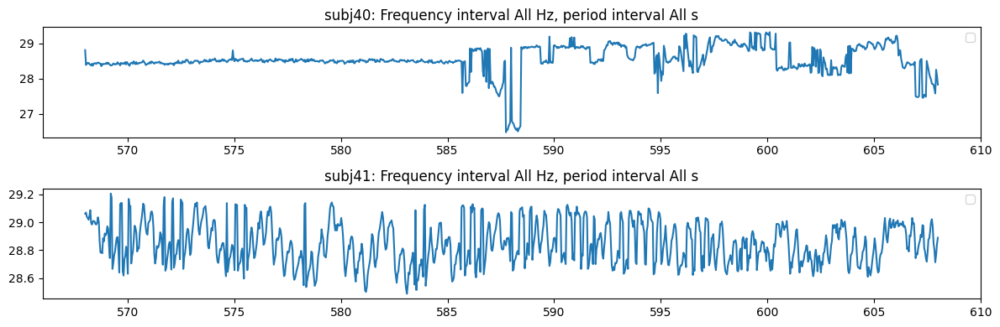
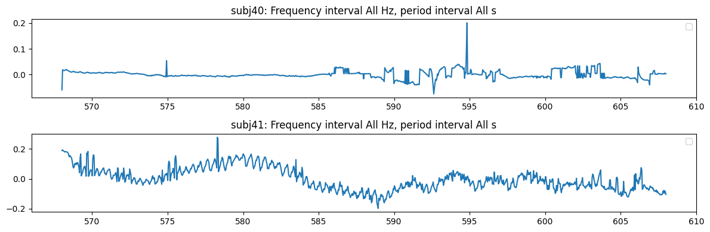
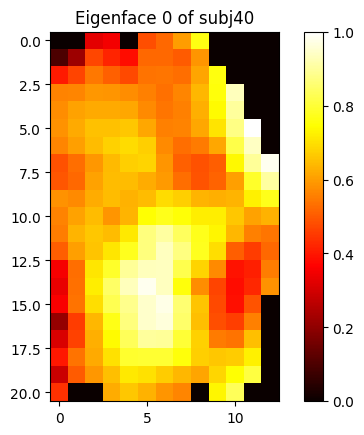
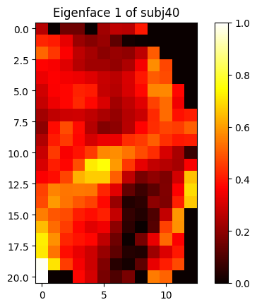
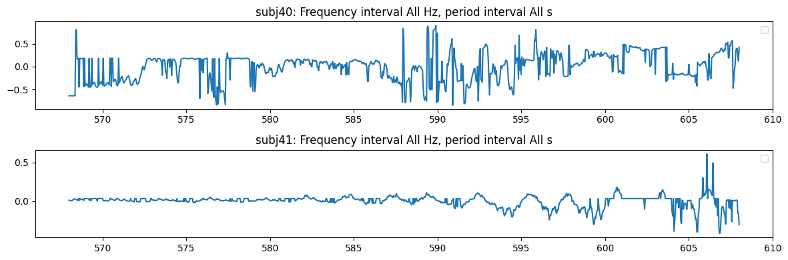
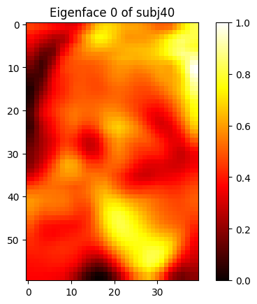
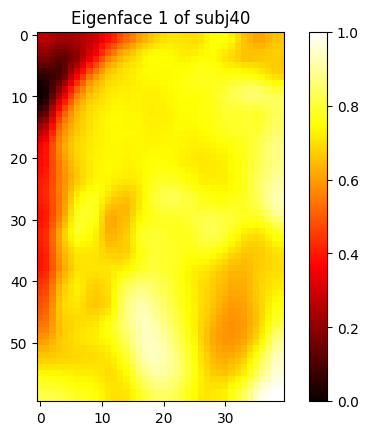
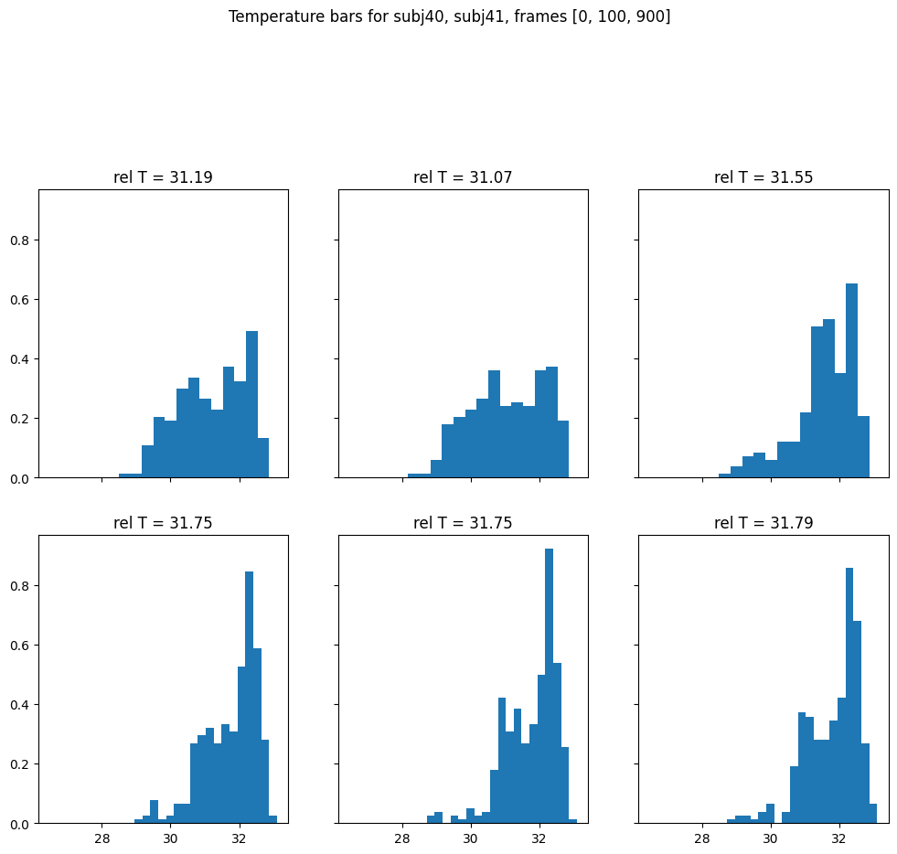
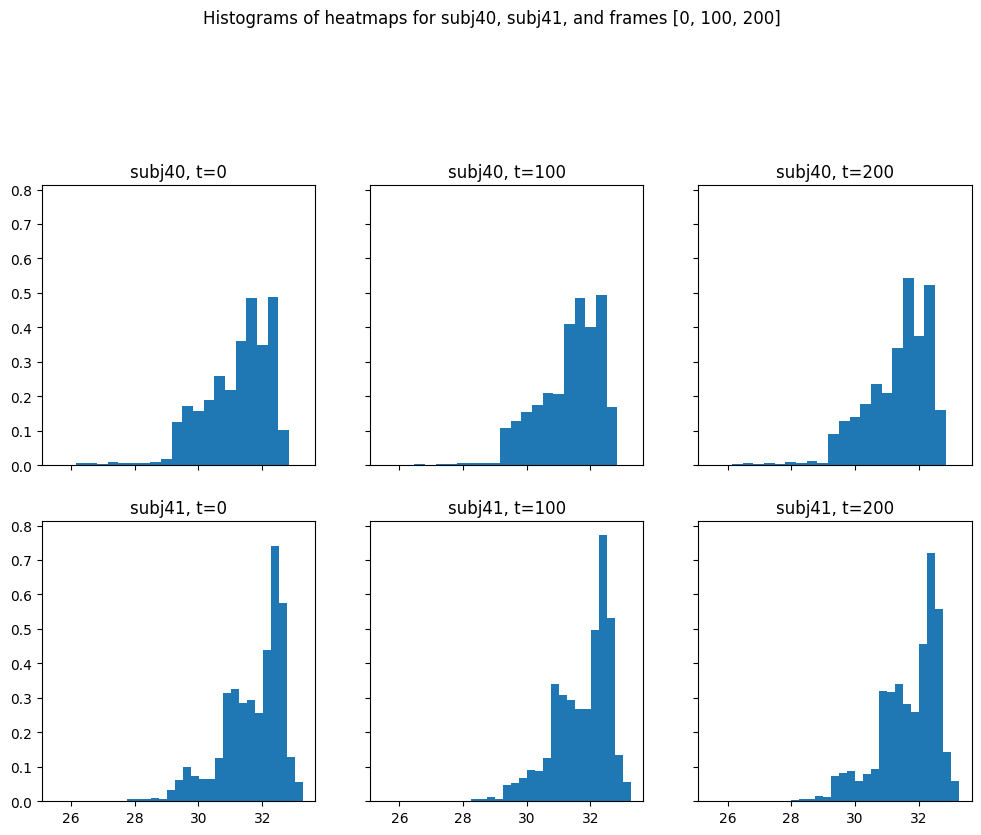
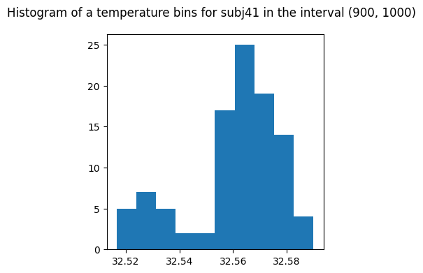

# Inspect Embeddings


<!-- WARNING: THIS FILE WAS AUTOGENERATED! DO NOT EDIT! -->

``` python
from nbdev_fhemb.embedding_ex import dg0, pca, percentile_emb, bin_emb, pca_emb, combined_emb0, combined_emb1
```

<div>

> **Note**
>
> Note that `EmbeddingCollection` invokes `.get_ts_subjs`, `.binedges`,
> `.plot_signal` methods through its [Dynamic Attribute
> Forwarding](embeddingColl.ipynb#dynamic-attribute-access).

</div>

## The Numeric Data

#### A request for a single percentile returns a Pandas dataframe

``` python
percentile_emb.get_ts_subjs('p55')   # percentiles are prefixed by 'p'
```

<div>
<style scoped>
    .dataframe tbody tr th:only-of-type {
        vertical-align: middle;
    }
&#10;    .dataframe tbody tr th {
        vertical-align: top;
    }
&#10;    .dataframe thead th {
        text-align: right;
    }
</style>

<table class="dataframe" data-quarto-postprocess="true" data-border="1">
<thead>
<tr style="text-align: right;">
<th data-quarto-table-cell-role="th"></th>
<th data-quarto-table-cell-role="th">subj40</th>
<th data-quarto-table-cell-role="th">subj41</th>
<th data-quarto-table-cell-role="th">subj42</th>
<th data-quarto-table-cell-role="th">subj43</th>
<th data-quarto-table-cell-role="th">subj44</th>
<th data-quarto-table-cell-role="th">subj47</th>
<th data-quarto-table-cell-role="th">subj48</th>
<th data-quarto-table-cell-role="th">subj49</th>
<th data-quarto-table-cell-role="th">subj50</th>
<th data-quarto-table-cell-role="th">subj51</th>
<th data-quarto-table-cell-role="th">...</th>
<th data-quarto-table-cell-role="th">subj65</th>
<th data-quarto-table-cell-role="th">subj66</th>
<th data-quarto-table-cell-role="th">subj67</th>
<th data-quarto-table-cell-role="th">subj68</th>
<th data-quarto-table-cell-role="th">subj69</th>
<th data-quarto-table-cell-role="th">subj70</th>
<th data-quarto-table-cell-role="th">subj71</th>
<th data-quarto-table-cell-role="th">subj73</th>
<th data-quarto-table-cell-role="th">subj74</th>
<th data-quarto-table-cell-role="th">subj75</th>
</tr>
</thead>
<tbody>
<tr>
<td data-quarto-table-cell-role="th">0</td>
<td>31.506458</td>
<td>32.125240</td>
<td>31.800814</td>
<td>32.560140</td>
<td>32.786428</td>
<td>32.909038</td>
<td>31.316922</td>
<td>32.117474</td>
<td>32.503437</td>
<td>32.068295</td>
<td>...</td>
<td>31.930644</td>
<td>31.914812</td>
<td>32.245775</td>
<td>31.501505</td>
<td>32.069073</td>
<td>31.687185</td>
<td>31.310745</td>
<td>31.930449</td>
<td>32.181499</td>
<td>31.233722</td>
</tr>
<tr>
<td data-quarto-table-cell-role="th">1</td>
<td>31.182337</td>
<td>32.105428</td>
<td>31.784720</td>
<td>32.560905</td>
<td>32.789658</td>
<td>32.899582</td>
<td>31.333058</td>
<td>32.113586</td>
<td>32.477349</td>
<td>32.074715</td>
<td>...</td>
<td>31.918918</td>
<td>31.875685</td>
<td>32.241907</td>
<td>31.506657</td>
<td>32.078602</td>
<td>31.687185</td>
<td>31.299582</td>
<td>31.930449</td>
<td>32.187313</td>
<td>31.242910</td>
</tr>
<tr>
<td data-quarto-table-cell-role="th">2</td>
<td>31.189138</td>
<td>32.117085</td>
<td>31.717500</td>
<td>32.548653</td>
<td>32.789658</td>
<td>32.895798</td>
<td>31.325089</td>
<td>32.106983</td>
<td>32.495766</td>
<td>32.060902</td>
<td>...</td>
<td>31.915594</td>
<td>31.899557</td>
<td>32.241907</td>
<td>31.509430</td>
<td>32.070824</td>
<td>31.683247</td>
<td>31.291605</td>
<td>31.926540</td>
<td>32.185375</td>
<td>31.231324</td>
</tr>
<tr>
<td data-quarto-table-cell-role="th">3</td>
<td>31.190339</td>
<td>32.105816</td>
<td>31.722616</td>
<td>32.549036</td>
<td>32.774844</td>
<td>32.896744</td>
<td>31.332262</td>
<td>32.098045</td>
<td>32.504204</td>
<td>32.097657</td>
<td>...</td>
<td>31.915203</td>
<td>31.919113</td>
<td>32.237652</td>
<td>31.494174</td>
<td>32.070824</td>
<td>31.683247</td>
<td>31.280437</td>
<td>31.909728</td>
<td>32.179562</td>
<td>31.232523</td>
</tr>
<tr>
<td data-quarto-table-cell-role="th">4</td>
<td>31.185738</td>
<td>32.120969</td>
<td>31.737957</td>
<td>32.544440</td>
<td>32.771424</td>
<td>32.897689</td>
<td>31.343811</td>
<td>32.098434</td>
<td>32.492699</td>
<td>32.087742</td>
<td>...</td>
<td>31.906990</td>
<td>31.854143</td>
<td>32.249256</td>
<td>31.490805</td>
<td>32.072964</td>
<td>31.691124</td>
<td>31.267667</td>
<td>31.918722</td>
<td>32.195061</td>
<td>31.235718</td>
</tr>
<tr>
<td data-quarto-table-cell-role="th">...</td>
<td>...</td>
<td>...</td>
<td>...</td>
<td>...</td>
<td>...</td>
<td>...</td>
<td>...</td>
<td>...</td>
<td>...</td>
<td>...</td>
<td>...</td>
<td>...</td>
<td>...</td>
<td>...</td>
<td>...</td>
<td>...</td>
<td>...</td>
<td>...</td>
<td>...</td>
<td>...</td>
<td>...</td>
</tr>
<tr>
<td data-quarto-table-cell-role="th">995</td>
<td>31.781578</td>
<td>32.151637</td>
<td>31.801207</td>
<td>32.846565</td>
<td>32.790037</td>
<td>32.948723</td>
<td>31.836508</td>
<td>32.069462</td>
<td>32.504204</td>
<td>32.164051</td>
<td>...</td>
<td>31.997012</td>
<td>31.864719</td>
<td>32.346948</td>
<td>31.460073</td>
<td>32.133007</td>
<td>31.903078</td>
<td>31.385396</td>
<td>31.914812</td>
<td>32.334225</td>
<td>31.122852</td>
</tr>
<tr>
<td data-quarto-table-cell-role="th">996</td>
<td>31.785505</td>
<td>32.152024</td>
<td>31.802384</td>
<td>32.838985</td>
<td>32.808260</td>
<td>32.952688</td>
<td>31.824745</td>
<td>32.070824</td>
<td>32.497300</td>
<td>32.160172</td>
<td>...</td>
<td>31.981410</td>
<td>31.870398</td>
<td>32.338081</td>
<td>31.441220</td>
<td>32.143294</td>
<td>31.870986</td>
<td>31.382414</td>
<td>31.914812</td>
<td>32.334225</td>
<td>31.113629</td>
</tr>
<tr>
<td data-quarto-table-cell-role="th">997</td>
<td>31.809054</td>
<td>32.151248</td>
<td>31.796889</td>
<td>32.861725</td>
<td>32.808260</td>
<td>32.964014</td>
<td>31.771562</td>
<td>32.055064</td>
<td>32.503437</td>
<td>32.148533</td>
<td>...</td>
<td>31.992916</td>
<td>31.875685</td>
<td>32.353500</td>
<td>31.445390</td>
<td>32.135531</td>
<td>31.847483</td>
<td>31.389373</td>
<td>31.922630</td>
<td>32.340008</td>
<td>31.154911</td>
</tr>
<tr>
<td data-quarto-table-cell-role="th">998</td>
<td>31.785505</td>
<td>32.159784</td>
<td>31.792963</td>
<td>32.846186</td>
<td>32.827041</td>
<td>32.956276</td>
<td>31.724386</td>
<td>32.042216</td>
<td>32.489629</td>
<td>32.179562</td>
<td>...</td>
<td>32.008709</td>
<td>31.877837</td>
<td>32.361210</td>
<td>31.450945</td>
<td>32.131648</td>
<td>31.871769</td>
<td>31.382414</td>
<td>31.910902</td>
<td>32.328438</td>
<td>31.168527</td>
</tr>
<tr>
<td data-quarto-table-cell-role="th">999</td>
<td>31.800225</td>
<td>32.143877</td>
<td>31.804739</td>
<td>32.838985</td>
<td>32.831591</td>
<td>32.952877</td>
<td>31.738940</td>
<td>32.066933</td>
<td>32.488862</td>
<td>32.173162</td>
<td>...</td>
<td>31.989016</td>
<td>31.873923</td>
<td>32.344441</td>
<td>31.455510</td>
<td>32.135531</td>
<td>31.894667</td>
<td>31.378437</td>
<td>31.918722</td>
<td>32.322651</td>
<td>31.164523</td>
</tr>
</tbody>
</table>

<p>1000 rows × 32 columns</p>
</div>

``` python
combined_emb0.get_ts_subjs('p55')
```

    {'pcomponents_ts': Empty DataFrame
     Columns: []
     Index: [],
     'percentiles_ts':         subj40     subj41     subj42     subj43     subj44     subj47  \
     0    31.506458  32.125240  31.800814  32.560140  32.786428  32.909038   
     1    31.182337  32.105428  31.784720  32.560905  32.789658  32.899582   
     2    31.189138  32.117085  31.717500  32.548653  32.789658  32.895798   
     3    31.190339  32.105816  31.722616  32.549036  32.774844  32.896744   
     4    31.185738  32.120969  31.737957  32.544440  32.771424  32.897689   
     ..         ...        ...        ...        ...        ...        ...   
     995  31.781578  32.151637  31.801207  32.846565  32.790037  32.948723   
     996  31.785505  32.152024  31.802384  32.838985  32.808260  32.952688   
     997  31.809054  32.151248  31.796889  32.861725  32.808260  32.964014   
     998  31.785505  32.159784  31.792963  32.846186  32.827041  32.956276   
     999  31.800225  32.143877  31.804739  32.838985  32.831591  32.952877   
     
             subj48     subj49     subj50     subj51  ...     subj65     subj66  \
     0    31.316922  32.117474  32.503437  32.068295  ...  31.930644  31.914812   
     1    31.333058  32.113586  32.477349  32.074715  ...  31.918918  31.875685   
     2    31.325089  32.106983  32.495766  32.060902  ...  31.915594  31.899557   
     3    31.332262  32.098045  32.504204  32.097657  ...  31.915203  31.919113   
     4    31.343811  32.098434  32.492699  32.087742  ...  31.906990  31.854143   
     ..         ...        ...        ...        ...  ...        ...        ...   
     995  31.836508  32.069462  32.504204  32.164051  ...  31.997012  31.864719   
     996  31.824745  32.070824  32.497300  32.160172  ...  31.981410  31.870398   
     997  31.771562  32.055064  32.503437  32.148533  ...  31.992916  31.875685   
     998  31.724386  32.042216  32.489629  32.179562  ...  32.008709  31.877837   
     999  31.738940  32.066933  32.488862  32.173162  ...  31.989016  31.873923   
     
             subj67     subj68     subj69     subj70     subj71     subj73  \
     0    32.245775  31.501505  32.069073  31.687185  31.310745  31.930449   
     1    32.241907  31.506657  32.078602  31.687185  31.299582  31.930449   
     2    32.241907  31.509430  32.070824  31.683247  31.291605  31.926540   
     3    32.237652  31.494174  32.070824  31.683247  31.280437  31.909728   
     4    32.249256  31.490805  32.072964  31.691124  31.267667  31.918722   
     ..         ...        ...        ...        ...        ...        ...   
     995  32.346948  31.460073  32.133007  31.903078  31.385396  31.914812   
     996  32.338081  31.441220  32.143294  31.870986  31.382414  31.914812   
     997  32.353500  31.445390  32.135531  31.847483  31.389373  31.922630   
     998  32.361210  31.450945  32.131648  31.871769  31.382414  31.910902   
     999  32.344441  31.455510  32.135531  31.894667  31.378437  31.918722   
     
             subj74     subj75  
     0    32.181499  31.233722  
     1    32.187313  31.242910  
     2    32.185375  31.231324  
     3    32.179562  31.232523  
     4    32.195061  31.235718  
     ..         ...        ...  
     995  32.334225  31.122852  
     996  32.334225  31.113629  
     997  32.340008  31.154911  
     998  32.328438  31.168527  
     999  32.322651  31.164523  
     
     [1000 rows x 32 columns],
     'binheights_ts': Empty DataFrame
     Columns: []
     Index: []}

#### A request for a list of percentiles returns a dictionary of dataframes

``` python
percentile_emb.get_ts_subjs(['p50','p55'])
```

    {'p50':         subj40     subj41     subj42     subj43     subj44     subj47  \
     0    31.252890  32.008514  31.667484  32.511105  32.745951  32.861725   
     1    31.010395  32.016308  31.663542  32.514938  32.736443  32.861723   
     2    31.018439  31.992916  31.584604  32.491932  32.736443  32.861725   
     3    31.048591  32.004616  31.568792  32.511105  32.738344  32.857935   
     4    31.052611  31.992916  31.592506  32.495766  32.736441  32.854145   
     ..         ...        ...        ...        ...        ...        ...   
     995  31.732450  32.086380  31.754076  32.827610  32.747852  32.922272   
     996  31.732450  32.059151  31.742283  32.823814  32.764961  32.929832   
     997  31.722616  32.059151  31.746214  32.831402  32.783960  32.929832   
     998  31.718681  32.074715  31.738350  32.827610  32.785858  32.929831   
     999  31.730484  32.063042  31.734417  32.827610  32.791555  32.918491   
     
             subj48     subj49     subj50     subj51  ...     subj65     subj66  \
     0    31.216936  32.066933  32.457382  31.998767  ...  31.836508  31.781578   
     1    31.208939  32.061096  32.442017  31.996817  ...  31.775686  31.758007   
     2    31.216934  32.061096  32.442017  31.969505  ...  31.775686  31.801207   
     3    31.208939  32.039684  32.449699  31.946077  ...  31.779614  31.785505   
     4    31.220933  32.035789  32.445858  31.994865  ...  31.779614  31.761936   
     ..         ...        ...        ...        ...  ...        ...        ...   
     995  31.655657  31.983165  32.430485  32.068878  ...  31.877642  31.730484   
     996  31.649740  31.955841  32.430485  32.076658  ...  31.869811  31.730484   
     997  31.620152  31.963650  32.422794  32.086382  ...  31.871769  31.746214   
     998  31.614229  31.977312  32.422794  32.088326  ...  31.858061  31.736383   
     999  31.562860  31.975361  32.422794  32.068878  ...  31.856102  31.736383   
     
             subj67     subj68     subj69     subj70     subj71     subj73  \
     0    32.198936  31.434074  32.014360  31.606332  31.150906  31.846307   
     1    32.202808  31.426132  32.018257  31.612255  31.122852  31.844347   
     2    32.191189  31.412229  32.008514  31.608306  31.130869  31.848267   
     3    32.206684  31.430105  32.024105  31.600409  31.118843  31.842387   
     4    32.210556  31.428118  32.018257  31.608307  31.114832  31.848267   
     ..         ...        ...        ...        ...        ...        ...   
     995  32.305286  31.316724  32.084436  31.824745  31.272855  31.836508   
     996  32.303356  31.314732  32.086380  31.781578  31.270860  31.816902   
     997  32.311073  31.334652  32.092215  31.765865  31.266868  31.812979   
     998  32.303356  31.310745  32.101933  31.769794  31.258884  31.824745   
     999  32.318792  31.328677  32.082493  31.750145  31.264873  31.816902   
     
             subj74     subj75  
     0    32.113586  31.022463  
     1    32.082493  31.022463  
     2    32.098045  31.030504  
     3    32.086380  31.042564  
     4    32.082493  31.030504  
     ..         ...        ...  
     995  32.276318  30.913694  
     996  32.276318  30.909658  
     997  32.256992  30.958052  
     998  32.264725  30.945959  
     999  32.256992  30.949991  
     
     [1000 rows x 32 columns],
     'p55':         subj40     subj41     subj42     subj43     subj44     subj47  \
     0    31.506458  32.125240  31.800814  32.560140  32.786428  32.909038   
     1    31.182337  32.105428  31.784720  32.560905  32.789658  32.899582   
     2    31.189138  32.117085  31.717500  32.548653  32.789658  32.895798   
     3    31.190339  32.105816  31.722616  32.549036  32.774844  32.896744   
     4    31.185738  32.120969  31.737957  32.544440  32.771424  32.897689   
     ..         ...        ...        ...        ...        ...        ...   
     995  31.781578  32.151637  31.801207  32.846565  32.790037  32.948723   
     996  31.785505  32.152024  31.802384  32.838985  32.808260  32.952688   
     997  31.809054  32.151248  31.796889  32.861725  32.808260  32.964014   
     998  31.785505  32.159784  31.792963  32.846186  32.827041  32.956276   
     999  31.800225  32.143877  31.804739  32.838985  32.831591  32.952877   
     
             subj48     subj49     subj50     subj51  ...     subj65     subj66  \
     0    31.316922  32.117474  32.503437  32.068295  ...  31.930644  31.914812   
     1    31.333058  32.113586  32.477349  32.074715  ...  31.918918  31.875685   
     2    31.325089  32.106983  32.495766  32.060902  ...  31.915594  31.899557   
     3    31.332262  32.098045  32.504204  32.097657  ...  31.915203  31.919113   
     4    31.343811  32.098434  32.492699  32.087742  ...  31.906990  31.854143   
     ..         ...        ...        ...        ...  ...        ...        ...   
     995  31.836508  32.069462  32.504204  32.164051  ...  31.997012  31.864719   
     996  31.824745  32.070824  32.497300  32.160172  ...  31.981410  31.870398   
     997  31.771562  32.055064  32.503437  32.148533  ...  31.992916  31.875685   
     998  31.724386  32.042216  32.489629  32.179562  ...  32.008709  31.877837   
     999  31.738940  32.066933  32.488862  32.173162  ...  31.989016  31.873923   
     
             subj67     subj68     subj69     subj70     subj71     subj73  \
     0    32.245775  31.501505  32.069073  31.687185  31.310745  31.930449   
     1    32.241907  31.506657  32.078602  31.687185  31.299582  31.930449   
     2    32.241907  31.509430  32.070824  31.683247  31.291605  31.926540   
     3    32.237652  31.494174  32.070824  31.683247  31.280437  31.909728   
     4    32.249256  31.490805  32.072964  31.691124  31.267667  31.918722   
     ..         ...        ...        ...        ...        ...        ...   
     995  32.346948  31.460073  32.133007  31.903078  31.385396  31.914812   
     996  32.338081  31.441220  32.143294  31.870986  31.382414  31.914812   
     997  32.353500  31.445390  32.135531  31.847483  31.389373  31.922630   
     998  32.361210  31.450945  32.131648  31.871769  31.382414  31.910902   
     999  32.344441  31.455510  32.135531  31.894667  31.378437  31.918722   
     
             subj74     subj75  
     0    32.181499  31.233722  
     1    32.187313  31.242910  
     2    32.185375  31.231324  
     3    32.179562  31.232523  
     4    32.195061  31.235718  
     ..         ...        ...  
     995  32.334225  31.122852  
     996  32.334225  31.113629  
     997  32.340008  31.154911  
     998  32.328438  31.168527  
     999  32.322651  31.164523  
     
     [1000 rows x 32 columns]}

#### Binheights

> this type of embedding has binedges, which define the bin intervals.
> Bin intervals do not have to have the same width.

``` python
bin_emb.binedges['subj66']
```

    array([[27.018463, 27.336157],
           [27.336157, 27.65385 ],
           [27.65385 , 27.971544],
           [27.971544, 28.289238],
           [28.289238, 28.606934],
           [28.606934, 28.924627],
           [28.924627, 29.242321],
           [29.242321, 29.560015],
           [29.560015, 29.877708],
           [29.877708, 30.195402],
           [30.195402, 30.513096],
           [30.513096, 30.83079 ],
           [30.83079 , 31.148483],
           [31.148483, 31.466177],
           [31.466177, 31.78387 ],
           [31.78387 , 32.101566],
           [32.101566, 32.41926 ],
           [32.41926 , 32.736954],
           [32.736954, 33.054646],
           [33.054646, 33.37234 ]], dtype=float32)

``` python
combined_emb1.binedges['binheights_ts']['subj66']
```

    array([[27.018463, 27.336157],
           [27.336157, 27.65385 ],
           [27.65385 , 27.971544],
           [27.971544, 28.289238],
           [28.289238, 28.606934],
           [28.606934, 28.924627],
           [28.924627, 29.242321],
           [29.242321, 29.560015],
           [29.560015, 29.877708],
           [29.877708, 30.195402],
           [30.195402, 30.513096],
           [30.513096, 30.83079 ],
           [30.83079 , 31.148483],
           [31.148483, 31.466177],
           [31.466177, 31.78387 ],
           [31.78387 , 32.101566],
           [32.101566, 32.41926 ],
           [32.41926 , 32.736954],
           [32.736954, 33.054646],
           [33.054646, 33.37234 ]], dtype=float32)

## Plots

### A projection to a chosen embedding component (`feature`)

#### Percentiles

``` python
percentile_emb.plot_signal(
    subjs=[40,41],    # specify subject(s) to plot
    feature='p0'      # specify feature to plot (e.g., 'p0' for 0th percentile        
)
```


    (<Figure size 1200x400 with 2 Axes>,
     [<Axes: title={'center': 'subj40: Frequency interval All Hz, period interval All s'}>,
      <Axes: title={'center': 'subj41: Frequency interval All Hz, period interval All s'}>])

``` python
combined_emb1.plot_signal(
    subjs=[40,41],    # specify subject(s) to plot
    feature='p0'      # specify feature to plot (e.g., 'p0' for 0th percentile
)
```



    {'percentiles_ts': (<Figure size 1200x400 with 2 Axes>,
      [<Axes: title={'center': 'subj40: Frequency interval All Hz, period interval All s'}>,
       <Axes: title={'center': 'subj41: Frequency interval All Hz, period interval All s'}>])}

#### Eigenfaces

``` python
pca_emb.plot_signal(
    subjs=[40,41],   # specify subject(s) to plot: may be specified also as intervals, e.g., [(40, 45), 47] 
    feature='pc2'    # specify feature to plot: principal components are prefixed by 'pc'    
)
```


    (<Figure size 1200x400 with 2 Axes>,
     [<Axes: title={'center': 'subj40: Frequency interval All Hz, period interval All s'}>,
      <Axes: title={'center': 'subj41: Frequency interval All Hz, period interval All s'}>])

``` python
combined_emb1.plot_signal(
    subjs=[40,41],   # specify subject(s) to plot: may be specified also as intervals, e.g., [(40, 45), 47] 
    feature='pc2'    # specify feature to plot: principal components are prefixed by 'pc'
)
```



    {'pcomponents_ts': (<Figure size 1200x400 with 2 Axes>,
      [<Axes: title={'center': 'subj40: Frequency interval All Hz, period interval All s'}>,
       <Axes: title={'center': 'subj41: Frequency interval All Hz, period interval All s'}>])}

> Heatmap time series are embedded into eigenface coordinate system by
> projecting each heatmap onto the eigenface basis that can be
> visualized.

``` python
pca_emb.visualize_eigenfaces(
    subjs=[40],       # specify subject(s) to plot: may be specified also as intervals, e.g., [(40, 45), 47] 
    components=[0,1]  # specify principle components, i.e., eigenfaces
)
```





    {'subj40': [<Figure size 640x480 with 2 Axes>,
      <Figure size 640x480 with 2 Axes>]}

> We can also visualize eigenfaces from a `Datasource` object with a
> nonstationary shape. Such a `Datasource`, like for example
> `facebbox_t`, must be “stationarized” by converting into
> `DatasourceResized` via `.rsfacebbox_t`.

``` python
pca_emb_rs = dg0.facebbox_t.rsfacebbox_t.create_pca_embedding(factory=pca)[0]
```

``` python
pca_emb_rs.plot_signal(
    subjs=[40,41],    # specify subject(s) to plot: may be specified also as intervals, e.g., [(40, 45), 47]  
    feature='pc2'     # specify feature to plot: principal components are prefixed by 'pc'    
)
```



    (<Figure size 1200x400 with 2 Axes>,
     [<Axes: title={'center': 'subj40: Frequency interval All Hz, period interval All s'}>,
      <Axes: title={'center': 'subj41: Frequency interval All Hz, period interval All s'}>])

``` python
pca_emb_rs.visualize_eigenfaces(
        subjs=[40],       # specify subject(s) to plot: may be specified also as intervals, e.g., [(40, 45), 47] 
        components=[0,1]  # specify principle components, i.e., eigenfaces
    )
```





    {'subj40': [<Figure size 640x480 with 2 Axes>,
      <Figure size 640x480 with 2 Axes>]}

### Summaries of a binheight embedding (`bin_emb`) over chosen frames (`frms`)

``` python
bin_emb.plot_temperaturebars(
    subjs=[40, 41],      # specify subject(s) to plot: may be specified also as intervals, e.g., [(40, 45), 47] 
    frms=[0,100,900],    # specify frame(s) to plot (e.g., [0, 100, 900])
    centralized=False    # specify whether to centralize the data (default: False): each bin around its own mean (centralized=True)     
)
```



### Summaries of a selected embedding (`normfacevec_t`) over chosen frames (`frms`)

``` python
dg0.facebbox_t.rsfacebbox_t.normfacevec_ts.plot_temperaturehist(
    subjs=[40, 41],  # sspecify subject(s) to plot: may be specified also as intervals, e.g., [(40, 45), 47] 
    frms=[0,100,200] # specify frames to plot (e.g., [0, 100, 200]
)
```



### A summary of a selected embedding component (`feature`) over a chosen frame interval (`intvl`)

``` python
percentile_emb.plot_intvlhist(
    subjs=[41],        # specify subject(s) to plot: may be specified also as intervals, e.g., [(40, 45), 47] 
    intvl=(900,1000),  # specify interval of frames to plot (e.g., (900, 1000))
    feature='p90'      # specify feature to plot (e.g., 'p90' for 90th percentile
)
```


