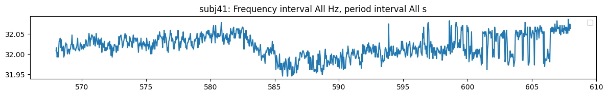
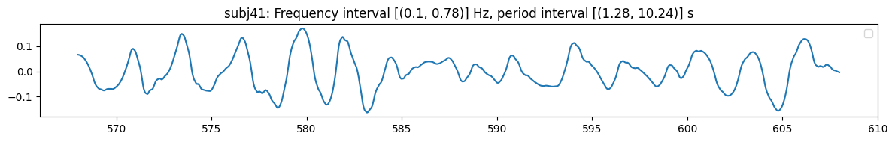
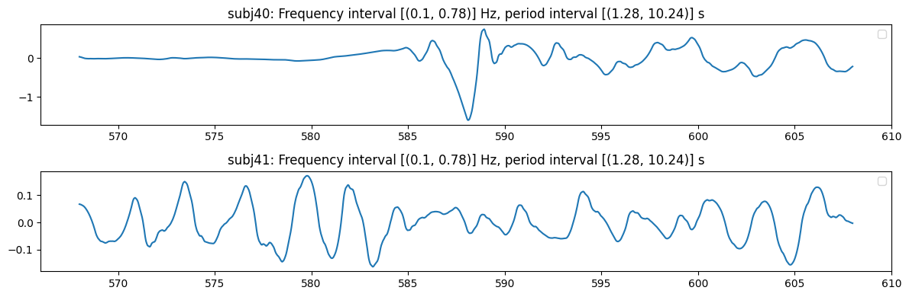
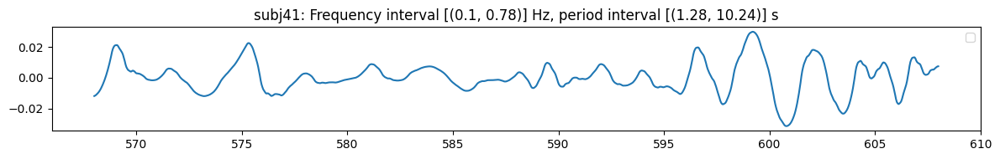

# Inspect `Embedding`s of Wavelet-based Subbands


<!-- WARNING: THIS FILE WAS AUTOGENERATED! DO NOT EDIT! -->

## Inspect the Metadata

> use methods provided by `Embedding` class

### Features

``` python
from nbdev_fhemb.wreconstruction_ex import emb_prj_decomp_rec1
```

##### Features of the reconstructed `EmbeddingCollection`

``` python
emb_prj_decomp_rec1.features
```

    {'percentiles_ts': ('p20', 'p80'),
     'binheights_ts': ('bh1', 'bh2', 'bh3'),
     'pcomponents_ts': ('pc0', 'pc1', 'pc2'),
     'features_ts': ('skew', 'kurtosis')}

##### The reconstructed embedding has the same features as the embedding it is reconstructed from

``` python
from nbdev_fhemb.decomposeEmb_ex import percentile_emb_decomp
```

``` python
percentile_emb_decomp.features
```

    ('p0', 'p50', 'p90')

``` python
from nbdev_fhemb.wreconstruction_ex import percentile_emb_prj_decomp_rec
```

``` python
percentile_emb_prj_decomp_rec.features
```

    ('p0', 'p50', 'p90')

### Subjects

##### Subjects of the reconstructed `EmbeddingCollection`

``` python
emb_prj_decomp_rec1.subjects
```

    {'percentiles_ts': ['subj65',
      'subj48',
      'subj57',
      'subj41',
      'subj49',
      'subj66',
      'subj42',
      'subj61',
      'subj56',
      'subj71',
      'subj40',
      'subj69',
      'subj59',
      'subj47',
      'subj68',
      'subj64',
      'subj74',
      'subj60',
      'subj53',
      'subj62',
      'subj73',
      'subj52',
      'subj67',
      'subj44',
      'subj43',
      'subj50',
      'subj58',
      'subj54',
      'subj63',
      'subj51',
      'subj75',
      'subj70'],
     'binheights_ts': ['subj65',
      'subj48',
      'subj57',
      'subj41',
      'subj49',
      'subj66',
      'subj42',
      'subj61',
      'subj56',
      'subj71',
      'subj40',
      'subj69',
      'subj59',
      'subj47',
      'subj68',
      'subj64',
      'subj74',
      'subj60',
      'subj53',
      'subj62',
      'subj73',
      'subj52',
      'subj67',
      'subj44',
      'subj43',
      'subj50',
      'subj58',
      'subj54',
      'subj63',
      'subj51',
      'subj75',
      'subj70'],
     'pcomponents_ts': ['subj65',
      'subj48',
      'subj57',
      'subj41',
      'subj49',
      'subj66',
      'subj42',
      'subj61',
      'subj56',
      'subj71',
      'subj40',
      'subj69',
      'subj59',
      'subj47',
      'subj68',
      'subj64',
      'subj74',
      'subj60',
      'subj53',
      'subj62',
      'subj73',
      'subj52',
      'subj67',
      'subj44',
      'subj43',
      'subj50',
      'subj58',
      'subj54',
      'subj63',
      'subj51',
      'subj75',
      'subj70'],
     'features_ts': ['subj65',
      'subj48',
      'subj57',
      'subj41',
      'subj49',
      'subj66',
      'subj42',
      'subj61',
      'subj56',
      'subj71',
      'subj40',
      'subj69',
      'subj59',
      'subj47',
      'subj68',
      'subj64',
      'subj74',
      'subj60',
      'subj53',
      'subj62',
      'subj73',
      'subj52',
      'subj67',
      'subj44',
      'subj43',
      'subj50',
      'subj58',
      'subj54',
      'subj63',
      'subj51',
      'subj75',
      'subj70']}

##### We have projected out most of the subjects in the reconstructed embedding

``` python
percentile_emb_decomp.subjects
```

    ['subj40',
     'subj41',
     'subj42',
     'subj43',
     'subj44',
     'subj47',
     'subj48',
     'subj49',
     'subj50',
     'subj51',
     'subj52',
     'subj53',
     'subj54',
     'subj56',
     'subj57',
     'subj58',
     'subj59',
     'subj60',
     'subj61',
     'subj62',
     'subj63',
     'subj64',
     'subj65',
     'subj66',
     'subj67',
     'subj68',
     'subj69',
     'subj70',
     'subj71',
     'subj73',
     'subj74',
     'subj75']

``` python
percentile_emb_prj_decomp_rec.subjects
```

    ['subj65',
     'subj48',
     'subj57',
     'subj41',
     'subj49',
     'subj66',
     'subj42',
     'subj61',
     'subj56',
     'subj71',
     'subj40',
     'subj69',
     'subj59',
     'subj47',
     'subj68',
     'subj64',
     'subj74',
     'subj60',
     'subj53',
     'subj62',
     'subj73',
     'subj52',
     'subj67',
     'subj44',
     'subj43',
     'subj50',
     'subj58',
     'subj54',
     'subj63',
     'subj51',
     'subj75',
     'subj70']

### Frequencies

> We have chosen 2nd, 3rd and 4th frequency band

##### Frequencies of the reconstructed `EmbeddingCollection`

``` python
emb_prj_decomp_rec1.frequencies
```

    {'percentiles_ts': [(0.1, 0.78)],
     'binheights_ts': [(0.1, 0.78)],
     'pcomponents_ts': [(0.1, 0.78)],
     'features_ts': [(0.1, 0.78)]}

##### Frequencies of the frequency bands of the used wavelet transformation can be reviewed in the `Wdecomposition` object

``` python
percentile_emb_decomp.frequencies
```

    [(0, 0.05),
     (0.05, 0.1),
     (0.1, 0.2),
     (0.2, 0.39),
     (0.39, 0.78),
     (0.78, 1.56),
     (1.56, 3.12),
     (3.12, 6.25),
     (6.25, 12.5)]

##### Frequencies of the wavelet band-interval reconstruction

``` python
percentile_emb_prj_decomp_rec.frequencies
```

    [(0.1, 0.78)]

### Periods

##### Frequencies of the reconstructed `EmbeddingCollection`

``` python
emb_prj_decomp_rec1.periods
```

    {'percentiles_ts': [(1.28, 10.24)],
     'binheights_ts': [(1.28, 10.24)],
     'pcomponents_ts': [(1.28, 10.24)],
     'features_ts': [(1.28, 10.24)]}

##### Periods of the frequency bands of the used wavelet transformation can be reviewed in the `Wdecomposition` object

``` python
percentile_emb_decomp.periods
```

    [(20.48, 'inf'),
     (10.24, 20.48),
     (5.12, 10.24),
     (2.56, 5.12),
     (1.28, 2.56),
     (0.64, 1.28),
     (0.32, 0.64),
     (0.16, 0.32),
     (0.08, 0.16)]

##### Periods of the wavelet band-interval reconstruction

``` python
percentile_emb_prj_decomp_rec.periods
```

    [(1.28, 10.24)]

<div>

> **Note**
>
> All the `Embedding`s in the `EmbeddingCollection` have the same
> subjects, frequencies, and periods. This is always the case if the
> `EmbeddingCollection` is created by `Datasource.project` method.

</div>

## Plot the Signals

##### The original signal

``` python
from nbdev_fhemb.embedding_ex import percentile_emb
```

``` python
percentile_emb.plot_signal( 
    subjs=[41],    # subjects to plot the signals for
    feature='p50'  # features, i.e., embedding components
)
```



    (<Figure size 1200x200 with 1 Axes>,
     [<Axes: title={'center': 'subj41: Frequency interval All Hz, period interval All s'}>])

##### The reconstructed signal

``` python
percentile_emb_prj_decomp_rec.plot_signal(
    subjs=[41],    # subjects to plot the signals for
    feature='p0'   # features, i.e., embedding components
)
```



    (<Figure size 1200x200 with 1 Axes>,
     [<Axes: title={'center': 'subj41: Frequency interval [(0.1, 0.78)] Hz, period interval [(1.28, 10.24)] s'}>])

##### Partially reconstructed signal

``` python
percentile_emb_prj_decomp_rec.plot_signal(
    subjs=[40, 41],    # subjects to plot the signals for
    feature='p0'       # features, i.e., embedding components
)
```



    (<Figure size 1200x400 with 2 Axes>,
     [<Axes: title={'center': 'subj40: Frequency interval [(0.1, 0.78)] Hz, period interval [(1.28, 10.24)] s'}>,
      <Axes: title={'center': 'subj41: Frequency interval [(0.1, 0.78)] Hz, period interval [(1.28, 10.24)] s'}>])

##### The reconstructed signal is also available in the `EmbeddingCollection` object

``` python
emb_prj_decomp_rec1.plot_signal(
    subjs=[41],    # subjects to plot the signals for
    feature='p20'   # features, i.e., embedding components
)
```



    {'percentiles_ts': (<Figure size 1200x200 with 1 Axes>,
      [<Axes: title={'center': 'subj41: Frequency interval [(0.1, 0.78)] Hz, period interval [(1.28, 10.24)] s'}>])}
