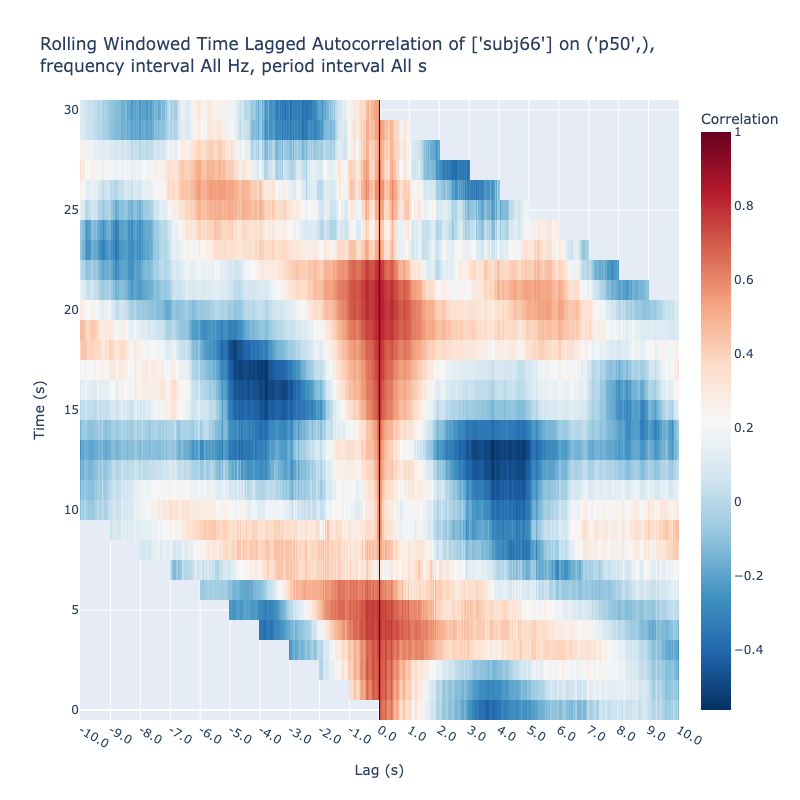
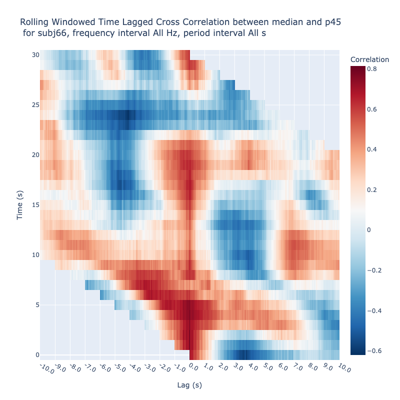
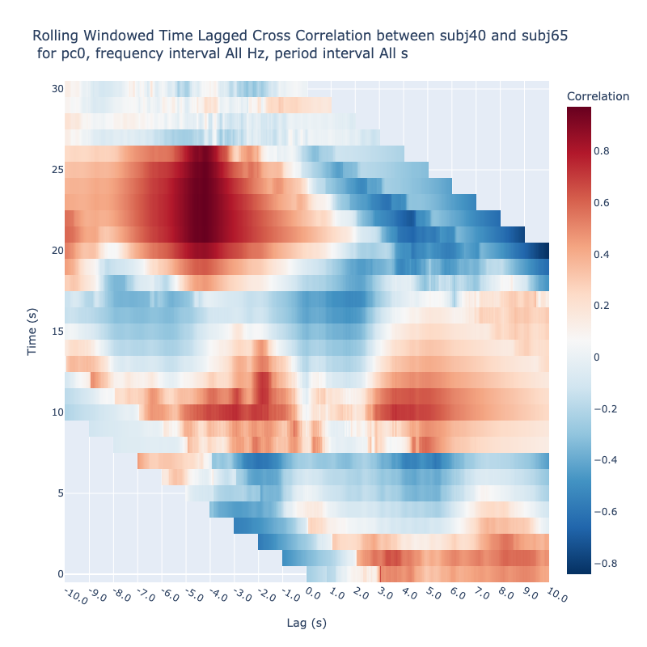
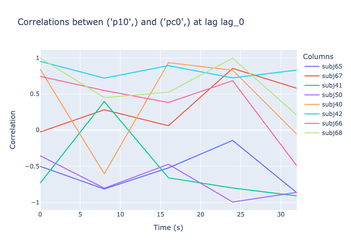

# Analyze Lagged Cross Correlations of Embeddings


<!-- WARNING: THIS FILE WAS AUTOGENERATED! DO NOT EDIT! -->

We use both color maps and time‑series plots for visual analysis. The
lagged cross‑correlation map represents correlation as a function of
both time and lag; fixing the lag collapses this 2‑D surface into a 1‑D
series that shows how the correlation at that specific lag evolves over
time. A lagged cross‑correlation time series at a fixed lag is therefore
just the vertical slice of the full map taken at that lag.

## Lagged Cross Correlation Color Map

We demonstrate the usage of the `lagged_correlations` method of the
`EmbeddingCollection` class. It can be used in three ways:

1.  auto-correlations of a single feature of a subject

2.  between two features of a subject or

3.  between two subjects on the same feature.

### Auto-Correlations

``` python
from nbdev_fhemb.embedding_ex import dg0, pca
```

``` python
dg0.face_t.project(
    subjs=[66],               # Subject of interest   
    features=['p50'],         # Features to be cross-correlated
).plot_lagged_correlations(
    twin=250,                 # Time window in frames
    step=25,                  # Step size in frames
    max_lag=250,              # Maximum lag in frames
)
```



### Cross-Correlations between two features

``` python
dg0.face_t.project(
    subjs=[66],                   # Subject of interest   
    features=['p45', 'median'],   # Features to be cross-correlated
).plot_lagged_correlations(
    twin=250,                     # Time window in frames
    step=25,                      # Step size in frames
    max_lag=250,                  # Maximum lag in frames
)
```



<div>

> **Note**
>
> Note that cross-correlation between median and 50-percentile would be
> effectively autocorrelation. It is expected that the cross-correlation
> between the median and 45-percentile have a similar pattern.

</div>

### Cross-Correlations between two subjects

``` python
dg0.face_t.project(
    subjs=[40,65],                # Specify subjects to be cross-correlated
    features=['pc0'],             # on a single feature - principle component 0
    pcfactory=pca,                # Specify the PCA  
).plot_lagged_correlations(
    twin=250,                     # Time window in frames 
    step=25,                      # Step size in frames
    max_lag=250,                  # Maximum lag in frames
)
```



## Lagged Cross Correlation Time Series

``` python
dg0.face_t.project(
    features=['pc0', 'p10'],      # on a single feature - principle component 0
    pcfactory=pca,                # Specify the PCA  
).lagged_correlation_graph(
    twin=50,                      # Time window in frames
    step=200,                     # Step size in frames
    max_lag=0,                    # Maximum lag in frames
)
```



## Numeric Values

``` python
dg0.face_t.project(
    subjs=[40,65],                # Specify subjects to be cross-correlated
    features=['pc0'],             # on a single feature - principle component 0
    pcfactory=pca,                # Specify the PCA  
).lagged_correlations_df(
    twin=50,                      # Time window in frames
    step=200,                     # Step size in frames
    max_lag=2,                    # Maximum lag in frames
)
```

    {'df': {'pc0':         lag_-2    lag_-1     lag_0     lag_1     lag_2
      0.0        NaN       NaN  0.031100  0.040745  0.045268
      8.0   0.446209  0.480241  0.512565  0.547133  0.602268
      16.0 -0.158507 -0.189139 -0.188891 -0.178513 -0.248553
      24.0  0.238012  0.210794  0.173820  0.122173  0.054476
      32.0 -0.185686 -0.176528 -0.191161  0.060838  0.198616}}
