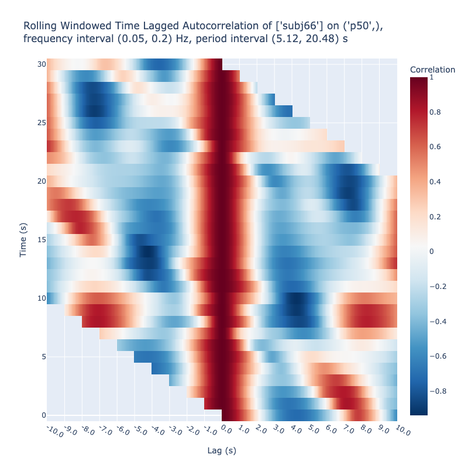
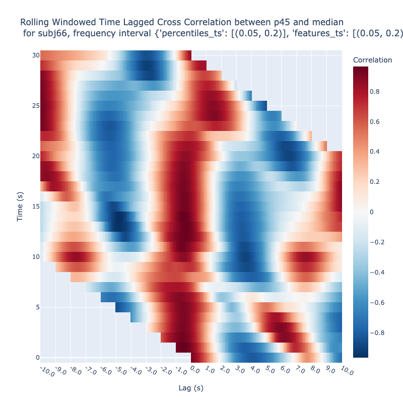
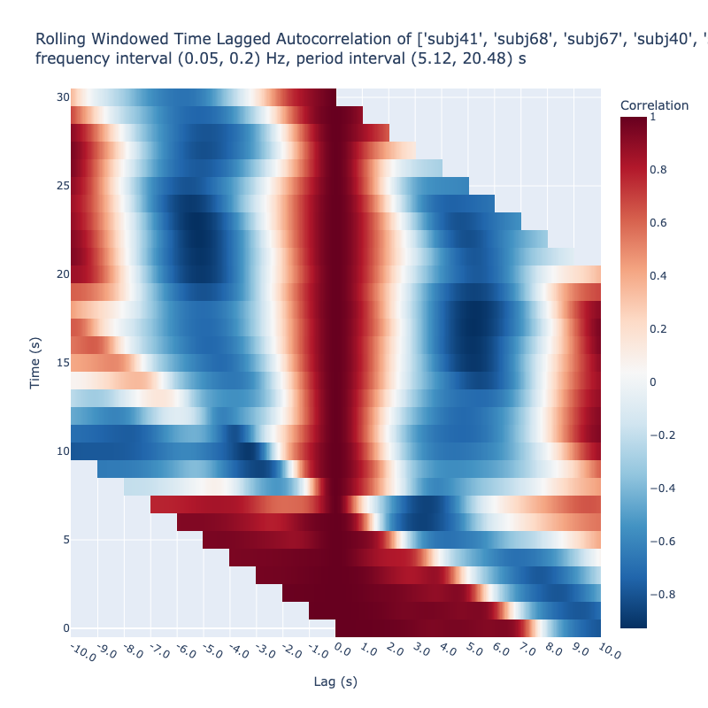
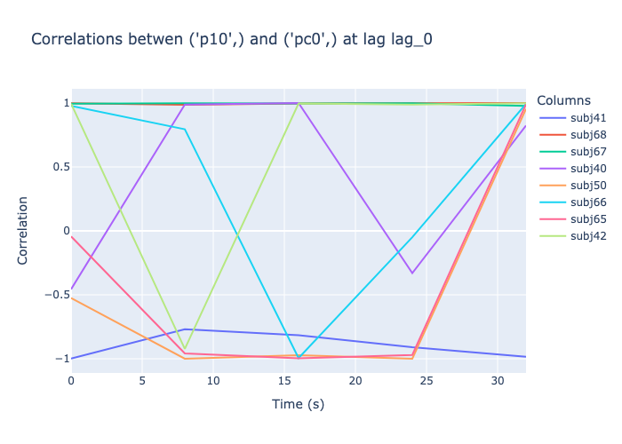

# Analyze Lagged Cross Correlations of `Embedding`s of Wavelet-based
Subbands


<!-- WARNING: THIS FILE WAS AUTOGENERATED! DO NOT EDIT! -->

We use both color maps and time‑series plots for visual analysis. The
lagged cross‑correlation map represents correlation as a function of
both time and lag; fixing the lag collapses this 2‑D surface into a 1‑D
series that shows how the correlation at that specific lag evolves over
time. A lagged cross‑correlation time series at a fixed lag is therefore
just the vertical slice of the full map taken at that lag.

## Lagged Cross Correlation Color Map

We demonstrate the usage of the `lagged_correlations` method of the
`EmbeddingCollection` class. It can be used in three ways:

1.  auto-correlations of a single feature of a subject

2.  between two features of a subject or

3.  between two subjects on the same feature.

### Auto-Correlations

``` python
from nbdev_fhemb.decomposeEmb_ex import wavelet_factory
```

``` python
from nbdev_fhemb.embedding_ex import dg0, pca
```

``` python
dg0.face_t.project(
    subjs=[66],                 # Subject of interest   
    features=['p50'],           # Features to be cross-correlated
    wdfactory=wavelet_factory,  # Specify the wavelet factory for decomposition
    fbands=[1,2],               # Frequency bands to include in the reconstruction 
).plot_lagged_correlations(
    twin=250,                   # Time window in frames
    step=25,                    # Step size in frames
    max_lag=250,                # Maximum lag in frames
)
```



### Cross-Correlations between two features

``` python
dg0.face_t.project(
    subjs=[66],                    # Subject of interest   
    features=['p45', 'median'],    # Features to be cross-correlated
    wdfactory=wavelet_factory,     # Specify the wavelet factory for decomposition
    fbands=[1,2],                  # Frequency bands to include in the reconstruction 
).plot_lagged_correlations(
    twin=250,                      # Time window in frames
    step=25,                       # Step size in frames
    max_lag=250,                   # Maximum lag in frames
)
```



<div>

> **Note**
>
> Note that cross-correlation between median and 50-percentile would be
> effectively autocorrelation. It is expected that the cross-correlation
> between the median and 45-percentile have a similar pattern.

</div>

### Cross-Correlations between two subjects

``` python
dg0.face_t.project(
    subjs=[40,65],                # Specify subjects to be cross-correlated
    features=['pc0'],             # on a single feature - principle component 0
    pcfactory=pca,                # Specify the PCA  
    wdfactory=wavelet_factory,    # Specify the wavelet factory for decomposition
    fbands=[1,2],                 # Frequency bands to include in the reconstruction 
).plot_lagged_correlations(
    twin=250,                     # Time window in frames 
    step=25,                      # Step size in frames
    max_lag=250,                  # Maximum lag in frames
)
```



## Lagged Cross Correlation Time Series

``` python
dg0.face_t.project(
    features=['pc0', 'p10'],      # on a single feature - principle component 0
    pcfactory=pca,                # Specify the PCA  
    wdfactory=wavelet_factory,    # Specify the wavelet factory for decomposition
    fbands=[1,2],                 # Frequency bands to include in the reconstruction 
).lagged_correlation_graph(
    twin=50,                      # Time window in frames
    step=200,                     # Step size in frames
    max_lag=0,                    # Maximum lag in frames
)
```



## Numeric Values

``` python
dg0.face_t.project(
    subjs=[40,65],                # Specify subjects to be cross-correlated
    features=['pc0'],             # on a single feature - principle component 0
    pcfactory=pca,                # Specify the PCA  
    wdfactory=wavelet_factory,    # Specify the wavelet factory for decomposition
    fbands=[1,2],                 # Frequency bands to include in the reconstruction 
).lagged_correlations_df(
    twin=50,                      # Time window in frames
    step=200,                     # Step size in frames
    max_lag=2,                    # Maximum lag in frames
)
```

    {'df': {'subj40':         lag_-2    lag_-1  lag_0     lag_1     lag_2
      0.0        NaN       NaN    1.0  0.989073  0.954361
      8.0   0.999988  0.999997    1.0  0.999998  0.999991
      16.0  0.999897  0.999975    1.0  0.999979  0.999927
      24.0  0.997815  0.999477    1.0  0.999525  0.998202
      32.0  0.948537  0.986760    1.0  0.987126  0.951693,
      'subj41':         lag_-2    lag_-1  lag_0     lag_1     lag_2
      0.0        NaN       NaN    1.0  0.991794  0.963841
      8.0   0.979360  0.995503    1.0  0.996664  0.988506
      16.0  0.999940  0.999986    1.0  0.999988  0.999955
      24.0  0.999822  0.999942    1.0  0.999921  0.999651
      32.0  0.999111  0.999767    1.0  0.999749  0.998964,
      'subj42':         lag_-2    lag_-1  lag_0     lag_1     lag_2
      0.0        NaN       NaN    1.0  0.999077  0.996650
      8.0   0.999496  0.999867    1.0  0.999858  0.999424
      16.0  0.999602  0.999907    1.0  0.999923  0.999735
      24.0  0.999587  0.999891    1.0  0.999886  0.999554
      32.0  0.999935  0.999983    1.0  0.999982  0.999925,
      'subj50':         lag_-2    lag_-1  lag_0     lag_1     lag_2
      0.0        NaN       NaN    1.0  0.999170  0.997019
      8.0   0.998631  0.999697    1.0  0.999764  0.999159
      16.0  0.996607  0.999274    1.0  0.999477  0.998277
      24.0  0.999805  0.999941    1.0  0.999926  0.999685
      32.0  0.998601  0.999635    1.0  0.999633  0.998597,
      'subj65':         lag_-2    lag_-1  lag_0     lag_1     lag_2
      0.0        NaN       NaN    1.0  0.999212  0.997139
      8.0   0.999919  0.999980    1.0  0.999982  0.999932
      16.0  0.999918  0.999980    1.0  0.999982  0.999937
      24.0  0.993202  0.998334    1.0  0.998477  0.994373
      32.0  0.997527  0.999378    1.0  0.999364  0.997415,
      'subj66':         lag_-2    lag_-1  lag_0     lag_1     lag_2
      0.0        NaN       NaN    1.0  0.999900  0.999574
      8.0   0.944694  0.986177    1.0  0.987746  0.955539
      16.0  0.998483  0.999648    1.0  0.999711  0.998996
      24.0  0.889064  0.971306    1.0  0.972129  0.895569
      32.0  0.997580  0.999368    1.0  0.999362  0.997549,
      'subj67':         lag_-2    lag_-1  lag_0     lag_1     lag_2
      0.0        NaN       NaN    1.0  0.999779  0.999174
      8.0   0.997459  0.999451    1.0  0.999588  0.998559
      16.0  0.999778  0.999941    1.0  0.999940  0.999773
      24.0  0.999235  0.999796    1.0  0.999786  0.999157
      32.0  0.998875  0.999701    1.0  0.999659  0.998541,
      'subj68':         lag_-2    lag_-1  lag_0     lag_1     lag_2
      0.0        NaN       NaN    1.0  0.999543  0.998323
      8.0   0.999827  0.999955    1.0  0.999955  0.999823
      16.0  0.999930  0.999982    1.0  0.999983  0.999935
      24.0  0.999873  0.999959    1.0  0.999944  0.999754
      32.0  0.996704  0.999186    1.0  0.999201  0.996822}}
