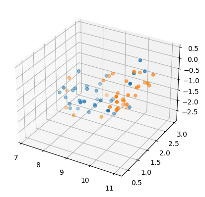
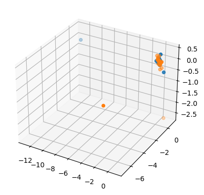
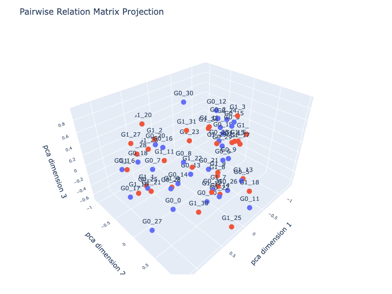

# Module-Level Functions


<!-- WARNING: THIS FILE WAS AUTOGENERATED! DO NOT EDIT! -->

> Most examples address the ML workflow for classification. The most
> basic workflow is demonstrated in four steps:
>
> 1.  obtain input data using [FhEmb library](./api.ipynb),
> 2.  prepare the data,
> 3.  split and scale,
> 4.  train and test a classifier.
> 5.  diagnose via a projection into a low-dimensional space.

<div>

> **Classification problem**
>
> Accuracy quantifies how well a binary classifier distinguishes between
> two classes. We define a class as a group of synchronized time‑series,
> which belong to the same segment of the underlying `Datasource`
> object. High accuracy indicates that the embeddings preserve
> class‑specific temporal structure strongly enough for a classifier to
> separate the two groups.

</div>

## 1. Obtain Input Data

> The input data here is the previously constructed
> `EmbeddingCollection` object `emb_prj_decomp_rec1`.

<div>

> **EmbeddingCollection**
>
> The `EmbeddingCollection` is constructed in the *Wdecomposition
> Objects* subsection. It already provides a sophisticated, handcrafted
> embedding of the data.

</div>

<details open class="code-fold">
<summary>Exported source</summary>

``` python
from nbdev_fhemb.wreconstruction_ex import emb_prj_decomp_rec1
```

</details>

## 2. Prepare Data

> 1.  Create a data matrix with \[ 2N \] rows.
>     - Rows 1…N store the embedding‑start time series.
>     - Rows N+1…2N store the embedding‑end time series. Each “vector”
>       is understood to be a time‑series sample, not a static feature
>       vector.
> 2.  Create a binary vector with \[2N\] class labels

<details open class="code-fold">
<summary>Exported source</summary>

``` python
from fhemb.utils.cutils import prepare_data, split_scale_data, calc_accuracies
```

</details>

<details open class="code-fold">
<summary>Exported source</summary>

``` python
Xdm, ydm = prepare_data(                          # ensure deduplication, NaN handling, class balancing 
    emb_prj_decomp_rec1.get_df_ts_subjs('p80')['percentiles_ts'].iloc[:250].T, 
    emb_prj_decomp_rec1.get_df_ts_subjs('p80')['percentiles_ts'].iloc[750:].T
)
```

</details>

## 3. Split and Scale

> 1.  Split data into train and test sets
>     - Use 30% of the data for testing
>     - Use 70% of the data for training  
> 2.  Scale data
>     - Use mean-variance scaling

<details open class="code-fold">
<summary>Exported source</summary>

``` python
X_train, X_test, y_train, y_test, _ = split_scale_data(
    Xdm, 
    ydm,
    test_size=0.3, 
    random_state=0, 
    normalize='meanvar'
)
```

</details>

## 4. Train and Test Classifiers

> Usually a single function includes the following steps:
>
> 1.  Fit a classifier
> 2.  Make predictions using the classifier
> 3.  Evaluate the classifier

<div>

> **Latent space**
>
> Training and testing a classifier may induce a new implicit
> representation space. Examples include:
>
> - Kernel‑induced feature space in *SVMs*, created during
>   `calc_accuracies`.
> - Latent manifold learned by *VAE/DVAE* models in
>   `DVAE.VAEClassifier.fit`.
> - Shapelet‑distance space used by shapelet‑based classifiers in
>   `calc_shapelet`.
> - Prototype space formed by prototypical networks in
>   `calc_prototype_accuracy`.
> - Pairwise‑relation space constructed in relation‑based approaches in
>   `calc_and_save_pr_accuracy`.

</div>

``` python
calc_accuracies(
    X_train.squeeze(),   # squeeze to remove singleton dimension: (44, 250, 1) -> (44, 250) where 250 is the number of features
    X_test.squeeze(),    # where the features correspond to timesteps 
    y_train,             # train labels
    y_test               # test labels
)
```

    {'knn_cosine': 0.65,
     'knn_nan_euclidean': 0.65,
     'knn_l1': 0.55,
     'knn_minkowski': 0.8,
     'knn_euclidean': 0.65,
     'rotf': 0.65,
     'randf': 0.55,
     'svm_rbf': 0.7,
     'svm_sigmoid': 0.7,
     'svm_poly': 0.6,
     'svm_linear': 0.7,
     'shapelet_rotationforest': 0.7}

## 5. Diagnose via Dimensionality Reduction

### Projection of the input space into a low-dimensional space

#### UMAP projection

``` python
from sklearn.manifold import TSNE
from umap import UMAP
from sklearn.decomposition import PCA
```

``` python
umap=UMAP(n_components=3, random_state=0)
reduced_umap=umap.fit_transform(Xdm)
```

``` python
fig = plt.figure()
ax = fig.add_subplot(111, projection='3d')

ax.scatter(reduced_umap[ydm==0, 0], reduced_umap[ydm==0, 1], reduced_umap[ydm==0, 2])
ax.scatter(reduced_umap[ydm==1, 0], reduced_umap[ydm==1, 1], reduced_umap[ydm==1, 2])
plt.show()
```



#### PCA projection

``` python
pca=PCA(n_components=3, random_state=0)
reduced_pca=pca.fit_transform(Xdm.squeeze())
```

``` python
fig = plt.figure()
ax = fig.add_subplot(111, projection='3d')

ax.scatter(reduced_pca[ydm==0, 0], reduced_pca[ydm==0, 1], reduced_pca[ydm==0, 2])
ax.scatter(reduced_pca[ydm==1, 0], reduced_pca[ydm==1, 1], reduced_pca[ydm==1, 2])
plt.show()
```



<div>

> **Pairwise Relation Embedding**
>
> When the latent space of a classifier is accessible, one can construct
> a [pairwise relation embedding](./pr_emb.ipynb) by computing all
> pairwise distances or similarities among samples. This enables
> [pairwise‑relation geometry](./pr_geometry.ipynb) diagnostic that
> remains stable across training runs and reveals structural properties
> of the learned representation.

</div>

### Projection of a pairwise relation embedding of the input space into a low-dimensional space

``` python
from fhemb.utils.cutils import plot_pr_projection
```

``` python
plot_pr_projection(
    Xdm[ydm==0],
    Xdm[ydm==1],                 # data matrices for two groups 
    alignment_type='dcor',       # distance correlation by Székely, Rizzo, and Bakirov (2007)            
    projection='pca',            # projection method for dimensionality reduction ('pca', 'tsne', 'mds', 'umap') 
    transformation='minmax',     # to transform distances into similarities for PCA
    normalize='l1',              # normalization method for distance matrix
    n_jobs=8,                    # number of jobs for parallelization
    dimensions=3,                # number of dimensions of the projection
)
```



<!-- End of notebook -->
