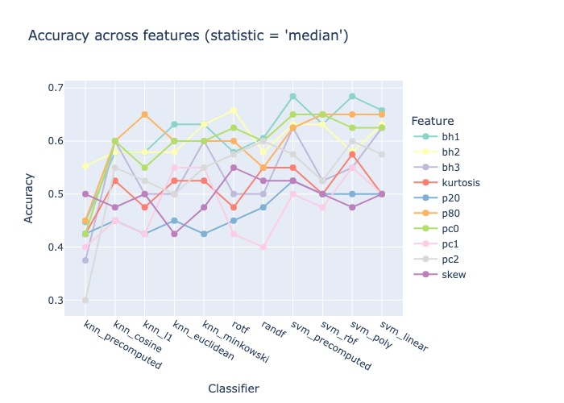
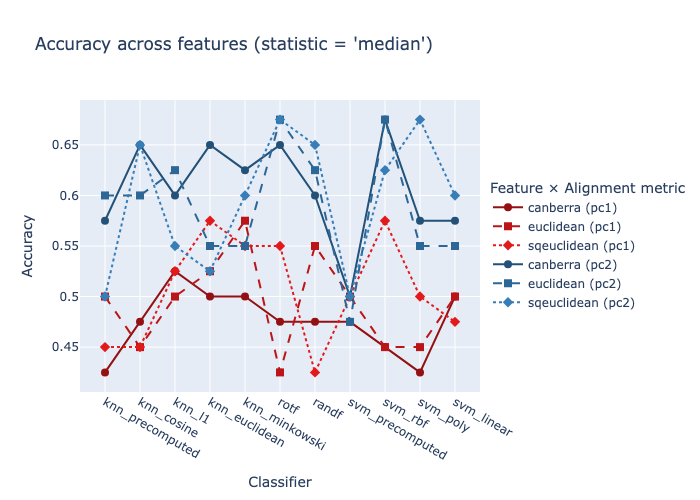
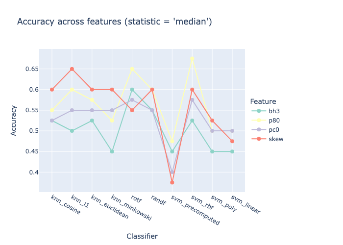

# Pairwise Relation Classification


<!-- WARNING: THIS FILE WAS AUTOGENERATED! DO NOT EDIT! -->

## Classification Accuracy

> of a binary [classification
> problem](./module_functions_ex.ipynb#classif_problem). A class
> contains pairwise relation embeddings (rows in a pairwise relation
> matrix) of time series that are synchronized, i.e., belong to the same
> segment of the underlying `Datasource` object.

#### The primary embedding `features`

``` python
from fhemb.utils.cutils import prepare_data, calc_and_save_pr_accuracy, plot_accuracy_summary
```

``` python
from nbdev_fhemb.wreconstruction_ex import emb_prj_decomp_rec1
```

``` python
emb_prj_decomp_rec1.features
```

    {'percentiles_ts': ('p20', 'p80'),
     'binheights_ts': ('bh1', 'bh2', 'bh3'),
     'pcomponents_ts': ('pc0', 'pc1', 'pc2'),
     'features_ts': ('skew', 'kurtosis')}

### Calculate and store

#### Distance correlation

``` python
dirname_dcor = 'dtw_accuracy' + '_emb_prj_decomp_rec1' + '_dcor_minmax'
```

``` python
for embedding, features in emb_prj_decomp_rec1.features.items():    #                 
    for feature in features:                                        #
                                      # iterate over this list of features of the EmbeddingCollection object 
        print(f"Embedding: {embedding}, Feature: {feature}")
        X, y = prepare_data(                                                      # prepare the matrix X and label vector y for the two groups
            emb_prj_decomp_rec1.get_df_ts_subjs(feature)[embedding].iloc[:500].T, # first 500 samples for group 0
            emb_prj_decomp_rec1.get_df_ts_subjs(feature)[embedding].iloc[500:].T  # last 500 samples for group 1
        )
        print(f"Shape: {X.shape}")            # matrix (n_samples x n_dataframes)
        filename=calc_and_save_pr_accuracy(   # compute the classification accuracy across multiple classifiers and primary embeddings, save results to Excel file and return the filename  
            X[y==0],                          # group 0
            X[y==1],                          # group 1
            dirname=dirname_dcor,             # directory in which the results Excel file will be stored
            alignment_type='dcor',            # alignment method for distance matrix computation
            normalize='minmax',               # normalize after splitting the data into train and test sets
            radius=1,                         # refinement window size in fastdtw (only used for fastdtw)
            feature=feature,                  # feature name for labeling the results
            random_states=10                  # number of random states for train/test splits in classification
        )
        print(f"Saved results to: {filename}")
```

    Embedding: percentiles_ts, Feature: p20
    Shape: (64, 500)

    Saved results to: /Users/radned/Projects/ttsembedding/dtw_accuracy_emb_prj_decomp_rec1_dcor_minmax/acc_summ_p20.xlsx
    Embedding: percentiles_ts, Feature: p80
    Shape: (64, 500)

    Saved results to: /Users/radned/Projects/ttsembedding/dtw_accuracy_emb_prj_decomp_rec1_dcor_minmax/acc_summ_p80.xlsx
    Embedding: binheights_ts, Feature: bh1
    Shape: (62, 500)

    Saved results to: /Users/radned/Projects/ttsembedding/dtw_accuracy_emb_prj_decomp_rec1_dcor_minmax/acc_summ_bh1.xlsx
    Embedding: binheights_ts, Feature: bh2
    Shape: (62, 500)

    Saved results to: /Users/radned/Projects/ttsembedding/dtw_accuracy_emb_prj_decomp_rec1_dcor_minmax/acc_summ_bh2.xlsx
    Embedding: binheights_ts, Feature: bh3
    Shape: (64, 500)

    Saved results to: /Users/radned/Projects/ttsembedding/dtw_accuracy_emb_prj_decomp_rec1_dcor_minmax/acc_summ_bh3.xlsx
    Embedding: pcomponents_ts, Feature: pc0
    Shape: (64, 500)

    Saved results to: /Users/radned/Projects/ttsembedding/dtw_accuracy_emb_prj_decomp_rec1_dcor_minmax/acc_summ_pc0.xlsx
    Embedding: pcomponents_ts, Feature: pc1
    Shape: (64, 500)

    Saved results to: /Users/radned/Projects/ttsembedding/dtw_accuracy_emb_prj_decomp_rec1_dcor_minmax/acc_summ_pc1.xlsx
    Embedding: pcomponents_ts, Feature: pc2
    Shape: (64, 500)

    Saved results to: /Users/radned/Projects/ttsembedding/dtw_accuracy_emb_prj_decomp_rec1_dcor_minmax/acc_summ_pc2.xlsx
    Embedding: features_ts, Feature: skew
    Shape: (64, 500)

    Saved results to: /Users/radned/Projects/ttsembedding/dtw_accuracy_emb_prj_decomp_rec1_dcor_minmax/acc_summ_skew.xlsx
    Embedding: features_ts, Feature: kurtosis
    Shape: (64, 500)

    Saved results to: /Users/radned/Projects/ttsembedding/dtw_accuracy_emb_prj_decomp_rec1_dcor_minmax/acc_summ_kurtosis.xlsx

#### FastDTW

> uses various distance metrics as a similarity metric when computing
> the distance matrix

``` python
dirname_fast = 'dtw_accuracy' + '_emb_prj_decomp_rec1' + '_fast_minmax'
```

``` python
for embedding, features in emb_prj_decomp_rec1.features.items():    #                 
    for feature in features:                                        #
        if feature in ['pc1', 'pc2']:                               # iterate over this list of features of the EmbeddingCollection object 
            print(f"Embedding: {embedding}, Feature: {feature}")
            X, y = prepare_data(                                                      # prepare the matrix X and label vector y for the two groups
                emb_prj_decomp_rec1.get_df_ts_subjs(feature)[embedding].iloc[:500].T, # first 500 samples for group 0
                emb_prj_decomp_rec1.get_df_ts_subjs(feature)[embedding].iloc[500:].T  # last 500 samples for group 1
            )
            print(f"Shape: {X.shape}")            # matrix (n_samples x n_dataframes)
            filename=calc_and_save_pr_accuracy(   # compute the classification accuracy across multiple classifiers and primary embeddings, save results to Excel file and return the filename  
                X[y==0],                          # group 0
                X[y==1],                          # group 1
                dirname=dirname_fast,             # directory in which the results Excel file will be stored
                alignment_type='fastdtw',         # alignment method for distance matrix computation
                normalize='minmax',               # normalize after splitting the data into train and test sets
                radius=1,                         # refinement window size in fastdtw (only used for fastdtw)
                feature=feature,                  # feature name for labeling the results
                random_states=10                  # number of random states for train/test splits in classification
            )
            print(f"Saved results to: {filename}")
        else:
            print(f"Skipping Embedding: {embedding}, Feature: {feature} for fastdtw")
```

    Skipping Embedding: percentiles_ts, Feature: p20 for fastdtw
    Skipping Embedding: percentiles_ts, Feature: p80 for fastdtw
    Skipping Embedding: binheights_ts, Feature: bh1 for fastdtw
    Skipping Embedding: binheights_ts, Feature: bh2 for fastdtw
    Skipping Embedding: binheights_ts, Feature: bh3 for fastdtw
    Skipping Embedding: pcomponents_ts, Feature: pc0 for fastdtw
    Embedding: pcomponents_ts, Feature: pc1
    Shape: (64, 500)

    Saved results to: /Users/radned/Projects/ttsembedding/dtw_accuracy_emb_prj_decomp_rec1_fast_minmax/acc_summ_pc1.xlsx
    Embedding: pcomponents_ts, Feature: pc2
    Shape: (64, 500)

    Saved results to: /Users/radned/Projects/ttsembedding/dtw_accuracy_emb_prj_decomp_rec1_fast_minmax/acc_summ_pc2.xlsx
    Skipping Embedding: features_ts, Feature: skew for fastdtw
    Skipping Embedding: features_ts, Feature: kurtosis for fastdtw

#### Soft DTW

> uses the squared Euclidean distance as a similarity metric when
> computing the distance matrix

``` python
dirname_soft = 'dtw_accuracy' + '_emb_prj_decomp_rec1' + '_soft_minmax'
```

``` python
for embedding, features in emb_prj_decomp_rec1.features.items():   # iterate over all features of the EmbeddingCollection object 
    for feature in features:                                       # 
        print(f"Embedding: {embedding}, Feature: {feature}")
        X, y = prepare_data(                                                        # prepare the matrix X and label vector y for the two groups
            emb_prj_decomp_rec1.get_df_ts_subjs(feature)[embedding].iloc[:500].T,   # first 500 samples for group 0
            emb_prj_decomp_rec1.get_df_ts_subjs(feature)[embedding].iloc[500:].T    # last 500 samples for group 1
        )
        print(f"Shape: {X.shape}")           # matrix (n_samples x n_dataframes)
        filename=calc_and_save_pr_accuracy(  # compute the classification accuracy across multiple classifiers and primary embeddings, save results to Excel file and return the filename 
            X[y==0],                         # group 0
            X[y==1],                         # group 1
            dirname=dirname_soft,            # directory in which the results Excel file will be stored
            alignment_type='soft_dtw',       # alignment method for distance matrix computation
            normalize='minmax',              # normalize after splitting the data into train and test sets
            feature=feature,                 # feature name for labeling the results
            random_states=10                 # number of random states for train/test splits in classification    
        )
        print(f"Saved results to: {filename}")
```

    Embedding: percentiles_ts, Feature: p20
    Shape: (64, 500)

    Saved results to: /Users/radned/Projects/ttsembedding/dtw_accuracy_emb_prj_decomp_rec1_soft_minmax/acc_summ_p20.xlsx
    Embedding: percentiles_ts, Feature: p80
    Shape: (64, 500)

    Saved results to: /Users/radned/Projects/ttsembedding/dtw_accuracy_emb_prj_decomp_rec1_soft_minmax/acc_summ_p80.xlsx
    Embedding: binheights_ts, Feature: bh1
    Shape: (62, 500)

    Saved results to: /Users/radned/Projects/ttsembedding/dtw_accuracy_emb_prj_decomp_rec1_soft_minmax/acc_summ_bh1.xlsx
    Embedding: binheights_ts, Feature: bh2
    Shape: (62, 500)

    Saved results to: /Users/radned/Projects/ttsembedding/dtw_accuracy_emb_prj_decomp_rec1_soft_minmax/acc_summ_bh2.xlsx
    Embedding: binheights_ts, Feature: bh3
    Shape: (64, 500)

    Saved results to: /Users/radned/Projects/ttsembedding/dtw_accuracy_emb_prj_decomp_rec1_soft_minmax/acc_summ_bh3.xlsx
    Embedding: pcomponents_ts, Feature: pc0
    Shape: (64, 500)

    Saved results to: /Users/radned/Projects/ttsembedding/dtw_accuracy_emb_prj_decomp_rec1_soft_minmax/acc_summ_pc0.xlsx
    Embedding: pcomponents_ts, Feature: pc1
    Shape: (64, 500)

    Saved results to: /Users/radned/Projects/ttsembedding/dtw_accuracy_emb_prj_decomp_rec1_soft_minmax/acc_summ_pc1.xlsx
    Embedding: pcomponents_ts, Feature: pc2
    Shape: (64, 500)

    Saved results to: /Users/radned/Projects/ttsembedding/dtw_accuracy_emb_prj_decomp_rec1_soft_minmax/acc_summ_pc2.xlsx
    Embedding: features_ts, Feature: skew
    Shape: (64, 500)

    Saved results to: /Users/radned/Projects/ttsembedding/dtw_accuracy_emb_prj_decomp_rec1_soft_minmax/acc_summ_skew.xlsx
    Embedding: features_ts, Feature: kurtosis
    Shape: (64, 500)

    Saved results to: /Users/radned/Projects/ttsembedding/dtw_accuracy_emb_prj_decomp_rec1_soft_minmax/acc_summ_kurtosis.xlsx

### Retrieve and visualize

> Accuracy of multiple classifiers on various landmark embeddings

``` python
COLUMNS_FILTER=[                     # list of classifier columns to include in the visualization
        'knn_precomputed', 
        'knn_cosine', 
        'knn_l1', 
        'knn_euclidean', 
        'knn_minkowski', 
        'rotf', 
        'randf', 
        'svm_precomputed', 
        'svm_rbf', 
        'svm_poly', 
        'svm_linear'
    ]
```

#### Distance correlation

``` python
plot_accuracy_summary(                       # visualize the `statistics` of the classification accuracy of multiple classifiers (`column_filter`) across `features` 
    dirname_dcor,                            # directory from which the results are loaded
    features=['pc0', 'pc1','pc2', 'bh1', 'bh2', 'bh3', 'skew', 'kurtosis', 'p20', 'p80'],  # the features of the primary embeddings for which the accuracy will be visualized      
    statistics='median',                     # statistic to aggregate accuracy across multiple random states ('median', 'mean', 'std', 'iqr')
    columns_filter=COLUMNS_FILTER,           # list of classifier columns to include in the visualization (e.g., ['knn_precomputed', 'svm_rbf'])
    verbose=True                             # for debugging
);
```



#### FastDTW

``` python
plot_accuracy_summary(                   # visualize the `statistics` of the classification accuracy of multiple classifiers (`column_filter`) across `features` and  `dtw_filter` 
    dirname_fast,                        # directory from which the results are loaded
    features=['pc2', 'pc1'],             # the features of the primary embeddings for which the accuracy will be visualized
    statistics='median',                 # statistic to aggregate accuracy across multiple random states ('median', 'mean', 'std', 'iqr')
    dtw_filter=[                         # list of DTW alignment distance metrics to include in the visualization
        'euclidean', 
        'sqeuclidean', 
        'canberra'
    ],          
    columns_filter=COLUMNS_FILTER,       # list of classifier columns to include in the visualization (e.g., ['knn_precomputed', 'svm_rbf'])
    verbose=True                         # for debugging
);
```



#### SoftDTW

``` python
plot_accuracy_summary(                       # visualize the `statistics` of the classification accuracy of multiple classifiers (`column_filter`) across `features` 
    dirname_soft,                            # directory from which the results are loaded
    features=['p80', 'bh3', 'pc0', 'skew'],  # the features of the primary embeddings for which the accuracy will be visualized      
    statistics='median',                     # statistic to aggregate accuracy across multiple random states ('median', 'mean', 'std', 'iqr')
    columns_filter=COLUMNS_FILTER,           # list of classifier columns to include in the visualization (e.g., ['knn_precomputed', 'svm_rbf'])
    verbose=True                             # for debugging
);
```


