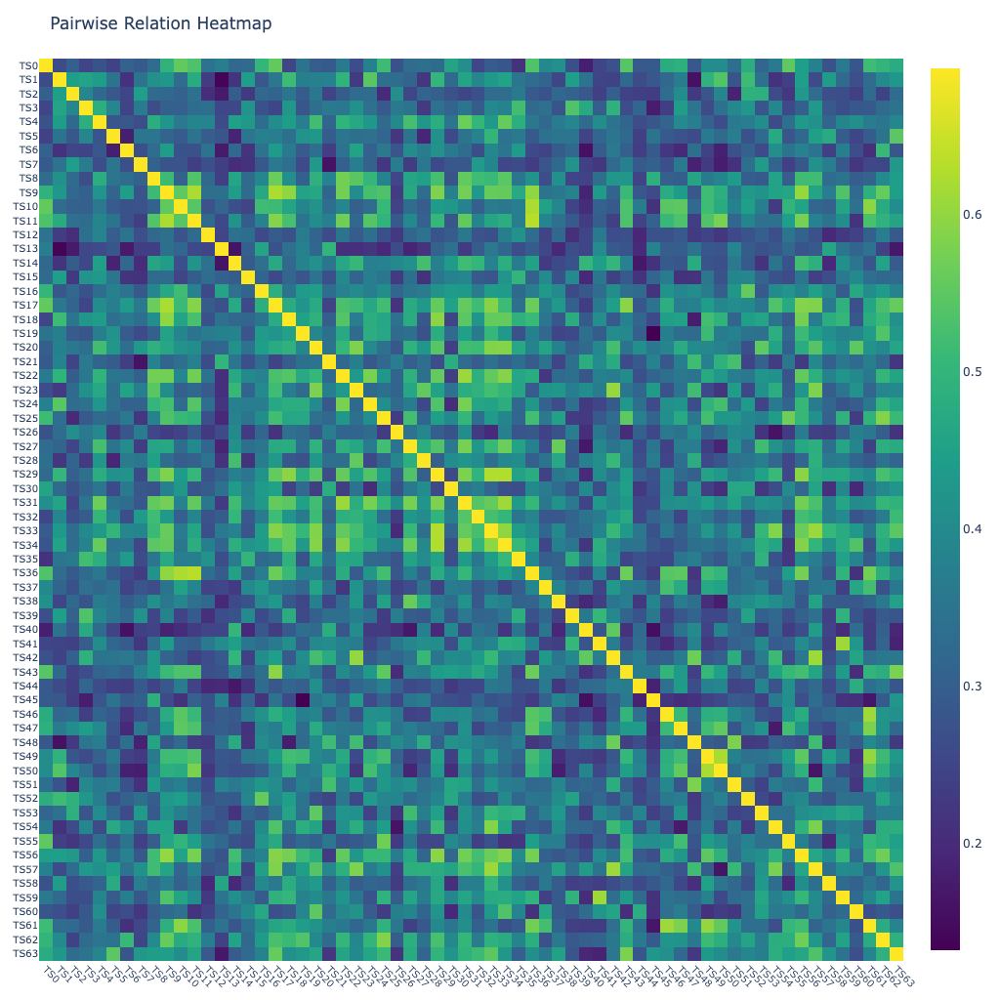
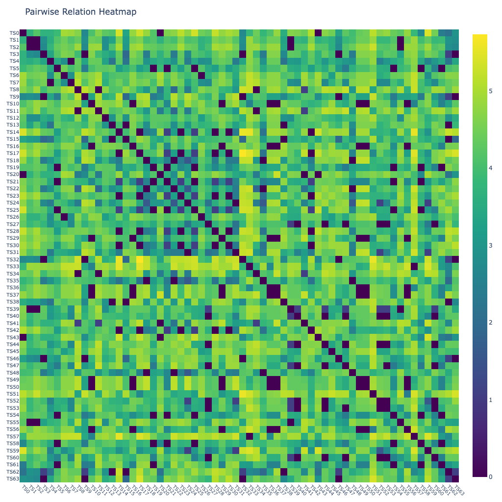
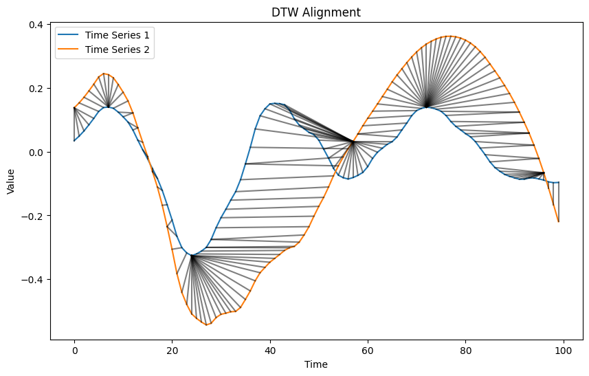

# Pairwise Relation Between Multiple Embeddings of Time Series


<!-- WARNING: THIS FILE WAS AUTOGENERATED! DO NOT EDIT! -->

> Pairwise scores include:
>
> - *dynamic timer warping alignment*,
> - *distance correlation*.

``` python
from fhemb.utils.cutils import depict_DTW, plot_pr_heatmap
```

## Diagnostics via Heatmaps

> covers matrix‑level pathologies visible directly in the
> pairwise‑relation heatmap:

> - Diagonal sanity — zeros (distance) or ones (similarity)
> - Symmetry — off‑diagonal mismatch reveals implementation errors
> - Banding — ordering‑dependent structure; local continuity
> - Block structure — natural grouping or segmentation
> - Outlier rows/columns — anomalous or corrupted time series
> - Range compression — measure uninformative for this dataset
> - Color‑scale skew — dominance of extremes hiding structure
> - Missing‑value patterns — NA stripes or blocks
> - Ordering artifacts — abrupt diagonal jumps

``` python
from nbdev_fhemb.module_functions_ex import Xdm
```

### Distance correlation

<div>

> **What distance correlation emphasizes for 1D time series**
>
> Distance correlation (biased V‑statistic) emphasizes:
>
> - any nonlinear dependence — captures relationships beyond linear or
>   monotonic trends
> - joint variation in amplitude — large differences contribute strongly
>   via Euclidean distances
> - shared temporal structure — responds to co‑movement even when shapes
>   are not aligned
> - global and local dependence — sensitive to both fine‑scale and
>   broad‑scale co‑variation
> - non‑monotonic patterns — detects curved, cyclic, or branched
>   relationships
> - distribution‑free association — equals zero only under independence,
>   regardless of marginal shapes
>
> Selecting distance correlation as the pairwise measure prioritizes
> general nonlinear dependence between 1D time series, making it a
> robust baseline for relation matrices.

</div>

``` python
plot_pr_heatmap(
    Xdm,                       # data matrix (64 x timesteps) 
    alignment_type='dcor',     # distance correlation alignment
    normalize='log',           # normalization method for the distance correlation matrix
    n_jobs=8,                  # number of jobs for parallelization
    base_size=16               # base pixel size
)
```



### Dynamic time warping alignment

> Dynamic Time Warping (DTW) is a method for aligning two time series by
> allowing non-linear stretching or compression along their temporal
> axes.

> Instead of comparing the signals point-by-point, DTW finds an optimal
> warping path that brings similar patterns into alignment, even when
> they occur at different speeds or with local temporal distortions. The
> amount of warping required - measured with respect to a chosen
> distance metrics - serves as a quantitative measure of dissimilarity
> between the two time series. This makes DTW particularly useful for
> comparing signals whose shapes are similar but not temporally
> synchronized.

<div>

> **Alignment metrics for DTW — What they measure**
>
> DTW can operate with different point‑wise distance metrics, each
> defining how local differences between two time‑series samples are
> evaluated. Choosing a metric determines what “local similarity” means
> inside DTW, allowing the clustering to emphasize amplitude, shape,
> correlation, or categorical differences depending on the application.

</div>

``` python
from scipy.spatial.distance import (
    euclidean, 
    cityblock, 
    cosine, 
    mahalanobis, 
    sqeuclidean, 
    chebyshev, 
    minkowski, 
    braycurtis, 
    canberra, 
    correlation, 
    jaccard, 
    hamming
)
```

<div>

> **Choosing a Distance Metric for DTW**
>
> Different metrics emphasize different aspects of local similarity
> inside DTW:
>
> - **euclidean** / **sqeuclidean** - best when absolute amplitude
>   differences matter
> - **cityblock** / **minkowski** - robust to outliers; good for
>   piecewise‑linear or sparse changes
> - **cosine** / **correlation** - focus on shape rather than magnitude;
>   useful when scaling varies
> - **chebyshev** - highlights the single largest deviation; good for
>   threshold‑type signals
> - **braycurtis** / **canberra** - emphasize relative changes; useful
>   when values vary across orders of magnitude
> - **hamming** / **jaccard** - for categorical or binary time series
> - **mahalanobis** - accounts for covariance structure when dimensions
>   are correlated
>
> Selecting a metric determines whether DTW prioritizes amplitude,
> shape, relative variation, or categorical differences, allowing the
> clustering to match the structure of your data.

</div>

``` python
plot_pr_heatmap(
    Xdm,                       # data matrix (64 x timesteps) 
    alignment_type='fastdtw',  # 'dcor', 'fastdtw'(euclidean), 'tslearn_dtw'(euclidean), 'soft_dtw'(sqeuclidean), 'soft_dtw_div'
    dist=cosine,               # alignment metric function used inside fastdtw
    radius=10,                 # refinement window size in fastdtw
    normalize='log',           # normalization method for the matrix of DTW alignment 
    n_jobs=8,                  # number of jobs for parallelization
    base_size=16               # base pixel size
)
```



<div>

> **Non‑clustered heatmap diagnostics (Synchronized time series)**
>
> It helps assess whether the dataset contains meaningful similarity
> structure before clustering:
>
> - **Uniform appearance** (no visible structure): All time series
>   behave similarly or differences are weak; clustering may not reveal
>   strong groups.
> - **Clear stripes** (horizontal or vertical): A specific time series
>   is consistently different from all others — an outlier or atypical
>   subject/channel.
> - **Gradients or smooth transitions along the diagonal**: The ordering
>   of the time series reflects a systematic progression (e.g., subjects
>   sorted by condition, intensity).
> - **Patchy or noisy texture**: Indicates heterogeneous data quality or
>   inconsistent preprocessing across time series.
> - **Large global brightness**: Distances are high overall — time
>   series differ strongly; normalization or scaling may need
>   adjustment.
> - **Symmetry check**: The matrix must be symmetric; deviations
>   indicate metric or implementation issues.
>
> This view reveals whether synchronized time series naturally separate
> into similarity groups, contain outliers, or require preprocessing
> adjustments before clustering.

</div>

<div>

> **Diagonal values**
>
> When the radius is very small (e.g.,  ≪ 10), FastDTW restricts the
> warping window too aggressively. This can force suboptimal alignments,
> causing unusually large diagonal values in the local cost matrix.
> These spikes are an artefact of the FastDTW approximation rather than
> properties of the underlying data.

</div>

<div>

> **Pairwise relation embedding**
>
> The pairwise relation matrix is computed over embedded time series
> (*primary embedding*). A row of this matrix defines a second order
> embedding: the vector of pairwise relations of a given embedded time
> series to all other embedded time series. Thus, this *pairwise
> relationship embedding* is determined jointly by the primary
> embedding, `alignment_type`, `normalize`, and `dist`, `radius` if
> applicable.

</div>

#### Zoom in on DTW alignment between two time series

``` python
from nbdev_fhemb.wreconstruction_ex import emb_prj_decomp_rec1
```

``` python
depict_DTW(
    emb_prj_decomp_rec1.get_df_ts_subjs('pc0')['pcomponents_ts']['subj50'][:100], 
    emb_prj_decomp_rec1.get_df_ts_subjs('pc0')['pcomponents_ts']['subj51'][:100],
    dist=euclidean
)
```



<div>

> **DTW alignment of embeddings - What it shows**
>
> DTW alignment reveals similarity even if events occur a bit earlier or
> later across synchronized time series.

</div>
