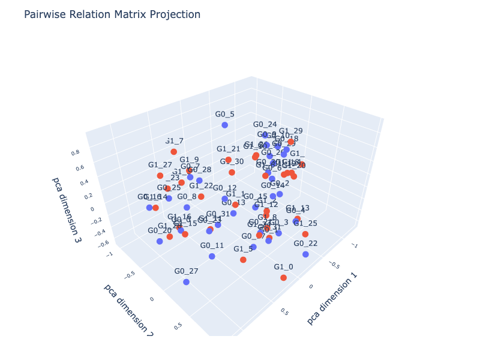
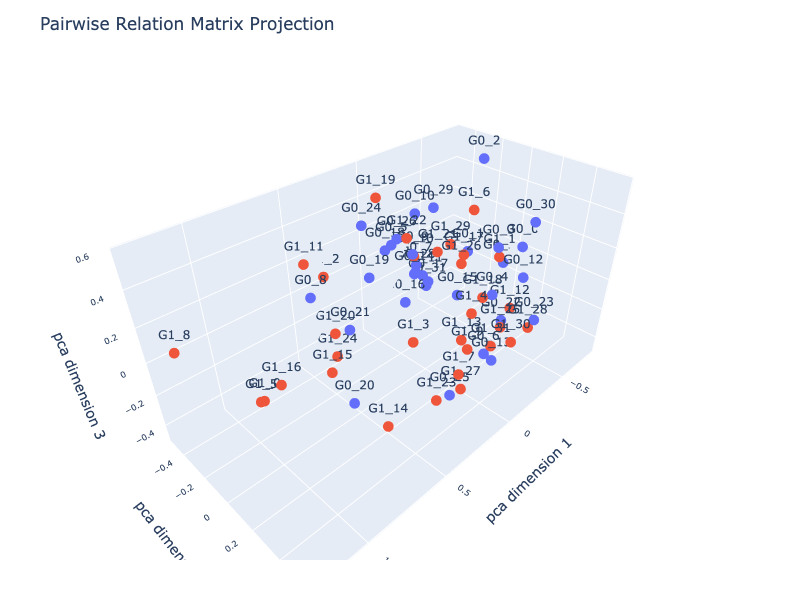
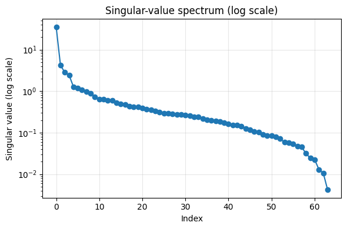

# Pairwise Relation Geometry


<!-- WARNING: THIS FILE WAS AUTOGENERATED! DO NOT EDIT! -->

## Diagnostics via Projection into a Low-Dimensional Space

> provides geometric, manifold‑level diagnostic layer

``` python
from fhemb.utils.cutils import plot_pr_projection
```

``` python
from nbdev_fhemb.module_functions_ex import Xdm
```

``` python
plot_pr_projection(
    Xdm[:32], Xdm[32:],         # data matrices for two groups (32 x 64)
    alignment_type='dcor',      # alignment method for distance matrix computation           
    projection='pca',           # projection method for dimensionality reduction ('pca', 'tsne', 'mds') 
    n_jobs=8,                   # number of jobs for parallelization
    dimensions=3,               # number of dimensions of the projection
)
```



``` python
from scipy.spatial.distance import (
    euclidean, 
    cityblock, 
    cosine, 
    mahalanobis, 
    sqeuclidean, 
    chebyshev, 
    minkowski, 
    braycurtis, 
    canberra, 
    correlation, 
    jaccard, 
    hamming
)
```

``` python
plot_pr_projection(
    Xdm[:32], Xdm[32:],         # data matrices for two groups (32 x 64)
    alignment_type='fastdtw',   # alignment method for distance matrix computation           
    dist=cosine,                # alignment metric function used inside fastdtw     
    projection='pca',           # projection method for dimensionality reduction ('pca', 'tsne', 'mds') 
    transformation='minmax',    # to transform distances into similarities for PCA
    normalize='log',            # normalization method for a 'pca' projection of a DTW alignment type
    n_jobs=8,                   # number of jobs for parallelization
    dimensions=3,               # number of dimensions of the projection
)
```



<div>

> **Distance-matrix projection diagnostics**
>
> Look for:
>
> - **Compact groups** → evidence of cluster structure in the underlying
>   time series
> - **Overlapping or diffuse clouds** → weak or ambiguous cluster
>   boundaries
> - **Isolated points** → outlier time series with atypical temporal
>   behavior
> - **Arcs, curves, or gradients** → continuous progression rather than
>   discrete clusters
> - **Changes across preprocessing steps** → reveals whether
>   normalization or filtering improves separability
> - **Metric comparison** → different distance metrics produce different
>   geometries; projection shows how strongly
> - **A sanity check**: it shows whether the DTW geometry contains
>   meaningful structure before applying any clustering algorithm.

</div>

## Diagnostics via Singular Value Decomposition (SVD)

<div>

> **svd_matrix**
>
> `svd_matrix(X, alignment_type, gamma, transformation, normalize, n_jobs)`  
> Computes a **low‑rank decomposition** of a distance‑based similarity
> matrix using **Singular Value Decomposition (SVD)**.  
> This function helps analyze the structure of the similarity geometry
> and estimate the **intrinsic dimensionality** of the dataset.
>
> **Pipeline** 1. Compute pairwise distances using `alignment_type`
> (e.g., `fastdtw`).  
> 2. Convert distances into similarities using `transformation` (e.g.,
> `gauss`, `invert`, `minmax`).  
> 3. Optionally normalize time series using `normalize`.  
> 4. Apply SVD to the resulting similarity matrix
>    *K* = *U**Σ**V*<sup>⊤</sup>
>
> **Returns** - `U` — left singular vectors  
> - `S` — singular values  
> - `Vt` — right singular vectors
>
> **Interpretation** - Singular values `S` quantify how much structure
> each latent dimension explains.  
> - Their decay provides a practical estimate of the **intrinsic
> dimension** of the similarity space:  
> - sharp drop → low intrinsic dimension  
> - gradual decay → diffuse or noisy structure  
> - Conceptually similar to PCA, but applied directly to the
> **similarity matrix** rather than centered feature data.
>
> **Use cases** - Inspecting geometric structure before embedding  
> - Choosing the number of PCA/MDS components  
> - Detecting noise vs. signal in distance‑based representations  
> - Low‑rank smoothing or compression of similarity matrices

</div>

##### Calculate singular-value spectrum

``` python
from fhemb.utils.cutils import svd_pr
```

``` python
U, S, Vt = svd_pr(       # returns U, S, Vt matrices from SVD of the distance matrix
    Xdm,                      # data matrix (64 x 64)
    alignment_type='fastdtw', # alignment method for distance matrix computation
    dist=cosine,              # alignment metric function used inside fastdtw
    radius=2,                 # refinement window size in fastdtw
    transformation='minmax',  # to transform distances into similarities for SVD
    normalize='log',          # normalization method for a DTW alignment type
    n_jobs=8                  # number of jobs for parallelization
)
```

##### Visualize the singular-value spectrum

> The vector S contains the singular values returned by the SVD. By
> convention, these values are sorted in descending order, so the first
> one corresponds to the dominant singular value and subsequent entries
> decrease monotonically.

``` python
import matplotlib.pyplot as plt
```

``` python
plt.figure(figsize=(6, 4))
plt.semilogy(S, marker='o', linewidth=1.5)
plt.xlabel("Index")
plt.ylabel("Singular value (log scale)")
plt.title("Singular-value spectrum (log scale)")
plt.grid(True, alpha=0.3)
plt.tight_layout()
plt.show()
```



<div>

> **Intrinsic Dimensionality**
>
> The singular-value spectrum exhibits a sharp decay after the first
> four components. This indicates that the matrix is well-approximated
> by a rank‑4 model, and that the intrinsic dimensionality of the
> similarity structure is approximately four. Components beyond the
> fourth lie near the noise floor and contribute minimally to the
> geometry of the space.

</div>
