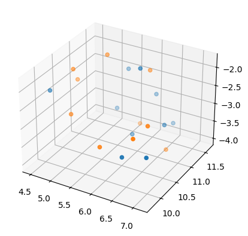
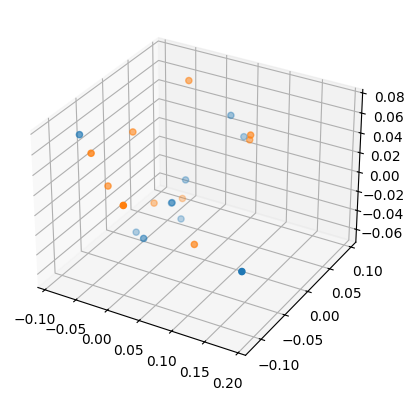
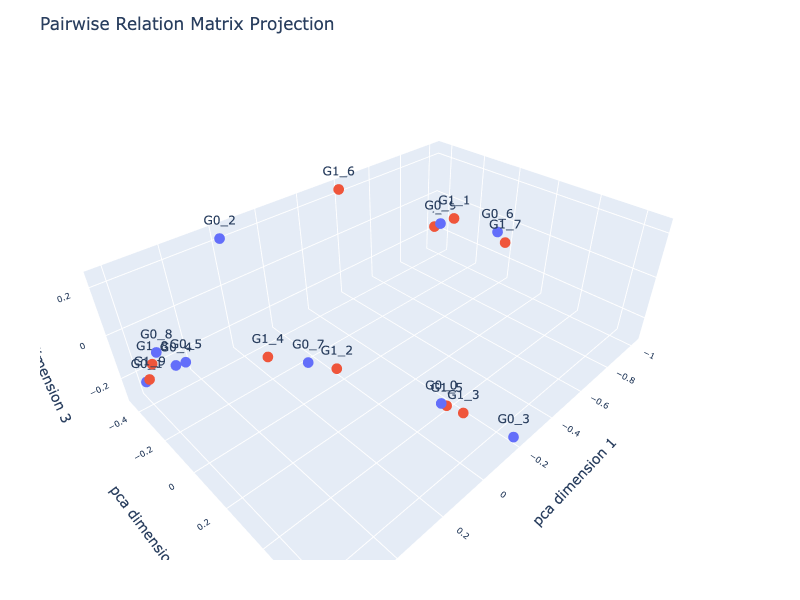

# Shapelets


<!-- WARNING: THIS FILE WAS AUTOGENERATED! DO NOT EDIT! -->

<div>

> **Shapelets**
>
> Shapelets provide a way to test whether time‑series classes differ
> through localized, discriminative subsequences. By searching for short
> patterns whose presence or absence separates classes, the method
> exposes whether class identity is tied to specific temporal motifs.
> When shapelets achieve high accuracy and remain stable across training
> runs, they indicate that classes share consistent, characteristic
> subsequences; when no such motifs emerge, the learned shapelets become
> diffuse, redundant, or weakly informative, suggesting limited or noisy
> class structure.

</div>

## Import Data

> to skip the first three steps of the [basic
> workflow](./module_functions_ex.ipynb#obtain_input_data): Obtain,
> Prepare, Split and Scale

``` python
from nbdev_fhemb.module_functions_ex import X_train, X_test, y_train, y_test
```

## Train and Test

### Shapelet embedding

> `calc_shapelet` trains the shapelet model using (`X_train`, `y_train`)
> and then applies the learned shapelet transform to both `X_train` and
> `X_test`, returning the resulting shapelet embeddings.

``` python
from fhemb.utils.cutils import calc_shapelet
```

``` python
X_train_transformed, X_test_transformed=calc_shapelet( 
    X_train.squeeze(),   # squeeze to remove singleton dimension: (44, 250, 1) -> (44, 250) where 250 is the number of timesteps
    X_test.squeeze(),    # 
    y_train              # train labels that serve to optimize the shapelets for distinguishing classes
)
```

<div>

> **Shapelet embedding**
>
> The shapelet transform converts each time series into a vector of
> distances to a learned set of shapelets. These distances quantify how
> strongly each discriminative pattern is expressed in the input,
> yielding a representation that emphasizes classrelevant structure. The
> resulting features can be passed to any downstream classifier,
> providing a compact and informative basis for accurate time‑series
> classification.

</div>

### Calculate accuracies

> 1.  Fit classifiers on the shapelet‑transformed training data.
> 2.  Use the fitted classifiers to predict labels for the
>     shapelet‑transformed test data.
> 3.  Compare the predicted labels with the true test labels to compute
>     accuracy scores.

``` python
from fhemb.utils.cutils import calc_accuracies
```

``` python
calc_accuracies(
    X_train_transformed,  # train data embedded via shapelets
    X_test_transformed,   # test data embedded via shapelets
    y_train,              # train labels
    y_test                # test labels   
)
```

    {'randf': 0.6,
     'svm_rbf': 0.5,
     'svm_sigmoid': 0.6,
     'svm_poly': 0.5,
     'svm_linear': 0.5,
     'rotf': 0.4,
     'knn_euclidean': 0.6,
     'knn_cosine': 0.45,
     'knn_nan_euclidean': 0.6,
     'knn_l1': 0.55,
     'knn_minkowski': 0.6}

## Diagnose via a Pairwise Relation and Dimensionality Reduction

### Projection of the input space into a low-dimensional space

#### UMAP projection

``` python
from sklearn.manifold import TSNE
from umap import UMAP
from sklearn.decomposition import PCA
```

``` python
umap=UMAP(n_components=3, random_state=0)
reduced_umap=umap.fit_transform(X_test_transformed)
```

``` python
fig = plt.figure()
ax = fig.add_subplot(111, projection='3d')

ax.scatter(reduced_umap[y_test==0, 0], reduced_umap[y_test==0, 1], reduced_umap[y_test==0, 2])
ax.scatter(reduced_umap[y_test==1, 0], reduced_umap[y_test==1, 1], reduced_umap[y_test==1, 2])
plt.show()
```



#### PCA projection

``` python
pca=PCA(n_components=3, random_state=0)
reduced_pca=pca.fit_transform(X_test_transformed)
```

``` python
fig = plt.figure()
ax = fig.add_subplot(111, projection='3d')

ax.scatter(reduced_pca[y_test==0, 0], reduced_pca[y_test==0, 1], reduced_pca[y_test==0, 2])
ax.scatter(reduced_pca[y_test==1, 0], reduced_pca[y_test==1, 1], reduced_pca[y_test==1, 2])
plt.show()
```



### Projection of a pairwise relation embedding of the input space into a low-dimensional space

``` python
from fhemb.utils.cutils import plot_pr_projection
```

``` python
plot_pr_projection(
    X_test_transformed[y_test==0],
    X_test_transformed[y_test==1],   # data matrices for two groups 
    alignment_type='dcor',           # distance correlation by Székely, Rizzo, and Bakirov (2007)            
    projection='pca',                # projection method for dimensionality reduction ('pca', 'tsne', 'mds', 'umap') 
    transformation='minmax',         # to transform distances into similarities for PCA
    normalize='l1',                  # normalization method for distance matrix
    n_jobs=8,                        # number of jobs for parallelization
    dimensions=3,                    # number of dimensions of the projection
)
```


