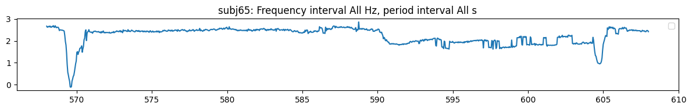

# Frequency Analysis of Temporal Series


<!-- WARNING: THIS FILE WAS AUTOGENERATED! DO NOT EDIT! -->

## Piece instances to analyze

``` python
dg0.face_t.project(features=['skew'], subjs=[65], fbands=[1,2], wdfactory=wfactory('db4',8)).plot_signal(subjs=[65])
```



    (<Figure size 1200x200 with 1 Axes>,
     [<Axes: title={'center': 'subj65: Frequency interval [(0.05, 0.2)] Hz, period interval [(5.12, 20.48)] s'}>])

``` python
dg0.face_t.project(
    subjs=[65],
    features=['kurtosis', 'skew'],
    fbands=[1,2,4],
    wdfactory=wfactory('db4',8),
    pcfactory=pca2,
).plot_lagged_correlations(
    twin=250,
    step=25,
    max_lag=250,
    n_jobs=8
)
```


